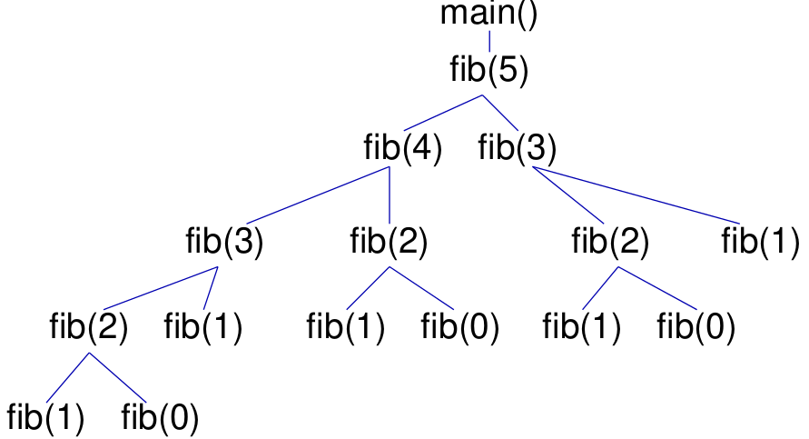
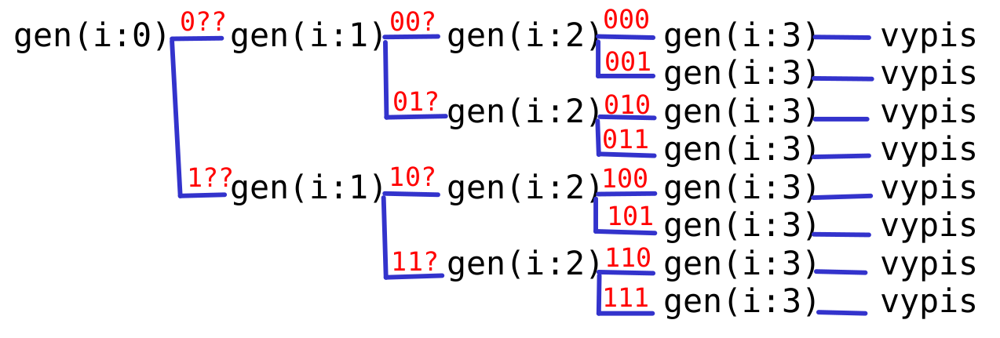
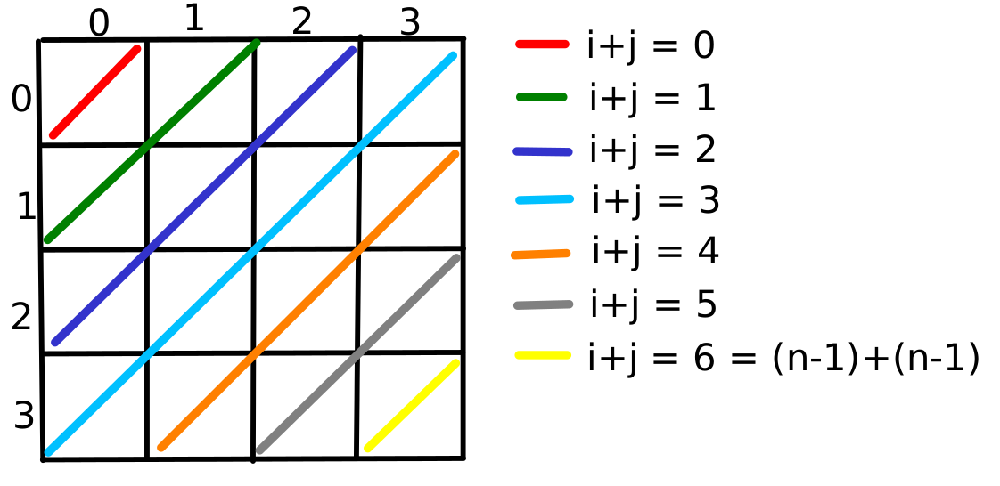
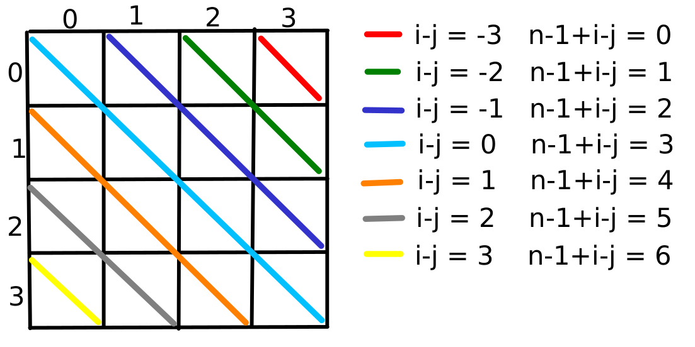

* TOC
{:toc}

## Oznamy

  - Štvrtok 22:00 termín odovzdania prvého miniprojektu.
      - Nenechávajte si prácu na poslednú chvíľu.
  - V stredu zverejníme druhý miniprojekt.
  - Zajtrajšia rozcvička bude z dnešnej prednášky (a teda je fajn si
    prednášku pozrieť pred cvičením).
  - V stredu 5.11. o 18:10 bude prvý semestrálny test.
      - Na absolvovanie predmetu treba z obidvoch semestrálnych testov
        spolu získať aspoň 50% známky.
      - Bude zahŕňať učivo po dnešnú prednášku / zajtrajšie cvičenia.
      - Ak máte problémy so slovenčinou, môžeme vám k zadaniu testu dať
        aj automatický preklad do ukrajinčiny, ruštiny alebo angličtiny.
        Ak máte záujem, registrujte sa najneskôr do pondelka 3.11.
        nasledujúcim
        [formulárom](https://forms.office.com/Pages/ResponsePage.aspx?id=jUcxznpu50yGcKW51RiE-fk1X-AjVvpHm_pTPiHlkYlURjBHTFY3R0dNVktGWlExTjhYTksyNFZCNS4u).
      - Na semestrálnom teste nebude povolený ťahák ani žiadne vlastné
        papiere.
  - Túto stredu bude na cvičeniach nepovinný nebodovaný cvičný test ako
    tréning na semestrálny test.
      - Za aktívnu účasť na cvičnom teste môžete dostať 1 bonusový bod.

<!-- end list -->

  - Všímajte si varovania kompilátora, môžu vás upozorniť na chybu

<!-- end list -->

    main.cpp:15:22: warning: 
      array subscript 1 is above array bounds of 'char [1]' 
      [-Warray-bounds]
            char str[0];
            str [0] = '\n';
    
    main.cpp:16:1: warning: 
      no return statement in function 
      returning non-void [-Wreturn-type]
    
    main.cpp:12:31: warning: 
      comparison of integer expressions 
      of different signedness: 'int' and 'size_t' 
      {aka 'long unsigned int'} [-Wsign-compare]
     for (int i = 0; i < strlen(retazec); i++) {

Posledný príklad síce väčšinou nie je problém, ale mohol by byť a navyše
je to veľmi neefektívne.

  - Lepšie je predpočítať dĺžku do premennej, aby sa nepočítala stále
    znova.

## Opakovanie rekurzie

  - **Rekurzívna definícia**: určitý objekt definujeme pomocou menších
    objektov toho istého typu
  - Napríklad rekurzívna definícia faktoriálu:
      - *n\! = 1* ak *n≤1* (triviálny prípad)
      - *n\! = n ⋅ (n-1)\!* inak

<!-- end list -->

  - Rekurzívne definície vieme často priamočiaro zapísať do
    **rekurzívnych funkcií**

<!-- end list -->

```cpp
int factorial(int n) {
    if (n <= 1) return 1;
    else return n * factorial(n-1);
}
```

  - V **rekurzívnej funkcii** riešime problém pomocou menších
    podproblémov toho istého typu
      - Napríklad aby sme našli číslo *x* v utriedenom poli medzi
        indexami `left` a `right`, potrebujeme ho porovnať so stredným
        prvkom tohoto intervalu a potom riešiť tú istú úlohu pre menší
        interval.
      - Aj keď sme pôvodne chceli hľadať prvok v celom poli, úlohu
        rozšírime o parametre `left` a `right`, aby sa dala spraviť
        rekurzia.

<!-- end list -->

```cpp
int find(int a[], int left, int right, int x) {
    if (left > right) {
        return -1;
    }
    int index = (left + right) / 2;
    if (a[index] == x) {
        return index;
    }
    else if (a[index] < x) {
        return find(a, index+1, right, x);
    }
    else {
        return find(a, left, index - 1, x);
    }
}
```

### Zásobník volaní

Druhý pohľad na rekurziu je dynamický: môžeme simulovať, čo sa v
programe deje so zásobníkom volaní (call stack).

  - Skúsme napríklad odsimulovať, čo sa deje ak vo funkcii `main`
    zavoláme `fib(3)`
  - Kvôli prehľadnosti si `fib` rozpíšeme na viac riadkov:

<!-- end list -->

```cpp
#include <iostream>
using namespace std;

int fib(int n) {
    if (n == 0) {
        return 0;
    } else if (n == 1) {
        return 1;
    } else {
        int a = fib(n - 1); // riadok (A)
        int b = fib(n - 2); // riadok (B)
        return a+b;
    }
}

int main() {
    int x = fib(3);    // riadok (C)
    cout << x << endl; 
}
```

Tu je priebeh programu (obsah zásobníka)

    (1)          (2)                      (3)
    
                                           fib n=2
                  fib n=3                  fib n=3, a=?, b=?, riadok A
    main, x=?     main, x=?, riadok C      main, x=?, riadok C
    
    (4)                             (5)
     
    fib n=1                         
    fib n=2, a=?, b=?, riadok A     fib n=2, a=1, b=?, riadok A
    fib n=3, a=?, b=?, riadok A     fib n=3, a=?, b=?, riadok A
    main, x=?, riadok C             main, x=?, riadok C             
    
    
    (6)                             (7)
     
    fib n=0                         
    fib n=2, a=1, b=?, riadok B     fib n=2, a=1, b=0, riadok B
    fib n=3, a=?, b=?, riadok A     fib n=3, a=?, b=?, riadok A
    main, x=?, riadok C             main, x=?, riadok C             
    
    
    (8)                             (9)
    
                                    fib n=1
    fib n=3, a=1, b=?, riadok A     fib n=3, a=1, b=?, riadok B 
    main, x=?, riadok C             main, x=?, riadok C                 
    
    
    (10)                            (11)
    
    fib n=3, a=1, b=1, riadok B     
    main, x=?, riadok C             main, x=2, riadok C 

Postupnosť volaní počas výpočtu vieme znázorniť aj stromovým diagramom:

{:width="400px"}

Pozor, priamočiary rekurzívny zápis výpočtu Fibonacciho čísel je
neefektívny, lebo výpočet Fibonacciho čísel sa opakuje, čas výpočtu
rastie exponenciálne od *n*

  - Napr. pre *n=5* počítame `fib(2)` trikrát, pre *n=6* päťkrát a pre
    *n=20* až 4181-krát
  - Fibonacciho čísla je teda lešie počítať nerekurzívnymi metódami z
    minulej prednášky, ktorých čas je lineárny od *n*
  - Iné ukážky z minulej prednášky (faktoriál, gcd, binárne
    vyhľadávanie) nevedú v rekurzívnej forme takémuto extrémnemu
    spomaleniu a teda väčšinou nie je problém v nich rekurziu použiť

## Vypisovanie variácií s opakovaním

Vypíšte všetky trojice cifier, pričom každá cifra je z množiny
*{0...n-1}* a cifry sa môžu opakovať (variácie 3-tej triedy z *n*
prvkov). Napr. pre *n=2*:

    000
    001
    010
    011
    100
    101
    110
    111

Veľmi jednoduchý program s troma cyklami:

```cpp
#include <iostream>
using namespace std;

int main() {
    int n;
    cin >> n;
    for(int i = 0; i < n; i++) {
        for(int j = 0; j < n; j++) {
            for(int k = 0; k < n; k++) {
                cout << i << j << k << endl;
            }
        }
    }
}
```

### Rekurzívne riešenie pre všeobecné k

Čo ak chceme *k*-tice pre všeobecné *k*? Využijeme rekurziu.

  - Variácie *k*-tej triedy vieme rozdeliť na *n* skupín podľa prvého
    prvku:
      - tie čo začínajú na 0, tie čo začínajú na 1, ..., tie čo začínajú
        na *n-1*.
  - V každej skupine ak odoberieme prvý prvok, dostaneme variácie triedy
    *k-1*

<!-- end list -->

```cpp
#include <iostream>
using namespace std;

void vypis(int a[], int k) {
    for (int i = 0; i < k; i++) {
        cout << a[i];
    }
    cout << endl;
}

void generuj(int a[], int i, int k, int n) {
    /* v poli a dlzky k mame prvych i cifier,
     * chceme vygenerovat vsetky moznosti
     * poslednych k-i cifier */
    if (i == k) {
        vypis(a, k);
    } else {
        for (int x = 0; x < n; x++) {
            a[i] = x;
            generuj(a, i + 1, k, n);
        }
    }
}

int main() {
    const int maxK = 100;
    int a[maxK];
    int k, n;
    cout << "Zadajte k a n: ";
    cin >> k >> n;
    generuj(a, 0, k, n);
}
```

Strom rekurzívnych volaní pre k=3, n=2 (generuj je skrátené na gen,
červenou je zobrazený obsah poľa `a`):
{:width="500px"}

### Ďalšie rozšírenia

  - Čo ak chceme všetky *k*-tice písmen A-Z?
  - Čo ak chceme všetky DNA reťazce dĺžky *k* (DNA pozostáva z "písmen"
    A,C,G,T)?

<!-- end list -->

```cpp
// pouzi n=26
void vypis(int a[], int k) {
    for (int i = 0; i < k; i++) {
        char c = 'A'+a[i];
        cout << c;
    }
    cout << endl;
}

// pouzi n=4
void vypis(int a[], int k) {
    char abeceda[5] = "ACGT";
    for (int i = 0; i < k; i++) {
        cout << abeceda[a[i]];
    }
    cout << endl;
}
```

**Cvičenia**

  - Ako by sme vypisovali všetky *k*-ciferné hexadecimálne čísla
    (šestnástková sústava), kde používame cifry 0-9 a písmená A-F?
  - Ako by sme vypisovali všetky *k*-tice písmen v opačnom poradí, od
    ZZZ po AAA?

## Variácie bez opakovania

Teraz chceme vypísať všetky *k*-tice cifier z množiny *{0, ..., n-1}*, v
ktorých sa žiaden prvok neopakuje (pre *k=n* dostávame permutácie)

Príklad pre k=3, n=3

    012
    021
    102
    120
    201
    210

### Skúšanie všetkých možností

  - Jednoduchá možnosť: použijeme predchádzajúci program a pred výpisom
    skontrolujeme, či je riešenie správne

Prvý pokus:

```cpp
bool spravne(int a[], int k, int n) {
    /* je v poli a dlzky k kazde cislo 
     * od 0 po n-1 najviac raz? */
    bool bolo[maxN];
    for (int i = 0; i < n; i++) {
        bolo[i] = false;
    }
    for (int i = 0; i < k; i++) {
        if (bolo[a[i]]) return false;
        bolo[a[i]] = true;
    }
    return true;
}

void generuj(int a[], int i, int k, int n) {
    /* v poli a dlzky k mame prvych i cifier,
     * chceme vygenerovat vsetky moznosti
     * poslednych k-i cifier */
    if (i == k) {
        if (spravne(a, k, n)) {
            vypis(a, k);
        }
    } else {
        for (int x = 0; x < n; x++) {
            a[i] = x;
            generuj(a, i + 1, k, n);
        }
    }
}
```

**Cvičenie:** ako by sme napísali funkciu `spravne`, ak by nedostala ako
parameter hodnotu *n*?

### Prehľadávanie s návratom, backtracking

  - Predchádzajúce riešenie je neefektívne, lebo prechádza cez všetky
    variácie s opakovaním a veľa z nich zahodí.
      - Napríklad pre *k=7* a *n=10* pozeráme *10<sup>7</sup>* variácií
        s opakovaním, ale iba 604800 z nich je správnych, čo je asi 6%
  - Len čo sa v poli *a* vyskytne opakujúca sa cifra, chceme túto vetvu
    prehľadávania ukončiť, lebo doplnením ďalších cifier problém
    neodstránime
  - Spravíme funkciu `moze(a,i,x)`, ktorá určí, či je možné na miesto
    *i* v poli *a* dať cifru *x*
  - Testovanie správnosti vo funkcii `generuj` sa dá vynechať

<!-- end list -->

```cpp
bool moze(int a[], int i, int x) {
    /* Mozeme dat hodnotu x na poziciu i v poli a?
     * Mozeme, ak sa nevyskytuje v a[0..i-1] */
    for (int j = 0; j < i; j++) {
        if (a[j] == x) return false;
    }
    return true;
}

void generuj(int a[], int i, int k, int n) {
    /* v poli a dlzky k mame prvych i cifier,
     * chceme vygenerovat vsetky moznosti
     * poslednych k-i cifier */
    if (i == k) {
        vypis(a, k);
    } else {
        for (int x = 0; x < n; x++) {
            if (moze(a, i, x)) {
                a[i] = x;
                generuj(a, i + 1, k, n);
            }
        }
    }
}
```

Možné zrýchlenie: vytvoríme trvalé pole `bolo`, v ktorom bude zaznamené,
ktoré cifry sa už vyskytli a to použijeme namiesto funkcie `moze`.

  - Po návrate z rekurzie nesmieme zabudúť príslušnú hodnotu odznačiť\!

<!-- end list -->

```cpp
void generuj(int a[], bool bolo[], int i, int k, int n) {
    /* v poli a dlzky k mame prvych i cifier,
     * v poli bolo su zaznamenane pouzite cifry,
     * chceme vygenerovat vsetky moznosti
     * poslednych k-i cifier */
    if (i == k) {
        vypis(a, k);
    } else {
        for (int x = 0; x < n; x++) {
            if (!bolo[x]) {
                a[i] = x;
                bolo[x] = true;
                generuj(a, bolo, i + 1, k, n);
                bolo[x] = false;
            }
        }
    }
}

int main() {
    const int maxK = 100;
    const int maxN = 100;
    int a[maxK];
    bool bolo[maxN];
    int k, n;
    cout << "Zadajte k a n (k<=n): ";
    cin >> k >> n;
    for (int i = 0; i < n; i++) {
        bolo[i] = false;
    }
    generuj(a, bolo, 0, k, n);
}
```

**Cvičenie:** ako potrebujeme zmeniť program, aby sme generovali všetky
postupnosti *k* cifier z množiny *{0,..,n-1}* také, že z každej cifry sú
v postupnosti najviac 2 výskyty?

Technika rekurzívneho prehľadávania všetkých možností s orezávaním
beznádejných vetiev sa nazýva **prehľadávanie s návratom**, po anglicky
**backtracking**.

  - Hľadáme všetky postupnosti, ktoré spĺňajú nejaké podmienky.
      - Vo všeobecnosti nemusia byť rovnako dlhé.
  - Ak máme celú postupnosť, vieme otestovať, či spĺňa podmienku
    (funkcia `spravne`).
  - Ak máme časť postupnosti a nový prvok, vieme otestovať, či po
    pridaní tohto prvku má ešte šancu tvoriť časť riešenia (funkcia
    `moze`).
      - Funkcia `moze` nesmie vrátiť `false`, ak ešte je možné riešenie.
      - Môže vrátiť `true`, ak už nie je možné riešenie, ale nevie to
        ešte odhaliť.
      - Snažíme sa však odhaliť problém čím skôr.
  - Prehľadávanie s návratom môže byť vo všeobecnosti **veľmi pomalé**,
    čas výpočtu exponenciálne rastie.

**Všeobecná schéma prehľadávania s návratom**

```cpp
void generuj(int a[], int i) {
    /* v poli a dlzky k mame prvych i cisel z riesenia */
    if (spravne(a, i)) { 
        /* ak uz mame cele riesenie, vypiseme ho */
        vypis(a, i);
    } else {
        pre vsetky hodnoty x {
            if (moze(a, i, x)) {
                a[i] = x;
                generuj(a, i + 1);
            }
        }
    }
}
```

## Problém 8 dám

Prehľadávanie s návratom sa dá využiť aj na riešenie rôznych hlavolamov.
Tu si ukážeme jeden z nich.

Cieľom je rozmiestniť *n* dám na šachovnici *nxn* tak, aby sa žiadne dve
navzájom neohrozovali, tj. aby žiadne dve neboli v rovnakom riadku,
stĺpci, ani na rovnakej uhlopriečke.

Príklad pre *n=4*:

``` 
 . * . .
 . . . *
 * . . .
 . . * .
```

  - V každom riadku bude práve jedna dáma, teda riešenie môžeme
    reprezentovať ako pole `damy` dĺžky *n*, kde `damy[i]` je stĺpec, v
    ktorom je dáma na riadku *i*
      - Príklad vyššie by v poli `damy` mal čísla 1,3,0,2
  - Podobne ako pri generovaní variácií bez opakovania chceme do poľa
    dať čísla od 1 po *n*, aby spĺňali ďalšie podmienky (v každom
    stĺpci a na každej uhlopriečke najviac 1 dáma)
  - Vytvoríme polia, kde si pre každý stĺpec a uhlopriečku pamätáme, či
    už je obsadená
  - Uhlopriečky v oboch smeroch očíslujeme číslami od 0 po *2n-2*
      - V jednom smere majú miesta na uhlopriečke rovnaký súčet, ten
        teda bude číslom uhlopriečky
      - V druhom smere majú rovnaký rozdiel, ten však môže byť aj
        záporný, pričítame *n-1*
  - Pre jednoduchosť použijeme niekoľko globálnych premenných, aby si
    rekurzívne funkcie nemuseli posielať veľa argumentov
      - Krajšie by bolo dať tieto premenné do struct-u a posielať ten
        ako argument

{:width="400px"}
{:width="400px"}

```cpp
#include <iostream>
using namespace std;

/* globalne premenne */
const int maxN = 100;
int n;                /* velkost sachovnice */
int damy[maxN];       /* damy[i] je stlpec s damou v riadku i*/
bool bolStlpec[maxN]; /* bolStlpec[i] je true ak stlpec i obsadeny */

/* polia, ktore obsahuju true, ak uhlopriecky obsadene */
bool bolaUhl1[2 * maxN - 1];  
bool bolaUhl2[2 * maxN - 1];
int pocet;       /* pocet najdenych rieseni */

int uhl1(int i, int j) {
    /* na ktorej uhlopriecke je riadok i, stlpec j v smere 1? */
    return i + j;
}

int uhl2(int i, int j) {
    /* na ktorej uhlopriecke je riadok i, stlpec j v smere 2? */
    return n - 1 + i - j;
}

void vypis() {
    /* vypis sachovnicu textovo a zvys pocitadlo rieseni */
    pocet++;
    for (int i = 0; i < n; i++) {
        for (int j = 0; j < n; j++) {
            if (damy[i] == j) cout << " *";
            else cout << " .";
        }
        cout << endl;
    }
    cout << endl;
}

void generuj(int i) {
    /* v poli damy mame prvych i dam, dopln dalsie */
    if (i == n) {
        vypis();
    } else {
        for (int j = 0; j < n; j++) {
            /* skus dat damu na riadok i, stlpec j */
            if (!bolStlpec[j]
                && !bolaUhl1[uhl1(i, j)] 
                && !bolaUhl2[uhl2(i, j)]) {
                damy[i] = j;
                bolStlpec[j] = true;
                bolaUhl1[uhl1(i, j)] = true;
                bolaUhl2[uhl2(i, j)] = true;
                generuj(i + 1);
                bolStlpec[j] = false;
                bolaUhl1[uhl1(i, j)] = false;
                bolaUhl2[uhl2(i, j)] = false;
            }
        }
    }
}

int main() {
    cout << "Zadajte velkost sachovnice: ";
    cin >> n;
    for (int i = 0; i < n; i++) {
        bolStlpec[i] = false;
    }
    for (int i = 0; i < 2 * n + 1; i++) {
        bolaUhl1[i] = false;
        bolaUhl2[i] = false;
    }

    /* rekuzia */
    pocet = 0;
    generuj(0);
    cout << "Pocet rieseni: " << pocet << endl;
}
```

## Generovanie všetkých podmnožín

Chceme vypísať všetky podmnožiny množiny *{0,..,m-1}*. Na rozdiel od
variácií nám v podmnožine nezáleží na poradí (napr. *{0,1} = {1,0}*),
prvky teda budeme vždy vypisovať od najmenšieho po najväčší. Napr. pre
*m=3* máme podmnožiny

    {}, {0}, {1}, {2}, {0,1}, {0,2}, {1,2}, {0,1,2}

Podmnožinu vieme vyjadriť ako binárne pole dĺžky *m*,

  - `a[i]=0` znamená, že *i* nepatrí do množiny a `a[i]=1` znamená, že
    patrí.
  - Napríklad podmnožina {0,2,3} množiny {0,1,2,3,4} sa zapíše ako pole
    1,0,1,1,0.

Teda môžeme použiť program variácie s opakovaním pre *n=2*, *k=m* a
zmeniť iba výpis:

```cpp
void vypis(int a[], int m) {
    cout << "{";
    bool prve = true;
    for (int i = 0; i < m; i++) {
        if (a[i] == 1) {
            if (prve) {
                cout << i;
                prve = false;
            } else {
                cout << "," << i;
            }
        }
    }
    cout << "}" << endl;
}
```

  - V premennej `prve` si pamätáme, či máme oddeliť ďalšie vypisované
    číslo od predchádzajúceho.
      - Ak ešte žiadne nebolo, oddeľovač je prázdny reťazec.
      - Ak už sme niečo vypísali, oddeľovač je čiarka.

Namiesto poľa intov môžeme použiť pole boolovských hodnôt a celý program
trochu prispôsobiť tomu, že generujeme podmnožiny:

```cpp
#include <iostream>
#include <cstring>
using namespace std;

void vypis(bool a[], int m) {
    cout << "{";
    bool prve = true;
    for (int i = 0; i < m; i++) {
        if (a[i]) {
            if (prve) {
                cout << i;
                prve = false;
            } else {
                cout << "," << i;
            }
        }
    }
    cout << "}" << endl;
}

void generuj(bool a[], int i, int m) {
    /* v poli a dlzky k mame rozhodnutie o prvych i
     * prvkoch, chceme vygenerovat vsetky podmnoziny
     * prvkov {i..m-1} */
    if (i == m) {
        vypis(a, m);
    } else {
        a[i] = true;
        generuj(a, i + 1, m);
        a[i] = false;
        generuj(a, i + 1, m);
    }
}

int main() {
    const int maxM = 100;
    int m;
    cin >> m;
    bool a[maxM];
    generuj(a, 0, m);
}
```

Pre `m=3` program vypíše:

    {0,1,2}
    {0,1}
    {0,2}
    {0}
    {1,2}
    {1}
    {2}
    {}

Cvičenie: Čo by program vypísal, ak by sme prehodili `true` a `false` v
rekurzii?

Generovanie podmnožín využijeme na budúcej prednáške na riešenie
problému batoha, čo je jeden z dôležitých praktických problémov, pre
ktoré nepoznáme efektívne algoritmy.

## Zhrnutie

  - Videli sme ako rekurzívne generovať všetky postupnosti spĺňajúce
    určité požiadavky.
  - Ak máme špeciálne požiadavky, napr. že žiadne číslo sa neopakuje,
    môžeme buď generovať všetky postupnosti a testovať to pred
    výpisom, alebo už počas generovania urezávať neperspektívne vetvy
    výpočtu, čo je rýchlejšie.
  - Táto technika sa volá prehľadávanie s návratom (backtracking).
  - Pozor, čas výpočtu prudko (exponenciálne) rastie s dĺžkou
    postupností, takže vhodné len pre malé vstupy.
  - Dve ukážky: problém 8 dám, problém batoha (budúca prednáška).

