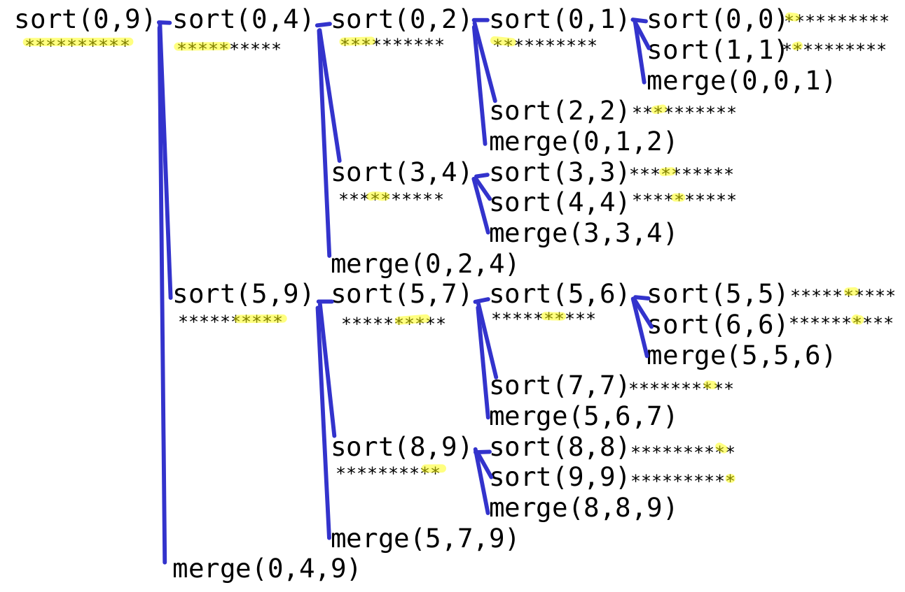

* TOC
{:toc}

## Oznamy

  - Zajtra 22:00 termín odovzdania prvého miniprojektu.
  - Druhý miniprojekt bude zverejnený dnes po prednáške, odovzdávajte do
    štvrtka 20.11. 22:00.
  - Dnes na cvičeniach nepovinný nebodovaný cvičný test (môžete dostať 1
    bonusový bod za aktívnu účasť).
  - V stredu 5.11. o 18:10 bude prvý semestrálny test.
  - Ak máte problémy so slovenčinou, môžeme vám k zadaniu testu dať aj
    automatický preklad do ukrajinčiny, ruštiny alebo angličtiny. Ak
    máte záujem, registrujte sa najneskôr do pondelka 3.11.
    nasledujúcim
    [formulárom](https://forms.office.com/Pages/ResponsePage.aspx?id=jUcxznpu50yGcKW51RiE-fk1X-AjVvpHm_pTPiHlkYlURjBHTFY3R0dNVktGWlExTjhYTksyNFZCNS4u).

<!-- end list -->

  - Plán na dnes: najskôr si ukážeme dva rýchle rekurzívne algoritmy na
    triedenie, potom sa vrátime k minulej téme prehľadávania s návratom.

## Rýchle triedenia prostredníctvom paradigmy „rozdeľuj a panuj”

Doposiaľ sme prebrali tri triediace algoritmy: *Bubble Sort*, *Insertion
Sort* a *Max Sort*. Všetky sú jednoduché, ale pomalé: majú kvadratickú
zložitosť *O(n<sup>2</sup>)*.

Dnes pridáme ďalšie dve triedenia, ktoré budú pre veľké polia omnoho
rýchlejšie: *Merge Sort* a *Quick Sort*. Obe sú založené na paradigme
*rozdeľuj a panuj* (angl. *divide and conquer*, lat. *divide et
impera*).

Rozdeľuj a panuj je paradigma rekurzívneho riešenia problémov pracujúca
v troch fázach:

  - **Rozdeľuj**: problém rozdelíme na menšie časti (t.j. podproblémy),
    ktoré sa dajú riešiť samostatne.
  - **Vyrieš podproblémy**: rekurzívne vyriešime úlohu pre každý
    podproblém.
  - **Panuj**: riešenia podproblémov spojíme do riešenia pôvodného
    problému.

## Triedenie zlučovaním (*Merge Sort*)

Triedenie zlučovaním (angl. *Merge Sort*) pracuje nasledovne:

  - Pole rozdelíme na dve približne rovnaké časti
  - Každú časť zvlášť rekurzívne utriedime
  - Vo fáze „panuj” sa tieto dve utriedené postupnosti zlúčia (angl.
    *merge*) do výsledného utriedeného poľa.

Príklad:

    Vstupné pole rozdelené na polovicu:
    |60 10 50 70 20|40 80 90 30 0|
    Po rekurzívnom utriedení ľavej časti
    |10 20 50 60 70|40 80 90 30 0|
    Po rekurzívnom utriedení pravej časti
    |10 20 50 60 70|0 30 40 80 90|
    Po zlúčení
    |0 10 20 30 40 50 60 70 80 90|

Triedenie zlučovaním tak bude vyzerať nasledovne (pričom zostáva
implementovať funkciu *merge*):

```cpp
void mergesort(int a[], int left, int right) {
/* Funkcia utriedi prvky pola a[] od indexu left po index right (vratane). */
    
    /* Trivialne pripady: */
    if (left >= right) {
        return;           
    }
    
    /* Rozdeluj -- spocitaj priblizny stred triedeneho useku: */
    int middle = (left + right) / 2;
          
    /* Rekurzivne vyries podproblemy: */
    mergesort(a, left, middle);
    mergesort(a, middle + 1, right);
       
    /* Panuj -- zluc obe utriedene casti do jednej: */ 
    merge(a, left, middle, right);
}
```

### Zlúčenie dvoch utriedených podpostupností

Zostáva naprogramovať zlúčenie dvoch utriedených postupností
`a[left..middle]`, `a[middle+1..right]` do jednej utriedenej
postupnosti.

Príklad:

    |10 20 50 60 70|0 30 40 80 90| -> |0 10 20 30 40 50 60 70 80 90|

Zlúčenú postupnosť budeme postupne ukladať do pomocného poľa `aux`,
pričom postupovať budeme nasledovne:

  - Prvým prvkom poľa `aux` bude menší z prvkov `a[left]` a
    `a[middle+1]`.
      - Ostanú nám postupnosti `a[left+1..middle]` a
        `a[middle+1..right]` alebo `a[left..middle]` a
        `a[middle+2..right]`.
  - Vo všeobecnosti máme postupnosti `a[i..middle]` a `a[j..right]`.
      - Ďalším prvkom poľa `aux` bude menší z prvkov `a[i]` a `a[j]`
      - Ostanú nám postupnosti `a[i+1..middle]` a `a[j..right]` alebo
        `a[i..middle]` a `a[j+1..right]`.
  - Toto robíme dovtedy, kým niektorú z postupností nevyčerpáme celú.
    Potom už len na koniec poľa `aux` dokopírujeme zvyšok druhej
    postupnosti.

Po spojení oboch postupností do utriedeného poľa `aux` toto pole
prekopírujeme naspäť do poľa `a`.

```cpp
void merge(int a[], int left, int middle, int right) {
    int aux[maxN];
    int i = left;       // index v prvej postupnosti
    int j = middle + 1; // index v druhej postupnosti
    int k = 0;          // index v poli aux
    
    while (i <= middle && j <= right) { 
        // Kým sú obe postupnosti a[i..middle], a[j..right] neprázdne,
        // menší z prvkov a[i], a[j] ulož do aux[k] a posuň indexy
        if (a[i] <= a[j]) {                         
            aux[k] = a[i];
            i++;
            k++;
        } else {
            aux[k] = a[j];
            j++;
            k++;
        }
    }
    
    while (i <= middle) {  
        // Ak niečo ostalo v prvej postupnosti, dokopíruj ju na koniec
        aux[k] = a[i];
        i++;
        k++;
    }
    
    while (j <= right) { 
        // Ak niečo ostalo v druhej postupnosti, dokopíruj ju na koniec
        aux[k] = a[j];
        j++;
        k++;
    }
    
    for (int t = left; t <= right; t++) { 
        // Prekopíruj pole aux naspať do poľa a 
        // pozícia 0 v aux pôjde na pozíciu left v a
        a[t] = aux[t - left];
    }
}
```

### Ukážka na príklade

Uvažujme pole `a = {60, 10, 50, 70, 20, 40, 80, 90, 30, 0}`.

Volanie `mergesort(a,0,9)` potom utriedi pole `a` pomocou nasledujúcich
rekurzívnych volaní (`mergesort(a,l,h)` je na obrázku skrátené na
`sort(l,h)` a `merge(a,l,m,h)` na `merge(l,m,h)`, žltou sú vyznačené
pozície v poli, ktoré sa v danom volaní triedia):

{:width="500px"}

Pole `a` sa počas týchto volaní mení nasledovne:

    merge(a,0,0,1): |60|10|50 70 20 40 80 90 30 0  -> |10 60|50 70 20 40 80 90 30 0
    merge(a,0,1,2): |10 60|50|70 20 40 80 90 30 0  -> |10 50 60|70 20 40 80 90 30 0
    merge(a,3,3,4):  10 50 60|70|20|40 80 90 30 0  ->  10 50 60|20 70|40 80 90 30 0
    merge(a,0,2,4): |10 50 60|20 70|40 80 90 30 0  -> |10 20 50 60 70|40 80 90 30 0
    merge(a,5,5,6):  10 20 50 60 70|40|80|90 30 0  ->  10 20 50 60 70|40 80|90 30 0
    merge(a,5,6,7):  10 20 50 60 70|40 80|90|30 0  ->  10 20 50 60 70|40 80 90|30 0
    merge(a,8,8,9):  10 20 50 60 70 40 80 90|30|0| ->  10 20 50 60 70 40 80 90|0 30|
    merge(a,5,7,9):  10 20 50 60 70|40 80 90|0 30| ->  10 20 50 60 70|0 30 40 80 90|
    merge(a,0,4,9): |10 20 50 60 70|0 30 40 80 90| -> |0 10 20 30 40 50 60 70 80 90|

### Odhad zložitosti

Zlučovanie dvoch postupností, ktoré spolu obsahujú *N* prvkov, trvá čas
*O(N)*. Prečo?

V algoritme máme *log<sub>2</sub> N* úrovní rekurzie:

  - na prvej spracovávame úseky dĺžky *N*,
  - na druhej *N/2*, na tretej *N/4* atď,
  - po *log<sub>2</sub> N* úrovniach dostaneme úseky dĺžky 1.

Na každej úrovni je každý prvok najviac v jednom zlučovaní, teda celkový
čas zlučovaní na každej úrovni je *O(N)*. Celkový čas výpočtu je *O(N
log N)*.

### Výsledný program

```cpp
#include <iostream>
using namespace std;

const int maxN = 1000;

void merge(int a[], int left, int middle, int right) {
    int aux[maxN];
    int i = left;
    int j = middle + 1;
    int k = 0;
    
    while (i <= middle && j <= right) {
        if (a[i] <= a[j]) {
            aux[k] = a[i];
            i++;
            k++;
        } else {
            aux[k] = a[j];
            j++;
            k++;
        }
    }
    
    while (i <= middle) {
        aux[k] = a[i];
        i++;
        k++;
    }
    
    while (j <= right) {
        aux[k] = a[j];
        j++;
        k++;
    }
    
    for (int t = left; t <= right; t++) {
        a[t] = aux[t - left];
    }
}

void mergesort(int a[], int left, int right) {
    if (left >= right) {
        return;
    }
    
    int middle = (left + right) / 2;
          
    mergesort(a, left, middle);
    mergesort(a, middle + 1, right);
       
    merge(a, left, middle, right);
}

int main() {
    int N;
    int a[maxN];
    
    cout << "Zadaj pocet cisel: ";
    cin >> N;
    cout << "Zadaj " << N << " cisel: ";
    for (int i = 0; i < N; i++) {
        cin >> a[i];
    }
    
    mergesort(a,0,N-1);
    
    cout << "Utriedene cisla:";
    for (int i = 0; i < N; i++) {
        cout << " " << a[i];
    }                        
    cout << endl;
}
```

## *Quick Sort*

*Quick Sort* je tiež založený na metóde rozdeľuj a panuj. Postupuje ale
nasledovne:

  - V rámci fázy *rozdeľuj* vyberie niektorý prvok poľa (napríklad jeho
    prvý prvok), ktorý nazve *pivotom*. Prvky poľa následne preusporiada
    na tri skupiny: v ľavej časti poľa budú prvky menšie ako pivot, za
    nimi pivot samotný a napokon v pravej časti prvky väčšie alebo rovné
    ako pivot.
  - *Rekurzívne utriedi* prvú a tretiu skupinu (druhá skupina má iba
    jeden prvok)
  - Vo fáze *panuj* už potom nemusí robiť nič – po utriedení spomínaných
    dvoch skupín totiž vznikne utriedené pole.

Príklad:

    Vstupné pole:
    |60 10 50 70 20 40 80 90 30 0| 
    Po rozdelení s pivotom 6:
    |0 10 50 20 40 30|60|90 70 80|
    Po rekurzívnom utriedení ľavej časti:
    |0 10 20 30 40 50|60|90 70 80|
    Po rekurzívnom utriedení pravej časti:
    |0 10 20 30 40 50|60|70 80 90|

Základ triedenia tak bude vyzerať nasledovne (pričom zostáva
implementovať funkciu `partition`):

```cpp
void quicksort(int a[], int left, int right) {
/* Utriedi cast pola a[] od indexu left po index right (vratane) */

    /* Trivialne pripady: */ 
    if (left >= right) {
        return; 
    }
    
    /* Rozdel pole na tri podpostupnosti: */ 
    int middle = partition(a, left, right); 
    // Po vykonani funkcie: 
    // a[left..middle-1] su mensie ako pivot 
    // a[middle] je pivot
    // a[middle+1..right] su vacsie ako pivot
    
    /* Rekurzivne utried a[left..middle-1], a[middle+1..right]: */    
    quicksort(a, left, middle-1);  
    quicksort(a, middle+1, right);   
}
```

### Funkcia `partition`

Funkcia `partition` na vstupe dostane pole `a` spolu s hraničnými
indexami `left` a `right`. Prvok `a[left]` vyberie ako pivot a
postupnosť `a[left..right]` preusporiada tak, aby pre nejakú hodnotu
`middle` takú, že `left <= middle <= right` platilo nasledovné:

  - Prvky `a[left],...,a[middle-1]` sú menšie, než pivot.
  - Prvok `a[middle]` je pivot.
  - Prvky `a[middle+1],...,a[right]` sú väčšie alebo rovné ako pivot.

Hodnotu `middle` potom funkcia `partition` vráti ako svoj výstup.

Funkcia `partition` udržiava nasledujúce invarianty:

  - Prvok `a[left]` je pivot.
  - Prvky `a[left+1],...,a[lastSmaller]` sú menšie ako pivot.
  - Prvky `a[lastSmaller+1],...,a[unknown-1]` sú väčšie alebo rovné ako
    pivot.
  - Prvky `a[unknown],...,a[right]` sa ešte s pivotom neporovnávali.

Funkcia `partition` zakaždým porovnáva prvok `a[unknown]` s pivotom:

  - Ak je menší ako pivot, je nutné „presunúť ho doľava”; vymení ho teda
    s `a[lastSmaller+1]` a hodnotu `lastSmaller` zvýši o jedna.
  - Ak je väčší alebo rovný ako pivot, môže ostať na svojom mieste.

Následne zvýši index `unknown` o jedna a tento postup opakuje, až kým
prejde cez všetky prvky danej časti poľa.

Nakoniec je ešte nutné vymeniť `a[left]` s `a[lastSmaller]`, čím sa
pivot dostane na svoje miesto.

```cpp
void swap (int &x, int &y) {
    int tmp = x;
    x = y;
    y = tmp;
}

int partition(int a[], int left, int right) {
    // Ak za pivot chceme zvolit iny prvok, vymenime ho najprv s a[left]
    int pivot = a[left];     
    int lastSmaller = left;
    
    for (int unknown = left + 1; unknown <= right; unknown++) {
        if (a[unknown] < pivot) {
            lastSmaller++;
            swap(a[unknown], a[lastSmaller]);
        }
    }   
    swap(a[left],a[lastSmaller]); 
    return lastSmaller;
}
```

### Ukážka na príklade

Opäť uvažujme pole `a = {60, 10, 50, 70, 20, 40, 80, 90, 30, 0}`.

Volanie `quicksort(0,9)` potom utriedi pole `a` pomocou nasledujúcich
rekurzívnych volaní (namiesto `quicksort(a,l,h)` píšeme zakaždým len
`sort(l,h)`):

    sort(0,9) sort(0,5) sort(0,-1)
              .         sort(1,5) sort(1,0)
              .         .         sort(2,5) sort(2,4) sort(2,2)
              .         .         .         .         sort(4,4)
              .         .         .         sort(6,5)
              sort(7,9) sort(7,8) sort(7,7)
                        .         sort(9,8)
                        sort(10,9)

Volania funkcie `partition` sú počas tohto behu nasledovné:

    partition(a,0,9): |60 10 50 70 20 40 80 90 30 0| -> |0 10 50 20 40 30|60|90 70 80|
    partition(a,0,5): |0 10 50 20 40 30|60 90 70 80  -> |0|10 50 20 40 30|60 90 70 80
    partition(a,1,5):  0|10 50 20 40 30|60 90 70 80  ->  0|10|50 20 40 30|60 90 70 80
    partition(a,2,5):  0 10|50 20 40 30|60 90 70 80  ->  0 10|30 20 40|50|60 90 70 80
    partition(a,2,4):  0 10|30 20 40|50 60 90 70 80  ->  0 10|20|30|40|50 60 90 70 80
    partition(a,7,9):  0 10 20 30 40 50 60|90 70 80| ->  0 10 20 30 40 50 60|80 70|90|
    partition(a,7,8):  0 10 20 30 40 50 60|80 70|90  ->  0 10 20 30 40 50 60|70|80|90

*Cvičenie*:

  - Ako sa bude Quick Sort správať, keď na vstupe dostane už utriedené
    pole?
  - Ako sa bude správať, keď na vstupe dostane zostupne utriedené pole?

### Odhad zložitosti

V ideálnom prípade pivot rozdelí pole na dve rovnako veľké časti. Vtedy
je čas výpočtu *O(N log N)*, podobne ako pre Mergesort.

Nepríjemné je, keď pivot je vždy najmenší alebo najväčší prvok v danom
úseku. Vtedy je čas *O(N<sup>2</sup>)*.

  - Aby sme sa vyhli problémom, v praxi sa ako pivot často vyberá
    náhodný prvok z intervalu.

### Výsledný program

```cpp
#include <iostream>
using namespace std;

const int maxN = 1000;

void swap (int &x, int &y) {
    int tmp = x;
    x = y;
    y = tmp;
}

int partition(int a[], int left, int right) {
    int pivot = a[left];
    int lastSmaller = left;
    
    for (int unknown = left + 1; unknown <= right; unknown++) {
        if (a[unknown] < pivot) {
            lastSmaller++;
            swap(a[unknown], a[lastSmaller]);
        }
    }   
    swap(a[left],a[lastSmaller]); 
    return lastSmaller;
}

void quicksort(int a[], int left, int right) {
    if (left >= right) {
        return; 
    }
    
    int middle = partition(a, left, right);
        
    quicksort(a, left, middle-1);  
    quicksort(a, middle+1, right);   
}

int main() {
    int N;
    int a[maxN];
    
    cout << "Zadaj pocet cisel: ";
    cin >> N;
    cout << "Zadaj " << N << " cisel: ";
    for (int i = 0; i <= N-1; i++) {
        cin >> a[i];
    }
    
    quicksort(a,0,N-1);
    
    cout << "Utriedene cisla:";
    for (int i = 0; i <= N-1; i++) {
        cout << " " << a[i];
    }                        
    cout << endl;
}
```

### Iná implementácia

Občas sa možno stretnúť aj s nasledujúcou implementáciou triedenia Quick
Sort. Skúste samostatne odôvodniť jej správnosť.

```cpp
void quicksort(int a[], int left, int right) {
    if (left >= right) {
        return;
    }
    
    /* partition */
    int pivot = a[(left + right)/2];
    int i = left;
    int j = right;
    
    while (i <= j) {
        while (a[i] < pivot) i++;
        while (a[j] > pivot) j--;
        if (i <= j) {
            swap(a[i],a[j]);
            i++; j--;
        }
    }
    
    /* rekurzia */    
    quicksort(a, left, j);
    quicksort(a, i, right);   
}
```

## Triediace algoritmy: zhrnutie

Jednoduché triedenia: Bubble Sort, Insertion Sort, Max Sort.

  - Jednoduché, ale pomalé: zložitosť *O(n<sup>2</sup>)*.

Rekurzívne triedenia založené na technike rozdeľuj a panuj.

  - Rýchlejšie, zložitejšie.
  - Merge Sort: zložitosť *O(n log n)*.
  - Quick Sort: zložitosť *O(n<sup>2</sup>)* v najhoršom prípade, pre
    väčšinu vstupov *O(n log n)*, väčšinou rýchlejší ako Merge Sort.

Reálnu rýchlosť triedení na náhodne zvolenom veľkom vstupe možno
porovnať napríklad nasledujúcim programom:

```cpp
#include <iostream>
#include <cstdlib>
#include <ctime>
using namespace std;

const int maxN = 100000;

void insertionsort(int a[], int n) {
    for (int i = 1; i < n; i++) {
        int prvok = a[i];
        int kam = i;
        while (kam > 0 && a[kam - 1] > prvok) {
            a[kam] = a[kam - 1];
            kam--;
        }
        a[kam] = prvok;
    }
}

void merge(int a[], int left, int mid, int right) {
    int aux[maxN];
    int i = left;
    int j = mid + 1;
    int k = 0;

    while ((i <= mid) && (j <= right)) {
        if (a[i] <= a[j]) {
            aux[k] = a[i];
            i++;
            k++;
        } else {
            aux[k] = a[j];
            j++;
            k++;
        }
    }

    while (i <= mid) {
        aux[k] = a[i];
        i++;
        k++;
    }

    while (j <= right) {
        aux[k] = a[j];
        j++;
        k++;
    }

    for (int k = left; k <= right; k++) {
        a[k] = aux[k - left];
    }
}

void mergesort(int a[], int left, int right) {
    if (left >= right) {
        return;
    }

    int mid = (left + right) / 2;

    mergesort(a, left, mid);
    mergesort(a, mid + 1, right);

    merge(a, left, mid, right);
}

void swap(int &x, int &y) {
    int tmp = x;
    x = y;
    y = tmp;
}

int partition(int a[], int left, int right) {
    int pivot = a[left];
    int lastSmaller = left;

    for (int unknown = left + 1; unknown <= right; unknown++) {
        if (a[unknown] < pivot) {
            lastSmaller++;
            swap(a[unknown], a[lastSmaller]);
        }
    }
    swap(a[left], a[lastSmaller]);
    return lastSmaller;
}

void quicksort(int a[], int left, int right) {
    if (left >= right) {
        return;
    }

    int mid = partition(a, left, right);

    quicksort(a, left, mid - 1);
    quicksort(a, mid + 1, right);
}

int main() {
    int N;
    int a1[maxN];
    int a2[maxN];
    int a3[maxN];

    cout << "Zadaj pocet nahodnych cisel v poli: ";
    cin >> N;

    srand(time(NULL));
    for (int i = 0; i <= N - 1; i++) {
        a1[i] = rand() % 1000;
        a3[i] = a2[i] = a1[i];
    }

    clock_t start1, end1, start2, end2, start3, end3;

    start1 = clock();
    insertionsort(a1, N);
    end1 = clock();

    start2 = clock();
    mergesort(a2, 0, N - 1);
    end2 = clock();

    start3 = clock();
    quicksort(a3, 0, N - 1);
    end3 = clock();

    cout << "Insertion sort: " 
     << (end1 - start1) * 1.0 / CLOCKS_PER_SEC << " CPU sekund" << endl;
    cout << "Merge sort: " 
     << (end2 - start2) * 1.0 / CLOCKS_PER_SEC << " CPU sekund" << endl;
    cout << "Quick sort: " 
     << (end3 - start3) * 1.0 / CLOCKS_PER_SEC << " CPU sekund" << endl;

}
```

Tu sú ukážky troch behov programu pre rôzne veľké polia. Časy sa líšia
od počítača k počítaču a od volania k volaniu.

  - Pre milión čísel by sme u insertion sortu predpokladali zhruba
    100-násobný čas, t.j. 500s alebo 8.3min, kým Quicksort a Mergesort
    by stále trvali menej ako sekundu.

<!-- end list -->

    Zadaj pocet nahodnych cisel v poli: 100000
    Insertion sort: 5.03091 CPU sekund
    Merge sort: 0.045339 CPU sekund
    Quick sort: 0.017915 CPU sekund
    
    Zadaj pocet nahodnych cisel v poli: 10000
    Insertion sort: 0.068281 CPU sekund
    Merge sort: 0.005041 CPU sekund
    Quick sort: 0.001093 CPU sekund

## Problém batoha (*Knapsack problem*)

Dnes sme videli ako použiť rekurziu v rýchlych algoritmoch, teraz sa
však vráťme k prehľadávaniu s návratom z minulej prednášky, čo je
pomalá metóda pre prípady, keď nepoznáme lepší algoritmus.

Metódu prehľadávania s návratom využijeme na riešenie problému batoha.
Ide o dôležitý problém, s ktorým sa ešte počas štúdia stretnete.
Predstaviť si ho môžeme napríklad takto:

  - Zlodej sa vlúpal do obchodu, v ktorom našiel niekoľko predmetov.
  - Pozná cenu aj hmotnosť predmetov.
  - Z obchodu dokáže odniesť iba lup nepresahujúci nosnosť svojho
    batoha.
  - Ktoré predmety má zlodej odcudziť, aby ich celková hmotnosť
    nepresahovala nosnosť batoha a aby odišiel s čo najcennejším lupom?

Vstup nášho programu bude vyzerať napríklad nejako takto:

    Zadaj pocet predmetov v obchode: 3
    Zadaj hmotnost a cenu predmetu 1: 5 9
    Zadaj hmotnost a cenu predmetu 2: 4 6
    Zadaj hmotnost a cenu predmetu 3: 4 4
    Zadaj nosnost batoha: 8

Výstup programu na horeuvedenom vstupe potom bude takýto:

    Zober nasledujuce predmety: 2 3
    Celkova hodnota lupu: 10

Pri reálnom použití nosnosť batoha môže reprezentovať dostupné zdroje,
napr. výpočtový čas na serveri, dostupných pracovníkov, veľkosť rozpočtu
a pod, a predmety sú potenciálne úlohy, z ktorých si chceme vybrať
podmnožinu, ktorú by sme s danými zdrojmi vedeli vykonať a dosiahnuť čo
najvyšší zisk alebo iný ukazovateľ.

### Prvé riešenie: preskúmanie všetkých podmnožín

  - Preskúmame všetky podmnožiny množiny predmetov v obchode, čiže
    všetky potenciálne lupy.
  - Na to upravíme program generujúci všetky podmnožiny danej množiny.
  - Pre každú podmnožinu namiesto výpisu spravíme nasledovné:
      - Spočítame celkovú hmotnosť a cenu nájdeného potenciálneho lupu.
      - Ak hmotnosť tohto lupu nepresahuje nosnosť batoha, porovnáme
        jeho cenu s najlepším doposiaľ nájdeným lupom.
      - Ak je cennejší, ako doposiaľ najlepší lup, ide o nového
        kandidáta na optimálny lup a zapamätáme si ho.

<!-- end list -->

  - Pre jednoduchosť použijeme v programe globálne premenné, lebo
    potrebujeme veľa údajov
      - Globálne premenné spôsobujú problémy vo väčších programoch: mená
        premenných sa môžu "biť", môžeme si omylom prepísať číslo
        dôležité v inej časti programu
      - Mohli by sme si tiež spraviť `struct` obsahujúci všetky premenné
        potrebné v rekurzii a odovzdávať si ten

Podmnožiny budeme reprezentovať poľom typu `bool`, v ktorom si pre každý
predmet pamätáme, či do danej podmnožiny patrí.

```cpp
#include <iostream>
using namespace std;

const int maxN = 100;

/* Struktura reprezentujuca jeden predmet */
struct predmet {
    int hmotnost;
    int cena;
}; 

/* Globalne premenne pouzivane v rekurzii: */

// pocet predmetov v obchode
int N;                         
// pole s udajmi o jednotlivych predmetoch
predmet veci[maxN];                 
// nosnost batoha
int nosnost;                     

// najcennejsi doposial najdeny lup
bool maxLup[maxN];          
// jeho cena (kazdy lup bude urcite cennejsi ako -1)
int maxCena = -1;    

int spocitajHmotnostLupu(bool lup[]) {
    int hmotnost = 0;
    for (int i = 0; i < N; i++) {
        if (lup[i]) {
            hmotnost += veci[i].hmotnost;
        }
    }
    return hmotnost;
}

int spocitajCenuLupu(bool lup[]) {
    int cena = 0;
    for (int i = 0; i < N; i++) {
        if (lup[i]) {
            cena += veci[i].cena;
        }
    }
    return cena;
}

void vypisLup(bool lup[]) {
    cout << "Zober nasledujuce predmety:";
    for (int i = 0; i < N; i++) {
        if (lup[i]) {
             cout << " " << i + 1;
        }            
    }
    cout << endl;
}

/* Generovanie vsetkych moznych lupov (podmnozin predmetov) */
void generuj(bool lup[], int index) {
    /* V poli lup[] dlzky N postupne generujeme podmnoziny.
       O hodnotach lup[0],...,lup[index-1] uz je rozhodnute.
       Postupne vygenerujeme vsetky moznosti 
       pre lup[index],...,lup[N-1].
       Kazdy lup porovname s doposial najlepsim 
       a v pripade potreby optimum aktualizujeme.    
    */
    if (index == N) {                                
        // Lup je vygenerovany; zisti, ci ho batoh unesie.                               
        if (spocitajHmotnostLupu(lup) <= nosnost) {  
            // Ak ano, porovnaj cenu s doposial najlepsim.
            int cenaLupu = spocitajCenuLupu(lup);
            if (cenaLupu > maxCena) {    
                // Ak je najdeny lup drahsi, uloz ho
                maxCena = cenaLupu;
                for (int i = 0; i < N; i++) {
                    maxLup[i] = lup[i];
                } 
            }
        }
    } else {                                         
        // Lup este nie je vygenerovany,
        // skus obe moznosti pre lup[index]. 
        lup[index] = false;
        generuj(lup, index+1);
        lup[index] = true;
        generuj(lup, index+1);
    }
} 

int main() {
    cout << "Zadaj pocet predmetov v obchode: ";
    cin >> N;
    for (int i = 0; i < N; i++) {
        cout << "Zadaj hmotnost a cenu predmetu " 
             << (i+1) << ": ";
        cin >> veci[i].hmotnost >> veci[i].cena;
    }
    cout << "Zadaj nosnost batoha: ";
    cin >> nosnost;
    
    bool lup[maxN];
    generuj(lup, 0);
    
    vypisLup(maxLup);
    cout << "Celkova hodnota lupu: " 
         << maxCena << endl;
}
```

Cvičenie: Čo bude program robiť, keď každý predmet má hmotnosť väčšiu
ako nosnosť batoha?

### Optimalizácia č. 1: ukončenie prehľadávania vždy, keď je prekročená nosnosť

Keď je už po vygenerovaní nejakej podmnožiny (čiže prvých niekoľko
hodnôt poľa `lup`) jasné, že hmotnosť lupu bude presahovať nosnosť
batoha, možno túto vetvu prehľadávania ukončiť.

Okrem samotnej funkcie `generuj` je potrebné prispôsobiť aj funkciu
`spocitajHmotnostLupu` tak, aby ju bolo možné aplikovať aj na neúplne
vygenerované podmnožiny.

```cpp
/* Potrebujeme vediet spocitat hmotnost len pre cast predmetov: */

int spocitajHmotnostLupu(bool lup[], int pokial) {
    int hmotnost = 0;
    for (int i = 0; i <= pokial; i++) {
        if (lup[i]) {
            hmotnost += veci[i].hmotnost;
        }
    }
    return hmotnost;
}

void generuj(bool lup[], int index) {
    if (spocitajHmotnostLupu(lup, index-1) > nosnost) {
        // Ak dosial vygenerovana cast lupu presahuje nosnost batoha, 
        // mozno prehladavanie ukoncit
        return;  
    }
    if (index == N) {
        int cenaLupu = spocitajCenuLupu(lup);
        if (cenaLupu > maxCena) {
            maxCena = cenaLupu;
            for (int i = 0; i < N; i++) {
                maxLup[i] = lup[i];
            } 
        }
    } else {
        lup[index] = false;
        generuj(lup, index+1);
        lup[index] = true;
        generuj(lup, index+1);
    }
} 
```

Cvičenie: Čo bude program robiť, keď každý predmet má hmotnosť väčšiu
ako nosnosť batoha?

### Optimalizácia č. 2: hmotnosť a cenu lupu netreba zakaždým počítať odznova

Predchádzajúci program vždy znovu a znovu prepočítava hmotnosť a cenu
lupu, aj keď sa zoznam vybraných predmetov zmení iba trochu. Namiesto
toho môžeme cenu a hmotnosť doposiaľ vygenerovanej časti lupu predávať
funkcii `generuj` ako parameter.

```cpp
#include <iostream>
using namespace std;

const int maxN = 100;

/* Struktura reprezentujuca jeden predmet */
struct predmet {
    int hmotnost;
    int cena;
}; 

/* Globalne premenne pouzivane v rekurzii: */

// pocet predmetov v obchode
int N;                         
// pole s udajmi o jednotlivych predmetoch
predmet veci[maxN];                 
// nosnost batoha
int nosnost;                     

// najcennejsi doposial najdeny lup
bool maxLup[maxN];          
// jeho cena (kazdy lup bude urcite cennejsi ako -1)
int maxCena = -1;    

void vypisLup(bool lup[]) {
    cout << "Zober nasledujuce predmety:";
    for (int i = 0; i < N; i++) {
        if (lup[i]) {
             cout << " " << i + 1;
        }            
    }
    cout << endl;
}

void generuj(bool lup[], int index, int hmotnostLupu, int cenaLupu) {
    if (hmotnostLupu > nosnost) {
        // Ak dosial vygenerovana cast lupu presahuje nosnost batoha, 
        // mozno prehladavanie ukoncit
        return;  
    }
    if (index == N) {
        if (cenaLupu > maxCena) {
            maxCena = cenaLupu;
            for (int i = 0; i < N; i++) {
                maxLup[i] = lup[i];
            } 
        }
    } else {
        lup[index] = false;
        generuj(lup, index+1, hmotnostLupu, cenaLupu);
        lup[index] = true;
        generuj(lup, index+1,
        hmotnostLupu + veci[index].hmotnost, 
                cenaLupu + veci[index].cena);
    }
} 

int main() {
    cout << "Zadaj pocet predmetov v obchode: ";
    cin >> N;
    for (int i = 0; i < N; i++) {
        cout << "Zadaj hmotnost a cenu predmetu " 
             << (i+1) << ": ";
        cin >> veci[i].hmotnost >> veci[i].cena;
    }
    cout << "Zadaj nosnost batoha: ";
    cin >> nosnost;
    
    bool lup[maxN];
    // Doposial nie je nic vygenerovane; 
    // hmotnost aj cena lupu su zatial nulove
    generuj(lup, 0, 0, 0);
    
    vypisLup(maxLup);
    cout << "Celkova hodnota lupu: " 
         << maxCena << endl;
}
```

