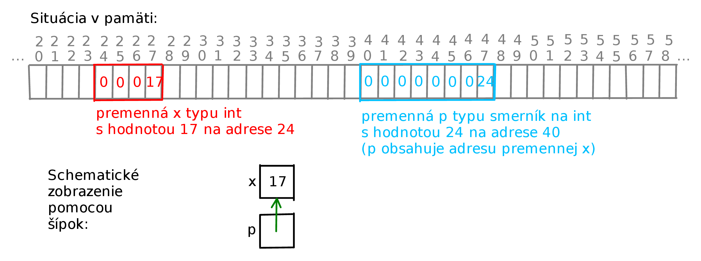

* TOC
{:toc}

## Oznamy

  - Druhý miniprojekt je zverejnený, odovzdávajte do štvrtka 20.11.
    22:00.
  - V stredu o 18:10 bude prvý semestrálny test v posluchárňach A a B.
      - Trvanie testu 45 minút.
      - Pokrýva učivo po prednášku 10 vrátane.
      - Rozsadenie bude na dverách posluchárne.
      - Prineste si ISIC a pero.
      - Vlastné papiere ani žiadne ďalšie pomôcky nie sú povolené.
        Mobily, hodinky a iné elektronické zariadenia musia byť vypnuté
        a odložené v taške.
      - Zákaz odpisovať od spolužiakov a komunikovať s inými osobami než
        vyučujúcimi.
      - Ak máte otázku k zadaniu prihláste sa, pokúsime sa vám pomôcť.
        Nebudeme vám ale radiť, ako riešiť úlohy.
      - Po opustení miestnosti nebude možné vrátiť sa a pokračovať v
        písaní testu.
  - Dnes nová téma: smerníky a práca s pamäťou.
  - Zajtra na cvičeniach rozcvička z dnešnej prednášky.
  - Cvičenia v stredu sú dobrovoľné, nebude bonusová rozcvička.

## Ukazovateľ, smerník, pointer

  - Pamäť v počítači je rozdelená na dieliky, napr. bajty.
  - Každá premenná zaberá niekoľko takýchto dielikov.
  - Každý dielik má adresu (poradové číslo).
  - Ukazovateľ (resp. smerník alebo pointer) je premenná, ktorej hodnota
    je adresa iného dieliku pamäte.

<!-- end list -->

  - Na obrázku je na adrese `24` uložená premenná `x` typu `int`, ktorej
    hodnota je 17.
  - Na adrese `40` je uložený smerník `p`, ktorého hodnota je `24`.
      - Hovoríme, že smerník `p` ukazuje na premennú `x`, zjednodušene
        to budeme kresliť ako šípku, viď spodok obrázku.
      - Väčšinou nás nezaujíma, aké sú presné hodnoty adries, chceme si
        ale vedieť nakresliť podobný obrázok so šípkami.

{:width="700px"}

Takúto situáciu (len s inými adresami) vyrobíme príkazmi

    int x = 17;   // vytvorenie a inicializácia premennej x
    int * p;      // vytvorenie premennej p, ktorá bude smerník na int
    p = & x;      // & x vráti adresu premennej x, tú uložíme do premennej p

### Operátor `*` (dereferencia, dáta na adrese)

  - Ak `p` je smerník, pomocou `*p` môžeme pristúpiť k údajom na adrese
    reprezentovanej smerníkom `p`.
  - Tieto údaje potom možno aj meniť.
  - Ak máme `x` a `p` ako vyššie, t.j. `p = &x`, tak ďalej v programe
    `*p` aj `x` sú mená pre ten istý dielik pamäte.

<!-- end list -->

```cpp
int x = 17;
int * p = &x;       // p ukazuje na adresu premennej x
cout << *p << endl; // vypíše hodnotu z adresy p, t.j. 17
*p = 9;             // hodnota na adrese p sa zmení na 9
cout << x << endl;  // vypíše hodnotu premennej x, t.j. 9
(*p)++;             // hodnota na adrese p sa zmení na 10
cout << x << endl;  // vypíše hodnotu premennej x, t.j. 10
x = 42;
cout << *p << endl;  // vypíše hodnotu na adrese p, t.j. 42
```

### Smerník `NULL`

Dôležitým špeciálnym prípadom smerníka je konštanta `NULL`
reprezentujúca smerník, ktorý nikam neukazuje.

  - Je definovaná vo viacerých štandardných knižniciach, ako napríklad
    `cstdlib` alebo `iostream`.
  - Možno ju priradiť do smerníka ľubovoľného typu.

Pozor, ak do premennej typu smerník nič nepriradíme, má nedefinovanú
hodnotu, ukazuje na náhodné miesto v pamäti, alebo niekde mimo.

## Smerník ako parameter funkcie

Namiesto odovzdávania parametrov referenciou ich môžeme odovzdať pomocou
smerníka. Tu je napríklad smerníková verzia funkcie swap, ktorá vymieňa
hodnoty dvoch premenných.

```cpp
#include <iostream>
using namespace std;

void swap(int * px, int * py) {  // parametre sú smerníky
    // hodnotu z adresy px uložíme do tmp:
    int tmp = *px;
    // na adresu px uložíme hodnotu z adresy py:
    *px = *py;
    // na adresu py uložíme tmp:
    *py = tmp;
}

int main() {
    int x, y;
    cout << "Zadaj x,y: ";
    cin >> x >> y;
    // ako parametre pošleme adresy premenných x,y
    swap(&x, &y);                                  
    cout << "x = " << x 
         << ", y = " << y << endl;
}
```

Knižničné funkcie v C často používajú odovzdávanie parametrov cez
smerníky.

## Smerníky a polia

Smerníky a polia v jazyku C spolu veľmi úzko súvisia.

  - Pole je vlastne smerník na nultý prvok.
  - Môžeme ho nakopírovať do premennej typu `T *`.
  - Na premenné typu `T *` môžeme použiť operátor `[]`.

<!-- end list -->

```cpp
int a[4] = {10, 20, 30, 40};
int * p;
p = a;        // p ukazuje na nulty prvok pola a
cout << a[1]; // vypise 20
cout << p[1]; // vypise 20
```

  - Polia v C pozostávajú z políčok rovnakej veľkosti uložených v pamäti
    jedno za druhým, veľkosť políčka je daná typom prvku
  - Výraz `p[i]` zoberie adresu uloženú v `p`, zvýši ju o
    `veľkosť_políčka * i` a pozrie sa na príslušnú adresu
  - `p[0]` je teda to isté ako `*p`
  - Pozor, C umožní `p[i]` použiť aj keď `p` neukazuje na pole, vtedy
    pristupuje do pamäte s neznámym obsahom, program môže skončiť s
    chybou alebo sa správať "záhadne"

<!-- end list -->

```cpp
int x = 10;
int * p;
p = &x;
cout << p[1]; // ??? pristupuje do pamäte za premennou x
              // môže to mať nepríjemné dôsledky
```

Polia sú konštantné smerníky, nemožno ich zmeniť.

```cpp
int a[4] = {10, 20, 30, 40};
int b[3] = {1, 2, 3};
int * p = b;  // ok
p = a;        // ok
a = b;        // nedá sa
a = p;        // nedá sa
```

Vo funkciách pracujúcich s poliami môžeme namiesto parametra `int a[]`
písať aj `int *a` a kód ani použitie funkcie sa nemení.

```cpp
#include <iostream>
using namespace std;

void vypisPole(int a[], int n) {
    for (int i = 0; i < n; i++) {
        cout << a[i] << " ";
    }
    cout << endl;
}

void vypisPole2(int * a, int n) {
    for (int i = 0; i < n; i++) {
        cout << a[i] << " ";
    }
    cout << endl;
}

int main() {
    const int N  = 4;
    int a[N] = {10, 20, 30, 40};
    int *b = a;
    
    //styrikrat vypiseme to iste
    vypisPole(a, N); 
    vypisPole(b, N);
    vypisPole2(a, N);
    vypisPole2(b, N);
}
```

## Dynamická alokácia a dealokácia pamäte

Doteraz sme videli:

  - Globálne premenné, ktoré majú vopred známu veľkosť a vyhradenú
    pamäť.
  - Lokálne premenné, ktoré majú vopred známu veľkosť, ale pamäť sa im
    prideľuje až pri volaní funkcie na zásobníku volaní funkcií (call
    stack).

Program si ale počas behu môže podľa potreby vyhradiť aj ďalšiu pamäť:

  - Používa sa na to operátor `new`.
  - Pamäť sa vyhradí v oblasti zvanej halda (heap).
  - Keď už pamäť nepotrebujeme, uvoľníme ju príkazom `delete`.
  - Uvoľnená pamäť môže byť znovu použitá pri ďalších volaniach `new`.

### Alokácia pamäte na jednu premennú

```cpp
int * p;   

// new vyhradí úsek pamäte pre jednu hodnotu typu int
// adresa tohto úseku sa uloží do smerníka p
p = new int;   

// do alokovanej pamäte sa uloží hodnota 50  
*p = 50;
cout << *p << endl;  // výpis 50

delete p;      // uvoľnenie alokovanej pamäte
```

### Alokácia pamäte pre pole

```cpp
int * p; 

// new vyhradí úsek pamäte pre pole 5 hodnôt typu int
p = new int[5];

// premenná p sa dá použiť ako pole dĺžky 5
for(int i = 0; i < 5; i++) {
   p[i] = i;
}   

delete[] p;     // uvoľnenie alokovanej pamäte 
```

  - Pozor, ak alokujeme pole, pamäť uvoľnujeme cez `delete[]`, nie
    `delete`
  - Ak zamieňate `delete[]` a `delete`, správanie programu môže byť
    nedefinované

<!-- end list -->

    int * p;
    
    p = new int;
    // ...
    delete p;
    
    p = new int[5];
    // ...
    delete[] p;

Dynamickú alokáciu polí možno využiť napríklad na vytvorenie poľa,
ktorého veľkosť zadá používateľ.

```cpp
#include <iostream>
using namespace std;

int main(void) {
    cout << "Zadaj pocet cisel: ";
    int N;
    cin >> N;
    int * a = new int[N];
    
    cout << "Zadavaj " << N << " cisel:" << end;
    for (int i = 0; i <= N-1; i++) {
        cin >> a[i];
    }
    cout << "Tu su cisla odzadu:" << endl;
    for (int i = N-1; i >= 0; i--) {
        cout << a[i] << " ";
    }
    cout << endl;

    delete[] a;
}
```

Poznámka:

  - V našich programoch sme vytvárali polia, ktorých veľkosť bola
    konštanta `const int maxN = 100; int a[maxN];`
  - Niektoré kompilátory dovolia vytvoriť aj pole, ktorého veľkosť sa
    zistí počas behu programu `int N; cin >> N; int a[N];`
      - Nefunguje to však vždy, navyše môže byť problém s veľkými
        poliami, lebo veľkosť zásobníka volaní môže byť obmedzená.
  - Pri alokovaní poľa pomocou `new` vždy môžeme použiť veľkosť, ktorá
    sa zistila až počas behu `int N; cin >> N; int *a = new int[N];`
      - Alokovanie má aj ďalšie výhody, takto vytvorené pole sa
        napríklad dá vrátiť ako výsledok funkcie.

## Aplikácia smerníkov: dynamické polia

V praxi často narazíme na nasledujúci problém: chceme zo vstupu načítať
do poľa nejaké údaje, ale vopred nevieme, koľko ich bude a teda aké
veľké pole potrebujeme vytvoriť.

  - Doteraz sme to riešili konštantou `MaxN` ohraničujúcou maximálnu
    povolenú veľkosť vstupu, ale to má problémy:
      - Ak je vstup väčší ako `MaxN`, nevieme ho spracovať, aj ak by
        inak kapacity počítača postačovali
      - Ak je vstup oveľa menší ako `MaxN`, zbytočne zaberáme pamäť
        veľkým poľom, ktorého veľká časť je nevyužitá
  - Pre jednoduchosť budeme uvažovať na vstupe postupnosť nezáporných
    čísel ukončenú -1, napr. `7 3 0 4 3 -1`
      - Do poľa chceme uložiť všetko okrem poslednej -1
      - Používateľ nám vopred nezadá počet prvkov

Riešením je postupne alokovať väčšie a väčšie polia podľa potreby

  - Začneme s malým poľom (napr. veľkosti 2)
  - Vždy keď sa pole zaplní, alokujeme nové pole dvojnásobnej veľkosti,
    prvky do neho skopírujeme a staré pole odalokujeme
  - Presúvanie prvkov dlho trvá, preto pole vždy zdvojnásobíme, aby sme
    nemuseli presúvať často
  - Spolu pri načítaní *n* prvkov robíme najviac *2n* presunov
    jednotlivých prvkov

Takáto verzia poľa, ktorá rastie podľa potreby, sa nazýva *dynamické
pole*

  - V štandardných C++ knižniciach je definovaná dátová štruktúra
    [vector](http://www.cplusplus.com/reference/vector/vector/), ktorá
    sa správa podobne.
  - My teraz implementujeme zjednodušenú verziu tejto štruktúry.
  - Pre jednoduchosť napíšeme iba verziu dynamického poľa pre typ `int`.
    Analogicky by sme postupovali pre iné typy.

Dynamické pole celých čísel budeme reprezentovať ako štruktúru typu
`dynArray`, ktorá bude pozostávať z nasledujúcich troch zložiek:

  - Zo smerníku `items` ukazujúceho na nultý prvok poľa (čiže vlastne
    pole samotné).
  - Z celočíselnej premennej `length`, v ktorej bude počet prvkov, ktoré
    sú aktuálne v poli.
  - Z celočíselnej premennej `size`, v ktorej bude veľkosť alokovanej
    pamäte pre pole `items`.

Štruktúra `dynArray` teda v sebe združuje pole aj jeho dĺžku, stačí
posielať jeden parameter.

Napíšeme niekoľko funkcií, pomocou ktorých budeme s dynamickými poľami
manipulovať.

  - Funkcia `void init(dynArray &a)` inicializuje dynamické pole `a`, v
    ktorom je nula prvkov. Funkcia ale alokuje nejaký malý objem pamäte
    (u nás dva prvky).
  - Funkcia `void add(dynArray &a, int x)` pridá do dynamického poľa `a`
    prvok s hodnotou `x`, čím počet prvkov vzrastie o jedna. V prípade
    potreby ešte predtým realokuje pamäť.
  - Funkcia `int get(dynArray a, int index)` vráti prvok dynamického
    poľa `a` na pozícii `index`. V prípade, že `index` nereprezentuje
    korektnú pozíciu prvku poľa (teda je menší ako `0` alebo väčší, než
    `a.length - 1`), ukončí vykonávanie programu pomocou `assert`.
  - Funkcia `void set(dynArray &a, int index, int x)` nastaví prvok
    dynamického poľa na pozícii `index` na hodnotou `x`. Ak `index`
    nereprezentuje korektnú pozíciu prvku poľa, ukončí vykonávanie
    programu pomocou `assert`.
  - Funkcia `int length(dynArray a)` vráti počet prvkov aktuálne
    uložených v dynamickom poli `a`.
  - Funkcia `void destroy(dynArray &a)` zlikviduje dynamické pole `a`
    (uvoľní pamäť).

Bez ohľadu na implementáciu samotného dynamického poľa už teda vieme
napísať kostru programu, ktorý ho využíva, napríklad na výpis vstupu
odzadu.

```cpp
#include <iostream>
#include <cassert>
using namespace std;

struct dynArray {
// ...
};

// definície funkcií init, add, get, set, length, destroy

int main() {
    dynArray a;
    init(a);  // inicializuje a
    
    int x;
    cin >> x;
    // pridavame prvky, kym su nezaporne
    while (x >= 0) {                 
        add(a, x);     
        cin >> x;    
    }
    // vypise prvky pola od konca
    for (int i = length(a) - 1; i >= 0; i--) {
        cout << get(a, i) << " ";     
    }
    cout << endl;

    // ukazka pouzitia get a set
    set(a, 0, 42);   
    cout << get(a, 0) << endl;  

    destroy(a);  // uvolni pamat
}
```

### Implementácia dynamického poľa

```cpp
#include <iostream>
#include <cassert>
using namespace std;

/* Dynamicke pole celych cisel */
struct dynArray {
    int * items;    // smerník na prvý prvok poľa
    int size;       // veľkosť alokovaného poľa
    int length;     // počet prvkov pridaných do poľa
};

void init(dynArray & a) {
    /* Inicializuje dynamické pole veľkosti 2 */
    a.size = 2;
    a.length = 0;
    a.items = new int[a.size];
}

void reallocate(dynArray & a, int newSize) {
    /* Pomocna funkcia, ktora sa pouziva vo funkcii add.
     * Zmeni velkost pola zo size na newSize,
     * prekopiruje vsetky prvky do noveho pola. */

    assert(a.length <= newSize);
    a.size = newSize;
    // alokujeme nove pole
    int * newItems = new int[a.size];
    // prekopirujeme stare pole do noveho
    for (int i = 0; i < a.length; i++) {
        newItems[i] = a.items[i];
    }
    // uvolnime stare pole
    delete[] a.items;
    a.items = newItems;  // a.items teraz ukazuje na nove pole
}

void add(dynArray & a, int x) {
    /* Prida na koniec dynamickeho pola prvok x
     * a v pripade potreby realokuje pole */

    // ak uz sa x do pola nevojde
    if (a.length == a.size) {
        // zdvojnasobime velkost pola items
        reallocate(a, a.size * 2);
    }
    // teraz je pole urcite dost velke
    // pridame x a zvysime pocet prvkov
    a.items[a.length] = x;
    a.length++;
}

int get(dynArray & a, int index) {
    /* Vrati prvok dynamickeho pola a na pozicii index
     * (ak ide o korektnu poziciu)*/
    assert(index >= 0 && index <= a.length - 1);
    return a.items[index];
}

void set(dynArray & a, int index, int x) {
    /* Ulozi na poziciu index dynamickeho pola a hodnotu x
     * (ak ide o korektnu poziciu)*/
    assert(index >= 0 && index <= a.length - 1);
    a.items[index] = x;
}

int length(dynArray & a) {
    /* Vrati pocet prvkov v dynamickom poli a */
    return a.length;
}

void destroy(dynArray & a) {
    /* Uvolni alokovanu pamat pre pole a */
    delete[] a.items;
}

int main() {
    dynArray a;
    init(a);  // inicializuje a

    int x;
    cin >> x;
    // pridavame prvky, kym su nezaporne
    while (x >= 0) {
        add(a, x);
        cin >> x;
    }
    // vypise prvky pola od konca
    for (int i = length(a) - 1; i >= 0; i--) {
        cout << get(a, i) << " ";
    }
    cout << endl;

    // ukazka pouzitia get a set
    set(a, 0, 42);
    cout << get(a, 0) << endl;

    destroy(a);  // uvolni pamat
}
```

## Ďalšie detaily používania smerníkov

### Typy smerníkov

Smerník ukazujúci na premennú typu `T` sa definuje ako `T *p`,
napríklad:

```cpp
int    * p1;   // smerník p1 na int
char   * p2;   // smerník p2 na char
double * p3;   // smerník p3 na double
// atď
```

Smerníky ukazujúce na premenné rôznych typov sú takisto rôznych typov.
Bez pretypovania sa nedá medzi nimi priraďovať.

```cpp
int * p1;
int * p2;
double * p3;

p1 = p2;   // korektné priradenie
p3 = p1;   // chyba
```

### Operátor `&` (adresa)

  - Videli sme, že adresu premennej vieme zistiť operátorom &
  - Tú potom môžeme priradiť do premennej typu smerník

<!-- end list -->

```cpp
int x = 17;
int * p;
p = &x;
```

Premenná *p* teraz ukazuje na miesto, kde je uložená celočíselná
premenná *x*.

  - Operátor `&` možno aplikovať aj na prvky poľa (alebo položky
    struct-u)
  - Operátor `&` nemožno aplikovať na konštanty ani na výrazy

<!-- end list -->

```cpp
int x = 0;
int a[5] = {1, 2, 3, 4, 5};
int * p;

p = &x;       // korektné priradenie
p = &a[2];    // korektné priradenie
p = &(x + 1); // chyba (výraz nemá adresu)
p = &42;      // chyba (konštanta 42 nemá adresu)
```

## Ladenie programov so smerníkmi

  - Smerníky (a polia) môžu byť nepríjemným zdrojom chýb, keďže
    kompilátor nekontroluje, či sú používané správne.
  - Napríklad možno čítať aj zapisovať mimo alokovanej pamäte.
  - S odchytávaním takýchto chýb môžu pomôcť automatizované nástroje,
    ako napríklad [Valgrind](http://valgrind.org/) (pre Linux) alebo
    [Dr. Memory](http://drmemory.org/) (pre Windows aj Linux).
  - [Návod na prácu s programom valgrind](./Valgrind.md)

## Zhrnutie

  - Smerník, ukazovateľ, pointer je premenná, v ktorej je uložená adresa
    nejakého pamäťového miesta.
  - Typ smerníku určuje, na aký typ premennej by mal ukazovať, napr.
    `int *p`.
  - Do smerníku môžeme priradiť `NULL`, adresu nejakej premennej `&i`,
    novoalokovanú pamäť pomocou `new`, iný smerník toho istého typu.
  - Ku políčku, na ktoré ukazuje smerník `p`, pristupujeme pomocou `*p`.
  - Pole je vlastne smerník na svoj nultý prvok.
  - Pole určitej dĺžky (ktorá je známa až počas behu) alokujeme pomocou
    `new typ[pocet]`.
  - Pamäť alokovanú cez `new` by sme mali odalokovať pomocou `delete`
    alebo `delete[]` (podľa toho, či to bolo pole).
  - Pri práci so smerníkmi ľahko spravíme chybu, pomôcť nám môže
    napríklad valgrind.
  - Nabudúce uvidíme: dvojrozmerné polia, smerník na smerník `int **`.

