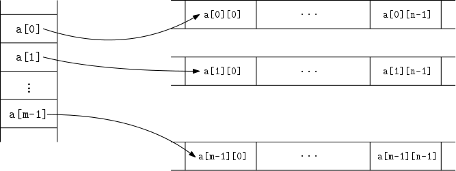
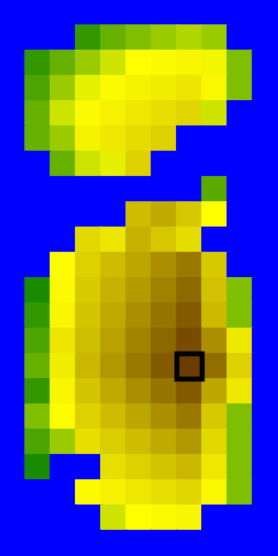

* TOC
{:toc}

## Oznamy

  - Dnes o 18:10 bude prvý semestrálny test v posluchárňach A a B.
      - Trvanie testu 45 minút.
      - Pokrýva učivo po prednášku 10 vrátane.
      - Rozsadenie bude na dverách posluchárne.
      - Prineste si ISIC a pero.
      - Vlastné papiere ani žiadne ďalšie pomôcky nie sú povolené.
        Mobily, hodinky a iné elektronické zariadenia musia byť vypnuté
        a odložené v taške.
      - Zákaz odpisovať od spolužiakov a komunikovať s inými osobami než
        vyučujúcimi.
      - Po opustení miestnosti nebude možné vrátiť sa a pokračovať v
        písaní testu.
  - Dnešné cvičenia sú dobrovoľné, nebude bonusová rozcvička.

## Opakovanie smerníkov

Smerníky na jednoduché premenné:

    int n = 7;         // premenná typu int 
    int * p = NULL;    // smerník na premennú typu int 
    p = &n;            // p ukazuje na n, *p a n sú zhruba to isté 
    *p = 8;            // v premennej n je teraz 8 
    n = (*p)+1;        // v premennej n je teraz 9

Smerníky a polia, alokovanie poľa:

    int a[3];
    int * b = a; // a,b sú teraz takmer rovnocenné premenné 
    *b = 3;
    b[1] = 4;
    a[2] = 5;   // v poli sú teraz čísla 3,4,5 
    b = new int[a[1]];  // b teraz ukazuje na nové pole dĺžky 4 
    delete[] b;         // uvoľníme pamäť alokovanú pre nové pole

## Dvojrozmerné polia

  - Doteraz sme stále pracovali s jednorozmerným poľom, čo však ak
    potrebujeme dvojrozmerné pole, maticu?
  - Príklady dvojrozmerných polí:
      - dvojrozmerné tabuľky napr. body študentov z domácich úloh,
      - matice z algebry,
      - rastrové obrázky.
  - Podobne môžeme potrebovať aj polia väčších rozmerov, pracuje sa s
    nimi analogicky ako s dvojrozmernými.

### Dvojrozmerné polia s konštantnou veľkosťou

  - Ak je veľkosť dvojrozmerného poľa vopred známa konštanta, môžeme ho
    vytvoriť veľmi jednoducho
      - napr. `int a[2][5]` vytvorí tabuľku s dvomi riadkami a piatimi
        stĺpcami
      - `a[i][j]` je potom prvok na riadku `i` a stĺpci `j`
      - Rozmery poľa musíme uviesť aj ak pole posielame do funkcie,
        napr. `void vypis(int a[2][5])`
  - Tento spôsob však **nebudeme ďalej používať**, lebo väčšinou chceme
    rozmery prispôsobiť potrebám daného vstupu.

<!-- end list -->

```cpp
#include <iostream>
using namespace std;

int main() {
    /* Vytvorime pole s dvoma riadkami a piatimi stlpcami 
     * a rovno ho aj inicializujeme: */ 
    int a[2][5] = { {1,2,3,4,5}, {6,7,8,9,10} };

    /* Vypiseme pole ako tabulku: */
    for (int i = 0; i < 2; i++) {
        for (int j = 0; j < 5; j++) {
            cout << a[i][j] << " ";
        }
        cout << endl;
    }
}
```

### Dvojrozmerné pole pomocou poľa smerníkov

  - Omnoho flexibilnejšou alternatívou sú polia smerníkov.
  - Každý riadok tabuľky bude jedno dynamicky alokované pole a smerník
    na jeho začiatok si uložíme do poľa smerníkov.
  - Tabuľka s `m` riadkami a `n` sĺpcami bude v pamäti uložená nejako
    takto:



Nasledujúci program načíta rozmery dvojrozmernej tabuľky, potom jej
prvky a spočíta priemer čísel v každom stĺpci.

```cpp
#include <iostream>
using namespace std;

int main() {
    int m, n;
    cout << "Zadaj pocet riadkov: ";
    cin >> m;
    cout << "Zadaj pocet stlpcov: ";
    cin >> n;
    
    /* Alokuj pole smernikov na riadky: */
    int **a;
    a = new int *[m];
    
    /* Alokuj jednotlive riadky: */
    for (int i = 0; i < m; i++) {
        // a[i] je smernik na i-ty riadok 
        a[i] = new int[n];           
    }
    
    /* Nacitanie prvkov tabulky: */
    cout << "Zadaj cisla tabulky:" << endl;
    for (int i = 0; i < m; i++) {
        for (int j = 0; j < n; j++) {
            // nacitaj j-ty prvok i-teho riadku 
            cin >> a[i][j];          
        }
    }
    
    /* Spocitaj a vypis priemery jednotlivych stlpcov: */
    for (int j = 0; j < n; j++) {
        int sum = 0;
        for (int i = 0; i < m; i++) {
            sum += a[i][j];
        }
        cout << "Priemer hodnot v stlpci " << j 
             << " je " << ((double)sum) / m << endl;
    } 
    
    /* Uvolnenie pamate: */
    for (int i = 0; i < m; i++) {
        delete[] a[i];
    }
    delete[] a;
}
```

Cvičenie:

  - Ako by ste spočítali priemery stĺpcov vstupnej tabuľky s využitím
    iba jednorozmerného poľa? (Celú tabuľku teda nechceme ukladať.)
  - Ako by vyzeralo vytvorenie a použitie trojrozmernej tabuľky?
  - Ako by sme navzájom vymenili prvý a druhý riadok tabuľky? Ako prvý a
    druhý stĺpec?

## Príklad: výšková mapa

Pokračujme ukážkou o niečo väčšieho programu využívajúceho dvojrozmerné
tabuľky (matice).

  - Maticu uložíme ako dynamicky alokované pole smerníkov.
  - V programe je niekoľko funkcií, ktoré sa môžu zísť aj v iných
    programoch na prácu s maticami.
  - `int ** vytvorMaticu(int m, int n)` alokuje pamäť pre maticu s `m`
    riadkami a `n` stĺpcami a vráti smerník na pole smerníkov.
  - `void zmazMaticu(int **a, int m)` uvolní pamäť alokovanú pre maticu
    `a` s `m` riadkami (počet stĺpcov nepotrebujeme).
  - `void nacitajMaticu(int **a, int m, int n)` dostane už alokovanú
    maticu `a` s `m` riadkami a `n` stĺpcami a vyplní ju číslami
    načítanými zo vstupu.

Všimnite si, že funkciám potrebujeme dávať aj rozmery matice. Namiesto
toho by sme si mohli spraviť štruktúru podobne ako pri dynamickom poli:

```cpp
struct matica {
  int m, n;
  int **a;
}
```

### Cieľ programu

Náš program bude v obdĺžnikovej tabuľke celých čísel uchovávať výškovú
mapu.

  - Bude to obdĺžniková tabuľka s `m` riadkami a `n` stĺpcami.
  - Každé políčko obsahovať nadmorskú výšku od `0` po `2000` metrov nad
    morom (nadmorská výška `0` znamená more a kladná nadmorská výška
    znamená pevninu).

<!-- end list -->

  - Program na vstupe najprv dostane rozmery tabuľky `m` a `n` a
    následne nadmorské výšky všetkých štvorčekov.
  - Takto zadanú mapu program vykreslí pomocou knižnice `SVGdraw`,
    pričom každý štvorček dostane určitú farbu podľa svojej nadmorskej
    výšky.
  - Následne zavolá funkciu `najvyssiVrch`, ktorá nájde najvyšší bod
    (resp. jeden z najvyšších bodov) vykresľovaného územia a v mape ho
    zvýrazní rámikom.

Príklad vstupu a výstupu:



``` 
   22   11
    0    0    0    0    0    0    0    0    0    0    0
    0    0    0   40   80  100  120  140  120    0    0
    0   40   80  120  160  200  240  280  190  100    0
    0   60  120  180  240  300  360  420  260  100    0
    0   80  160  240  320  400  480  560  160    0    0
    0   80  120  300  400  500  600    0    0    0    0
    0    0   80  160  180  600    0    0    0    0    0
    0    0    0    0    0    0    0    0   70    0    0
    0    0    0    0    0  800  960  700  200    0    0
    0    0    0  540  420  900  700  500    0    0    0
    0    0  220  600  800 1000 1200 1400  680    0    0
    0   20  240  660  880 1100 1320 1540  750  100    0
    0   40  280  720  960 1200 1440 1680  820  100    0
    0   60  420  780 1040 1300 1560 1820 1200  400    0
    0   80  360  840 1120 1400 1680 1960 1500  600    0
    0   40  280  720  960 1200 1440 1680 1000  400    0
    0  100  220  600  800 1000 1200 1400  680  100    0
    0   60  120  480  640  800  960 1120  540  100    0
    0   20    0    0  480  600  720  840  400  100    0
    0    0    0  240  320  400  480  560  260  100    0
    0    0    0    0  160  200  240  280    0    0    0
    0    0    0    0    0    0    0    0    0    0    0
```

### Program výšková mapa

```cpp
#include <iostream>
#include "SVGdraw.h"
using namespace std;

/* velkost stvorceka mapy v pixeloch */
const int stvorcek = 15;

int ** vytvorMaticu(int m, int n) {
    /* Vytvori a vrati maticu (obdlznikovu tabulku)
     * s m riadkami a n stlpcami. */
    int **a;
    a = new int *[m];
    for (int i = 0; i < m; i++) {
        a[i] = new int[n];
    }
    return a;
}

void zmazMaticu(int **a, int m) {
    /* Uvolni z pamate maticu s m riadkami. */
    for (int i = 0; i < m; i++) {
        delete[] a[i];
    }
    delete[] a;
}

void nacitajMaticu(int **a, int m, int n) {
    /* Nacita hodnoty do uz vytvorenej matice 
     * velkosti m krat n. */
    for (int i = 0; i < m; i++) {
        for (int j = 0; j < n; j++) {
            cin >> a[i][j];
        }
    }
}

void nastavFarbu(int vyska, SVGdraw &drawing) {
    /* podla nadmorskej vysky nastavi farbu ciary 
     * aj vyplne
     * modra -- more (nadmorska vyska 0)
     * zelena -- niziny (nadmorska vyska 1,...,200)
     * hneda -- "pohoria" (nadmorska vyska 200,...,2000) */

    // premenne pre cervenu, zelenu a modru zlozku farby
    int r, g, b;
    // nastavenie farby podla hodnoty
    if (vyska == 0) { // modre more
        r = 0;
        g = 0;
        b = 255;
    } else if (vyska <= 200) { // zelena nizina
        double x = vyska / 200.0;
        r = x * 255;
        g = 127 + x * 127;
        b = 0;
    } else {  // zlto-hnede hory
        double x = (vyska - 200) / 1800.0;
        r = 255 - x * 150;
        g = 255 - x * 200;
        b = 0;
    }

    /* Nastavi farbu ciary aj vyplne na dane hodnoty. */
    drawing.setLineColor(r, g, b);
    drawing.setFillColor(r, g, b);
}

void vykresliStvorcek(int riadok, int stlpec, SVGdraw &drawing) {
    /* Vykresli stvorcek pre dany riadok a stlpec mapy.
     * Pouzije pri tom aktualne nastavene farby.
     * Pozor, pri vykreslovani 
     * uvadzame najskor x (stlpec), potom y (riadok) */
    drawing.drawRectangle(stlpec * stvorcek,
              riadok * stvorcek,
              stvorcek, stvorcek);
}

void vykresliMapu(int **a, int m, int n, SVGdraw &drawing) {
    /* Vykresli mapu rozmerov m krat n do obrazku. 
     * Jednotlive stvorceky mapy ofarbi podla ich nadmorskej vysky */
    for (int i = 0; i < m; i++) {
        for (int j = 0; j < n; j++) {
            nastavFarbu(a[i][j], drawing);
            vykresliStvorcek(i, j, drawing);
        }
    }
}

void maximumMatice(int **a, int m, int n, int &riadok, int &stlpec) {
    /* Najde v matici a o rozmeroch m krat n 
     * policko s maximalnou hodnotou 
       a jeho suradnice ulozi do premennych riadok, stlpec. */
    riadok = 0;
    stlpec = 0;
    for (int i = 0; i < m; i++) {
        for (int j = 0; j < n; j++) {
            if (a[i][j] > a[riadok][stlpec]) {
                riadok = i;
                stlpec = j;
            }
        }
    }
}

int main() {
    /* nacitaj rozmery matice */
    int m, n;
    cin >> m >> n;

    /* vytvor a nacitaj maticu */
    int **a = vytvorMaticu(m, n);
    nacitajMaticu(a, m, n);

    /* zobraz maticu, pozor vymena suradnice */
    SVGdraw drawing(n * stvorcek, m * stvorcek,
            "mapa.svg"); 
    vykresliMapu(a, m, n, drawing);

    /* najdi najvyssi vrch a zvyrazni ho stvorcekom */
    int riadok, stlpec;
    maximumMatice(a, m, n, riadok, stlpec);

    drawing.setLineColor("black");
    drawing.setLineWidth(3);
    drawing.setNoFill();
    vykresliStvorcek(riadok, stlpec, drawing);

    /* ukonci vykreslovanie */
    drawing.finish();

    /* uvolni pamat matice */
    zmazMaticu(a, m);
}
```

## Hra life

[Hra life](http://en.wikipedia.org/wiki/Conway%27s_Game_of_Life) je
jednoduchá simulácia kolónie buniek, ktorá má zaujímavé teoretické
vlastnosti.

  - Máme mriežku *m x n* štvorčekov, v každom žije najviac 1 bunka
  - Bunky sa rodia a umierajú podľa toho, koľko majú susedov v ôsmych
    okolitých políčkach
      - Ak v čase *t* má bunka 2 alebo 3 susedov, zostane žiť aj v čase
        *t+1*, inak zomiera
      - Ak v čase *t* má prázdne políčko presne 3 susedov, narodí sa tam
        v čase *t+1* nová bunka

Stav hry si môžeme pamätať v matici boolovských hodnôt.

### Príklad vstupu

  - Pre jednoduchosť vstup uvádzame ako nuly a jednotky bez medzier
    (1=živá bunka). Výslednú animáciu nájdete
    [tu](../files/PROG-life.svg).

<!-- end list -->

    20 20
    00000000000000000000
    00000000000000000000
    00000000000000000000
    00000000000000000000
    00000000000000000000
    00000000000000000000
    00000000000000000000
    00000000000000000000
    00000000000000000000
    00000111111111100000
    00000000000000000000
    00000000000000000000
    00000000000000000000
    00000000000000000000
    00000000000000000000
    00000000000000000000
    00000000000000000000
    00000000000000000000
    00000000000000000000
    00000000000000000000

### Rátanie zmeny v matici

  - Stav v čase *t* máme v matici *a*, do matice *b* chceme dať stav v
    čase *t+1*

<!-- end list -->

```cpp
int zratajOkolie(int m, int n, bool **a, int riadok, int stlpec) {
    /* pocet zivych prvkov v okoli */
    int sucet = 0;
    for (int i = riadok - 1; i <= riadok + 1; i++) {
        for (int j = stlpec - 1; j <= stlpec + 1; j++) {
            /* treba osetrit okraje matice */
            if (i >= 0 && i < m && j >= 0 && j < n && a[i][j]) {
                sucet++;
            }
        }
    }
    /* samotny stvorcek nechceme zaratat */
    if (a[riadok][stlpec]) {
        sucet--;
    }
    return sucet;
}

void prepocitajMaticu(int m, int n, bool **a, bool **b) {
    for (int i = 0; i < m; i++) {
        for (int j = 0; j < n; j++) {
            int pocet = zratajOkolie(m, n, a, i, j);
            /* prirad do b[i][j] hodnotu podla okolia a[i][j] */
            b[i][j] = (pocet == 3 || (pocet == 2 && a[i][j]));
        }
    }
}
```

### Ďalšie detaily programu

  - Celý program, ktorý načíta vstup a simuluje 10 krokov hry Life aj s
    vytvorením animácie: [Program Life](./#program_life)
  - Prepočítavanie chceme opakovať v cykle pre viacero časových
    intervalov.
  - Môžeme prekopírovať celú maticu z *b* späť do *a*, ale rýchlejšie je
    len vymeniť smerníky.

<!-- end list -->

```cpp
    for (int i = 0; i < 10; i++) {
        /* podla a spocitaj maticu do b */
        prepocitajMaticu(m, n, a, b);
        /* vymen smerniky, aby v a bola nova matica */
        bool **tmp = b;
        b = a;
        a = tmp;
    }
```

  - `vytvorMaticu`, `zmazMaticu` a pod. prepíšeme tak, aby robili s
    maticou boolovských hodnôt namiesto intov.
  - V animácii na začiatku vykreslíme celú maticu, potom prekreslíme
    vždy len tie bunky, ktoré sa zmenili.

## Polia reťazcov

  - Dvojrozmerné polia v C/C++ nemusia mať všetky riadky rovnako dlhé.
    To sa hodí napríklad na ukladanie viacerých reťazcov.
  - Spomeňte si, že v C je reťazec jednoducho pole `char`-ov, kde za
    posledným znakom ide špeciálny znak 0.
  - Pole reťazcov bude teda dvojrozmerné pole `char`-ov.
  - Môžeme načítavať napr. vstup po riadkoch, pričom každý riadok
    načítame do dlhého poľa, ktoré by malo stačiť a potom do
    prekopírujeme do akurát veľkého riadku v poli.
  - Vstup je ukončený prázdnym riadkom.
  - Nakoniec program riadky vypíše odzadu.
  - Ak by sme vopred alokovali `maxN` riadkov, každý veľkosti
    `maxRiadok`, vyšlo by potenciálne na zmar oveľa viac pamäte.

<!-- end list -->

```cpp
#include <iostream>
#include <cstring>
using namespace std;

const int maxN = 1000;
const int maxRiadok = 1000;

int main() {
    char *a[maxN];   // pole maxN smernikov na char
    char riadok[maxRiadok];
    int n = 0;
    while (true) {
        // nacitame jeden riadok 
        cin.getline(riadok, maxRiadok);
        // ak je prazdny alebo sa minuli polozky pola A,
        // koncime nacitavanie        
        if (strcmp(riadok, "") == 0 || n == maxN) {
            break;
        }
        // alokujeme pamat pre n-ty retazec pola a
        // pozor, k strlen pridame 1 kvoli 0 na konci
        a[n] = new char[strlen(riadok)+1];
        // prekopirujeme riadok 
        strcpy(a[n], riadok);
        n++;
    }

    // vypiseme riadky odzadu
    for(int i = n-1; i >= 0; i--) {
      cout << a[i] << endl;
    }

    // uvolnime pamat
    for (int i = 0; i < n; i++) {
        delete[] a[i];
    }
}
```

Cvičenia:

  - Prečo nemáme na konci programu `delete[] a`?
  - Čo by sa stalo, ak by sme namiesto `a[n] = new
    char[strlen(riadok)+1]; strcpy(a[n], riadok)` dali `a[n] = riadok`?
  - Prerobte program tak, aby namiesto poľa `a` fixnej veľkosti `maxN`
    používal dynamické pole.
  - Vedeli by sme dynamické polia nejako použiť aj na načítavanie
    jednotlivých riadkov?

## Vstupy do funkcie main

Často vidíte v programoch funkciu `main` s nasledujúcou hlavičkou:

```cpp
int main(int argc, char ** argv) {
```

Vstupné argumenty `argc` a `argv` sa používajú pri spúšťaní programu na
príkazovom riadku.

  - `argv` je pole C-čkových reťazcov a `argc` je počet reťazcov v tomto
    poli
  - Prvý reťazec, `argv[0]`, je meno samotného programu a ostatné sú
    argumenty programu
  - Videli sme napríklad spúšťanie kompilátora na príkazovom riadku:

<!-- end list -->

    g++ program.cpp -o program

  - Tu `g++` je meno programu, ktoré je nasledované tromi argumentami
    `"program.cpp"`, `"-o"` a `"program"`. Tieto argumenty dávajú
    kompilátoru informáciu o tom, ktorý zdrojový súbor má kompilovať a
    kam má uložiť spustiteľný program.

Nasledujúci jednoduchý program vypíše všetky argumenty, ktoré dostal z
príkazového riadku, vrátane mena programu.

```cpp
#include <iostream>
using namespace std;

int main(int argc, char ** argv) {
    for (int i = 0; i < argc; i++) {
        cout << argv[i] << endl;
    }
}
```

## Deklarácie so smerníkmi a poľami

Príklady na prácu s maticami uvedené vyššie môžete modifikovať vo
vlastných programoch, ale je dobré trochu lepšie rozumieť logike práce
so smerníkmi v C/C++.

  - Operátor `[ ]` je zľava asociatívny, t.j. `a[2][3]` je to isté ako
    `(a[2])[3]`
  - Operátor `*` je sprava asociatívny, t.j. `**p` je to isté ako
    `*(*p)`.
  - Operátor `[ ]` má vyššiu prioritu ako `*`, t.j. `*a[2]` je to isté
    ako `*(a[2])`.
  - Ak `x` je pole smerníkov na `int`, tak `*(x[2])` znamená, že vezmeme
    pole `x`, pozrieme sa na jeho druhý prvok a následne na tento druhý
    prvok aplikujeme dereferenciu, čím dostaneme `int`.
  - Ak `x` je smerník na pole `int`-ov, `(*x)[2]` znamená, že vezmeme
    `x`, aplikujeme dereferenciu, ktorej výsledkom je pole `int`-ov a
    pozrieme sa na druhý prvok tohto poľa.

Cvičenie:

  - Premennú `x` sme vytvorili príkazom `int ** x = vytvorMaticu(4,4)`.
    S ktorými prvkami tabuľky potom pracujú výrazy `*(x[2])` a
    `(*x)[2]`?

Komplikácie nastávajú aj pri pochopení typov premenných. Pomôžu
nasledujúce rady.

  - Deklaráciu premennej `int * p` môžeme čítať takto: Ak vezmeme
    smerník `p` a aplikujeme na neho operátor `*`, získame hodnotu typu
    `int`.
  - Deklarácia `int * a[4]` je to isté ako `int * (a[4])` a znamená: Ak
    vezmeme `a`, pozrieme sa na niektorý zo štyroch prvkov tohto poľa a
    nakoniec aplikujeme dereferenciu, dostaneme hodnotu typu `int`.
    Vytvorili sme teda štvorprvkové pole smerníkov na `int`. Jednotlivé
    smerníky v poli zatiaľ nie sú inicializované.
  - Deklarácia `int (* a)[4]` znamená: Ak vezmeme `a`, aplikujeme
    dereferenciu, dostaneme pole a keď sa pozrieme na niektorý prvok
    tohto poľa, dostaneme `int`. Riadok teda vytvorí smerník na pole
    štyroch celých čísel. Tento smerník však zatiaľ ukazuje na náhodné
    miesto pamäte, žiadne nové pole nevzniklo. To sa nám málokedy zíde,
    premennú `a` môžeme zadefinovať radšej ako `int **a`.
  - Deklarácia `int *(*(a[4]))` vytvorí štvorprvkové pole smerníkov na
    smerníky na `int`. Dá sa zapísať aj bez zátvoriek `int ** a[4]`

## Zhrnutie

  - Hlavnou náplňou dnešnej prednášky bolo vytvorenie a používanie
    dvojrozmerných polí pomocou poľa smerníkov na riadky.
  - Môžete používať a podľa potreby upravovať funkcie `int **
    vytvorMaticu(int m, int n)`, `void zmazMaticu(int **a, int m)` a
    `void nacitajMaticu(int **a, int m, int n)` z programu s výškovou
    mapou.
  - Pole reťazcov je vlastne dvojrozmerná tabuľka znakov, ktorej riadky
    môžu mať rôznu dĺžku (a každý je správne ukončený nulou).
  - Pozor na správnu alokáciu a dealokáciu. Pri práci so smerníkmi sa
    oplatí nakresliť si obrázok, čo kam ukazuje.

## Program Life

    /* Program Hra Life z prednášky 13. */
    
    #include "SVGdraw.h"
    #include <iostream>
    #include <cassert>
    using namespace std;
    
    /* velkost stvorceka */
    const int stvorcek = 15;
    
    bool ** vytvorMaticu(int m, int n) {
        /* vytvor maticu s m riadkami a n stlpcami */
        bool **a;
        a = new bool *[m];
        for (int i = 0; i < m; i++) {
            a[i] = new bool[n];
        }
        return a;
    }
    
    void zmazMaticu(int m, bool **a) {
        /* uvolni pamat matice s m riadkami */
        for (int i = 0; i < m; i++) {
            delete[] a[i];
        }
        delete[] a;
    }
    
    void nacitajMaticu(int m, int n, bool **a) {
        /* matica je vytvorena, velkosti m krat n, vyplnime ju cislami zo vstupu */
        for (int i = 0; i < m; i++) {
            for (int j = 0; j < n; j++) {
                char c;
                cin >> c;  // nacitaj znak, preskoc biele znaky, ak nejake su
                a[i][j] = (c == '1');
            }
        }
    }
    
    void zobrazStvorcek(int i, int j, bool hodnota, SVGdraw &drawing) {
        /* zobraz stvorcek v riadku i a stlpci j */
        drawing.setLineColor("white");
        if (hodnota) {
            drawing.setFillColor("black");
        } else {
            drawing.setFillColor("white");
        }
        drawing.drawRectangle(j * stvorcek, i * stvorcek, stvorcek, stvorcek);
    }
    
    void zobrazMaticu(int m, int n, bool **a, SVGdraw &drawing) {
        /* zobraz prvky true ciernymi stvorcekmi */
        for (int i = 0; i < m; i++) {
            for (int j = 0; j < n; j++) {
                /* nastavenie farby podla hodnoty */
                if (a[i][j]) {
                    zobrazStvorcek(i, j, true, drawing);
                }
            }
        }
    }
    
    void zobrazZmeny(int m, int n, bool **a, bool **b, SVGdraw &drawing) {
        /* zobraz nove stvorceky na miestach, kde bola zmena */
        for (int i = 0; i < m; i++) {
            for (int j = 0; j < n; j++) {
                if (a[i][j] != b[i][j]) {
                    zobrazStvorcek(i, j, b[i][j], drawing);
                }
            }
        }
    }
    
    int zratajOkolie(int m, int n, bool **a, int riadok, int stlpec) {
        /* pocet zivych prvkov v okoli */
        int sucet = 0;
        for (int i = riadok - 1; i <= riadok + 1; i++) {
            for (int j = stlpec - 1; j <= stlpec + 1; j++) {
                /* treba osetrit okraje matice */
                if (i >= 0 && i < m && j >= 0 && j < n && a[i][j]) {
                    sucet++;
                }
            }
        }
        /* samotny stvorcek nechceme zaratat */
        if (a[riadok][stlpec]) {
            sucet--;
        }
        return sucet;
    }
    
    void prepocitajMaticu(int m, int n, bool **a, bool **b) {
        for (int i = 0; i < m; i++) {
            for (int j = 0; j < n; j++) {
                int pocet = zratajOkolie(m, n, a, i, j);
                /* prirad do b[i][j] hodnotu podla okolia a[i][j] */
                b[i][j] = (pocet == 3 || (pocet == 2 && a[i][j]));
            }
        }
    }
    
    int main(void) {
        /* nacitaj rozmery matice */
        int m, n;
        cin >> m >> n;
    
        /* vytvor a nacitaj maticu */
        bool **a = vytvorMaticu(m, n);
        nacitajMaticu(m, n, a);
    
        /* zobraz maticu */
        SVGdraw drawing(m * stvorcek, n * stvorcek, "life.svg");
        zobrazMaticu(m, n, a, drawing);
        drawing.wait(1);
    
        /* pomocna matica na vypocty */
        bool **b = vytvorMaticu(m, n);
    
        /* simuluj 10 krokov hry life */
        for (int i = 0; i < 10; i++) {
            /* podla a spocitaj maticu do b */
            prepocitajMaticu(m, n, a, b);
            /* prekresli, co sa zmenilo */
            zobrazZmeny(m, n, a, b, drawing);
            drawing.wait(1);
            /* vymen smerniky, aby v a bola nova matica */
            bool **tmp = b;
            b = a;
            a = tmp;
        }
    
        /* uvolni pamat matic */
        zmazMaticu(m, a);
        zmazMaticu(m, b);
        drawing.finish();
    }

