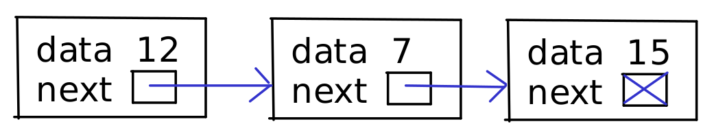
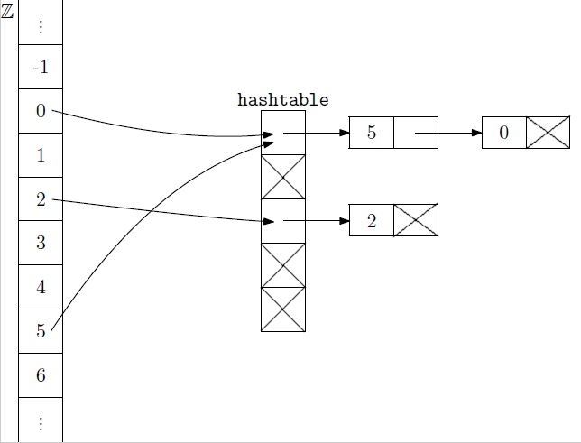

* TOC
{:toc}

## Oznamy

  - Druhý miniprojekt odovzdávajte do štvrtka 20.11. 22:00.
  - Výsledky semestrálneho testu sú na testovači, svoj test si môžete
    pozrieť na cvičeniach v stredu.
  - Druhý semestrálny test bude 10.12. o 18:10, opravný test v januári.
  - Rozcvička zajtra bude o dvojrozmerných poliach, cvičiť budeme aj
    učivo z dnešnej prednášky.
  - V stredu bude na cvičeniach malá bonusová rozcvička.

## Dynamická množina

### Motivačný príklad

  - Na fakulte sa dvere do niektorých miestností otvárajú priložením
    čipovej karty k čítačke.
  - Každá karta má v sebe uložené identifikačné číslo.
  - Čítačka má v pamäti zoznam identifikačných čísel oprávnených osôb
    (študenti, vyučujúci a pod.).
  - Po priložení karty z nej prečíta číslo a zisťuje, či ho má vo svojom
    zozname.
  - Administrátor tiež potrebuje vedieť pridávať a uberať oprávnené
    osoby.
  - Ako asi môže byť systém pracujúci so zoznamom identifikačných čísel
    naprogramovaný?

### Dynamická množina

Chceli by sme vytvoriť dátovú štruktúru s nasledujúcou špecifikáciou.

  - Máme množinu *A*, ktorá sa bude postupne meniť, preto ju nazývame
    dynamická množina.
  - Funkcia `contains` dostane množinu *A* a hodnotu *x* a zistí, či *x*
    patrí do *A*.
  - Funkcia `add` dostane množinu *A* a hodnotu *x* a pridá *x* do *A*.
  - Funkcia `remove` dostane množinu *A* a prvok *x* a odoberie *x* z
    *A*.
  - Pre jednoduchosť funkciu `remove` nebudeme dnes uvažovať.
  - Niekedy sa môžu zísť aj iné operácie.

Problém príslušnosti k množine sa vyskytuje aj v mnohých iných
situáciách.

  - Ako dnes uvidíme, dynamickú množinu môžeme implementovať rôznymi
    spôsobmi.
  - Hovoríme, že dynamická množina je **abstraktný dátový typ**,
    špecifikuje totiž iba rozhranie, ktoré má dátová štruktúra
    poskytovať používateľovi, nie jeho implementáciu.
  - Ak by sme zmenili implementáciu z jednej na inú, nemusíme nutne
    meniť programy, ktoré dynamickú množinu využívajú, pokiaľ k nej
    pristupujú iba pomocou uvedených funkcií.

## Implementácie dynamických množín

  - Pre jednoduchosť budeme uvažovať iba dynamickú množinu celých čísel.
  - Dynamickú množinu budeme uchovávať v štruktúre `set`.
  - Navyše budeme mať implementovaných niekoľko funkcií, ktoré s
    dynamickými množinami pracujú.
  - Kostra programu teda bude vyzerať pre ľubovoľnú implementáciu
    dynamickej množiny takto:

<!-- end list -->

```cpp
/* Štruktúra reprezentujúca dynamickú množinu. */
struct set {
    // ...
};

/* Funkcia vytvorí prázdnu dynamickú množinu. */
void init(set &s) {
    // ...
}

/* Funkcia zistí, či prvok x patrí do množiny s. */
bool contains(set &s, int x) {
    // ...
}

/* Funkcia pridá prvok x do množiny s. */
void add(set &s, int x) {
    // ...
}

/* Funkcia uvoľní množinu s z pamäte. */
void destroy(set &s) {
    // ...
}
```

Bez ohľadu na implementáciu štruktúry `set` a uvedených funkcií už teraz
môžeme napísať program, ktorý ich využíva. Z konzoly číta príkazy a
postupne ich vykonáva.

```cpp
#include <iostream>
#include <cstring>
using namespace std;

// ...

const int maxlength = 100;

int main(void) {
    set A;
    init(A);
    
    while (true) {
        char prikaz[maxlength];
        cin.width(maxlength);
        cin >> prikaz;
        if (strcmp(prikaz, "contains") == 0) {
            int x;
            cin >> x;
            cout << contains(A, x) << endl;        
        } else if (strcmp(prikaz, "add") == 0) {
            int x;
            cin >> x;
            add(A, x);
        } else if (strcmp(prikaz, "end") == 0) {    
            break;
        }
    }

    destroy(A);
}
```

Ukážeme si teraz niekoľko rôznych implementácii dynamickej množiny;
začneme s dvoma, ktoré už poznáme.

### Dynamická množina ako pole

Dynamickú množinu môžeme implementovať tak, že jej prvky budeme ukladať
do poľa v ľubovoľnom poradí.

  - Funkcia `contains` musí zakaždým prejsť celé pole lineárnym
    prehľadávaním (nie je teda zrovna rýchla).
  - Funkcia `add` je naopak veľmi rýchla: stačí pridať prvok na koniec
    poľa.
  - Je ale potrebné dávať pozor na prekročenie kapacity poľa (mohli by
    sme použiť dynamické pole).

<!-- end list -->

```cpp
#include <cassert>

// ...

const int maxN = 1000;

struct set {
    int *items;  // Smerník na nultý prvok poľa
    int length;  // Počet prvkov v poli
};

void init(set &s) {
    s.items = new int[maxN];
    s.length = 0;
}

bool contains(set &s, int x) {
    for (int i = 0; i < s.length; i++) {
        if (s.items[i] == x) {
            return true;
        }
    }
    return false;
}

void add(set &s, int x) {
    assert(s.length < maxN);
    s.items[s.length] = x;
    s.length++;
}

void destroy(set &s) {
    delete[] s.items;
}           
```

### Dynamická množina ako utriedené pole

Prvky množiny môžeme v poli uchovávať aj utriedené od najmenšieho po
najväčšie.

  - Funkcia `contains` potom môže použiť binárne vyhľadávanie. Je teda
    rýchlejšia, ako v predchádzajúcom prípade (v poli veľkosti *n* sa
    pozrie len na približne log<sub>2</sub> *n* pozícií; napríklad pre
    miliónprvkové pole sa pozrie asi na 20 prvkov poľa).
  - Funkcia `add` ale musí vložiť prvok na správne miesto v utriedenom
    poli; je teda o dosť pomalšia.
  - Tento spôsob je teda vhodný, ak sa množina mení zriedkavo.

<!-- end list -->

```cpp
#include <cassert>

// ...

const int maxN = 1000;

struct set {
    int *items;  // smerník na nultý prvok poľa
    int length;  // počet prvkov v poli
};

void init(set &s) {
    s.items = new int[maxN];
    s.length = 0;
}

bool contains(set &s, int x) {
    int left = 0;
    int right = s.length - 1;
    while (left <= right) {
        int index = (left + right) / 2;
        if (s.items[index] == x) {
            return true;
        } else if (s.items[index] > x) {
            right = index - 1;
        } else {
            left = index + 1;
        }    
    }
    return false;
}

void add(set &s, int x) {
    assert(s.length < maxN);
    int kam = s.length;
    while (kam > 0 && s.items[kam - 1] > x) {
        s.items[kam] = s.items[kam - 1];
        kam--;
    }
    s.items[kam] = x;
    s.length++;
}

void destroy(set &s) {
    delete[] s.items;
}           
```

### Ďalšie možnosti implementácie dynamickej množiny (plán na dnes)

Dnes uvidíme ďalšie dva spôsoby implementácie dynamickej množiny:

  - Množina ako **spájaný zoznam**:
      - Ľahko pridáme nové prvky, nepotrebujeme vopred vedieť veľkosť.
      - Nedá sa rýchlo binárne vyhľadávať.
      - Založené na smerníkoch.
  - Množina pomocou **hašovania**:
      - Často veľmi rýchle vyhľadávanie.
      - Použijeme polia aj spájané zoznamy.

## Odbočka: smerníky a `struct`

### Opakovanie základnej práce so smerníkmi

```cpp
int n = 7;         // premenná typu int 
int * p = &n;      // smerník na int 
// n, *p teraz znamenajú to isté

int * p2 = new int; // p2 ukazuje na alokovanú pamäť
*p2 = 7;            // cez *p2 pracujeme s touto pamäťou
delete p2;          // uvoľníme pamäť
p2  = p;            // meníme samotný smerník
p = NULL;           // NULL "nikam neukazuje"
```

### Smerníky a `struct`

Smerník môže ukazovať aj na `struct`. Operátory `.` (prístup k prvku
štruktúry) a `[]` (prístup k prvku poľa) majú vyššiu prioritu ako
operátory `*` (dereferencia smerníka) a `&` (adresa). Preto napríklad:

  - Zápis `*s.cokolvek` je to isté ako `*(s.cokolvek)` a vyjadruje
    dereferenciu smerníka `s.cokolvek`.
  - Zápis `(*p).cokolvek` vyjadruje prvok `cokolvek` štruktúry získanej
    dereferenciou smerníka `p`.
  - Zvyčajne je potrebnejší zápis `(*p).cokolvek`; existuje preň preto
    skratka `p->cokolvek`.

<!-- end list -->

```cpp
struct bod {
  int x, y;
};

// ...

bod b; 
b.x = 0;
b.y = 0;
bod *p = &b;       // p ukazuje na bod b

bod *p2 = new bod; // alokovanie nového bodu
(*p2).x = 20;      // bod, na ktorý ukazuje p2, bude mať x 20
p2->y = 10;        // bod, na ktorý ukazuje p2, bude mať y 10
delete p2;         // uvoľnenie pamäte
```

## Spájané zoznamy

**Spájaný zoznam** (angl. *linked list*) je postupnosť uzlov rovnakého
typu usporiadaných za sebou. Každý uzol pritom pozostáva z dvoch častí:

  - Samotné dáta; v našom prípade jedno číslo typu `int`.
  - Smerník `next`, ktorý ukazuje na nasledujúci prvok zoznamu.
      - Tieto smerníky umožňujú pohybovať sa po zozname zľava doprava.
      - Posledný uzol zoznamu nemá následníka, smerník `next` bude mať
        hodnotu `NULL`.

Štruktúra spájaného zoznamu je znázornená na nasledujúcom obrázku:



Uzol jednosmerne spájaného zoznamu budeme reprezentovať pomocou
`struct`-u `node`:

```cpp
/* Štruktúra reprezentujúca uzol jednosmerne spájaného zoznamu: */
struct node {
    int data;    // Hodnota uložená v danom uzle
    node *next;  // Smerník na nasledujúci uzol
};
```

Vo vnútri definície typu `node` teda používame smerník na samotný typ
`node`.

Samotná množina reprezentovaná spájaným zoznamom je potom štruktúra
`set` obsahujúca iba smerník na prvý prvok zoznamu. Ak je zoznam
prázdny, bude tento smerník `NULL`.

```cpp
/* Štruktúra implementujúca množinu ako spájaný zoznam: */
struct set {
    node *first; // Smerník na prvý uzol zoznamu
};

void init(set &s) {
    s.first = NULL;
}
```

### Vkladanie na začiatok zoznamu

Nasledujúca funkcia na začiatok zoznamu vloží nový uzol s dátami *x*:

```cpp
void add(set &s, int x) {
    // Vytvoríme nový uzol, uložíme doňho x
    node * p = new node; 
    p->data = x;
    // uzol p bude novým prvým prvkom zoznamu
    p->next = s.first;  
    s.first = p;         
}
```

### Vyhľadávanie v zozname

Funkcia vyhľadávajúca číslo *x* v zozname bude pracovať tak, že postupne
prehľadáva zoznam od jeho začiatku, s využitím smerníkov na nasledujúce
prvky:

```cpp
bool contains(set &s, int x) {
    node *p = s.first;
    while (p != NULL) {
        if (p->data == x) {
            return true;
        } 
        p = p->next;
    }
    return false;
}
```

Funkcia by sa dala napísať aj pomocou for cyklu

```cpp
bool contains(set &s, int x) {
    for(node *p = s.first; p != NULL; p = p->next) {
        if (p->data == x) {
            return true;
        } 
    }
    return false;
}
```

V tejto forme sa viac podobá na funkciu pre polia:

```cpp
bool contains(set &s, int x) {
    for (int i = 0; i < s.length; i++) {
        if (s.items[i] == x) {
            return true;
        }
    }
    return false;
}
```

  - Smerník `p` je teda v zoznamoch ekvivalentom indexu `i`
  - Inicializácia je `p = s.first` namiesto `i = 0`
  - Posun na ďalší prvok je `p = p->next` namiesto `i++`
  - Podmienka na pokračovanie je `p != NULL` namiesto `i < s.length`

### Uvoľnenie zoznamu

Funkcia, ktorá uvoľní zoznam z pamäti, pracuje podobne: prechádza
postupne zoznam od začiatku až po jeho koniec a uvoľňuje z pamäte
jednotlivé uzly. Treba si však dať pozor na to, aby sme smerník na
nasledujúci uzol získali ešte predtým, než z pamäti uvoľníme ten
predošlý.

```cpp
void destroy(set &s) {
    node *p = s.first;
    while (p != NULL) {
        node *p2 = p->next;
        delete p;
        p = p2;
    }
}           
```

### Výpis zoznamu

Môžeme napísať aj nasledujúcu funkciu, ktorá po zavolaní vypíše obsah
celého zoznamu:

```cpp
void print(set &s) {
    node *p = s.first;
    while (p != NULL) {
        cout << p->data << " ";
        p = p->next;
    }   
    cout << endl; 
}            
```

### Varianty spájaných zoznamov

  - V našom zozname si v každom uzle pamätáme iba smerník na následníka,
    hovoríme o *jednosmerne spájanom zozname*.
  - Často sú užitočné aj *obojsmerne spájané zoznamy*, kde sa v každom
    uzle uchováva aj smerník na predchodcu; takéto zoznamy sú ale o
    niečo náročnejšie na údržbu.
  - Používajú sa dokonca aj cyklické zoznamy, kde posledný prvok ukazuje
    späť na prvý prvok zoznamu.

## Hašovanie

### Implementácia množiny priamym adresovaním

Úplne odlišným spôsobom implementácie dynamickej množiny je tzv. *priame
adresovanie* (angl. *direct addressing*).

  - Množinu všetkých možných hodnôt, ktoré v danej implementácii môžeme
    chcieť do množiny pridať, nazveme univerzum *U*.
  - Predchádzajúce implementácie sa ľahko dali upraviť na rôzne univerzá
    (celé čísla, desatinné čísla, smerníky na zložitejšie štruktúry,
    napr. struct, pole, reťazec).
  - Na rozdiel od toho sa priame adresovanie dá použiť iba ak univerzum
    je *U* = {0,1,...,*m*-1} pre nejaké rozumne malé prirodzené číslo
    *m*.
  - Podmnožinu *A* univerza *U* potom môžeme reprezentovať ako pole
    booleovských hodnôt dĺžky *m*, kde *i*-ty prvok poľa bude `true`
    práve vtedy, keď *i* patrí do *A*.
  - Túto reprezentáciu sme používali napríklad v poli `bolo` pri
    prehľadávaní s návratom.

<!-- end list -->

  - Funkcie `contains` aj `add` sú potom veľmi jednoduché a rýchle.
  - Problémom tohto prístupu je ale vysoká pamäťová zložitosť, ak je
    číslo *m* veľké.
  - Veľmi efektívne pre malé univerzá (napr. cifry 0,...,9, všetky znaky
    anglickej abecedy, všetky znaky s ASCII hodnotami od 0 po 255, a
    pod.).

<!-- end list -->

```cpp
#include <cassert>

/* Maximálne povolené číslo v množine */
const int m = 1000;

/* Štruktúra implementujúca množinu priamym adresovaním: */
struct set {
    bool *isin;
};

void init(set &s) {
    s.isin = new bool[m];
    for (int i = 0; i < m; i++) {
        s.isin[i] = false;
    }
}

bool contains(set &s, int x) {
    assert(x >= 0 && x < m);
    return s.isin[x];  
}

void add(set &s, int x) {
    assert(x >= 0 && x < m);
    s.isin[x] = true;
}

void destroy(set &s) {
    delete[] s.isin;
}          
```

### Jednoduché hašovanie

Priame adresovanie sa nehodí pre veľké univerzá, lebo by vyžadovalo veľa
pamäte.

**Hašovanie** (angl. hashing) je jednoduchá finta, ktorá funguje
nasledovne:

  - Nech *U* je univerzum všetkých možných prvkov množiny.
  - Vytvoríme **hašovaciu tabuľku** (angl. hash table), čo je pole
    nejakej rozumnej veľkosti *m*.
  - Naprogramujeme **hašovaciu funkciu**, ktorá transformuje prvky
    univerza *U* na indexy hašovacej tabuľky; pôjde teda o funkciu *h*:
    *U* -\> {0, 1, ... , *m*−1}.
  - Najjednoduchšia hašovacia funkcia pre celočíselné prvky je *h*(*x*)
    = |*x*| mod *m*.
      - |*x*| spočítame funkciou `abs` z knižnice `cstdlib`.
      - Absolútnu hodnotu používame, lebo napríklad `-10 % 3` je -1, čo
        mimo rozsahu indexov tabuľky.
      - V praxi sa používajú zložitejšie hašovacie funkcie. Ideálne je
        hašovacia funkcia jednoduchá a rýchla, ale pritom hodnoty do
        tabuľky distribuuje rovnomerne, aby sa príliš často nestávalo,
        že dva prvky sa namapujú na to isté políčko.

<!-- end list -->

```cpp
int h(int x, int m) {
    return abs(x) % m;
}
```

Napríklad pre *m = 5*: h(12, 5) je 2, h(-6, 5) je 1.

Prvý pokus o prácu hašovacou tabuľkou by teda mohol vyzerať takto:

**Vkladanie** prvku *x*:

  - Spočítame `index = h(x, m)` a prvok vložíme na pozíciu
    `table[index]`.

**Vyhľadávanie** prvku *x*:

  - Ak je prvok s kľúčom *x* v tabuľke, musí byť na indexe `h(x, m)`.
  - Skontrolujeme túto pozíciu a ak tam je niečo iné ako *x*, prvok *x*
    sa v tabuľke nenachádza.

**Problémy**:

  - Na akú hodnotu inicializovať prvky poľa `table`?
  - Čo ak budeme potrebovať vložiť prvok na miesto, kde je už niečo
    uložené?

### Kolízie

  - Pri vkladaní prvku sme narazili na problém, ak na už obsadené miesto
    chceme vložiť iný prvok.
  - Ak sa dva prvky *x* a *y* sa zahašujú na rovnakú pozíciu *h*(*x*) =
    *h*(*y*), hovoríme, že nastala **kolízia**.
  - Existujú rôzne prístupy na riešenie kolízií, môžeme napríklad hľadať
    iné voľné miesto v tabuľke.
  - V našom programe kolízie vyriešime tak, že v každom políčku tabuľky
    uložíme spájaný zoznam všetkých prvkov, ktoré sa tam zahašovali.
      - Táto situácia je znázornená na nasledujúcom obrázku, v ktorom
        sme do hašovacej tabuľky pre m=5 pridali prvky 0,2,5.



```cpp
#include <cstdlib>

/* hašovacia funkcia: */
int h(int x, int m) {
    return abs(x) % m;
}

/* štruktúra reprezentujúca jeden prvok spájaného zoznamu: */
struct node {
    int data;
    node *next;
};

/* štruktúra implementujúca dynamickú množinu hašovaním: */
struct set {
    node **table;  // pole smerníkov na začiatky zoznamov
    int m;         // veľkost hašovacej tabuľky
};

void init(set &s, int m) {  
    // veľkosť tabuľky je parametrom funkcie init
    s.m = m;
    s.table = new node *[m];
    for (int i = 0; i < m; i++) {
        s.table[i] = NULL;
    }
}

bool contains(set &s, int x) {
    // spočítame políčko tabuľky
    int index = h(x, s.m);      
    node *p = s.table[index];
    // p ukazuje na začiatok zoznamu
    while (p != NULL) {         
        // prechádzame zoznam, hľadáme x
        if (p->data == x) {
            return true;
        }
        p = p->next;
    } 
    return false;    
}

void add(set &s, int x) {
    // spočítame políčko tabuľky
    int index = h(x, s.m);
    // vytvoríme nový uzol
    node *p = new node;         
    p->data = x;
    // uzol vložíme na začiatok zoznamu
    p->next = s.table[index];   
    s.table[index] = p;       
}

void destroy(set &s) {
    for (int i = 0; i < s.m; i++) {
        // uvoľníme zoznam s.table[i]
        node *p = s.table[i];   
        while (p != NULL) {
            node *p2 = p->next;
            delete p;
            p = p2;
        }
    }
    delete[] s.table;
}          
```

**Cvičenie:** Ako bude vyzerať hašovacia tabuľka pri riešení kolízií
pomocou spájaných zoznamov, ak hašovacia funkcia je |x| mod 5 a vkladáme
prvky 13, -2, 0, 8, 10, 17?

### Zložitosť

  - Rýchlosť závisí od veľkosti tabuľky *m*, hašovacej funkcie a počtu
    kolízií.
  - V najhoršom prípade sa všetky prvky zahašujú do toho istého políčka,
    a teda musíme pri hľadaní prejsť všetky prvky množiny.
  - Ak máme šťastie a v každom políčku máme len málo prvkov, bude aj
    vyhľadávanie rýchle.
      - Ak je tabuľka dosť veľká a hašovacia funkcia vhodne zvolená,
        tento prípad je pomerne obvyklý.
      - Hašovacie tabuľky sa často používajú v praxi.
  - Viac budúci rok na predmete Algoritmy a dátové štruktúry.

## Zhrnutie

  - Videli sme abstraktný dátový typ dynamická množina.
  - Implementovali sme ho pomocou neutriedených a utriedených polí,
    spájaných zoznamov, priamym adresovaním (ak prvky sú napr. malé
    celé čísla) a hašovaním.
  - Ďalšie dve implementácie uvidíme na konci semestra.
  - Spájané zoznamy sú ďalším príkladom využitia smerníkov. Ich výhodou
    je možnosť rýchlo pridávať a uberať uzly na začiatku zoznamu, alebo
    aj na ľubovoľnom mieste zoznamu, pokiaľ máme smerník na predchodcu.
    Nevieme však rýchlo pristupovať k prvku na danej pozícii. Prácu so
    zoznamami si precvičíme na cvičeniach tento a budúci týždeň.
  - Na zamyslenie: pri jednoduchej implementácii množiny v poli sme
    skúsili dve možnosti: utriedenú a neutriedenú. Malo by zmysel
    uvažovať aj utriedený spájaný zoznam?

