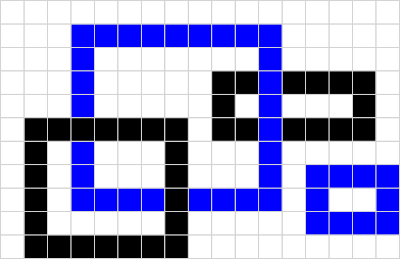
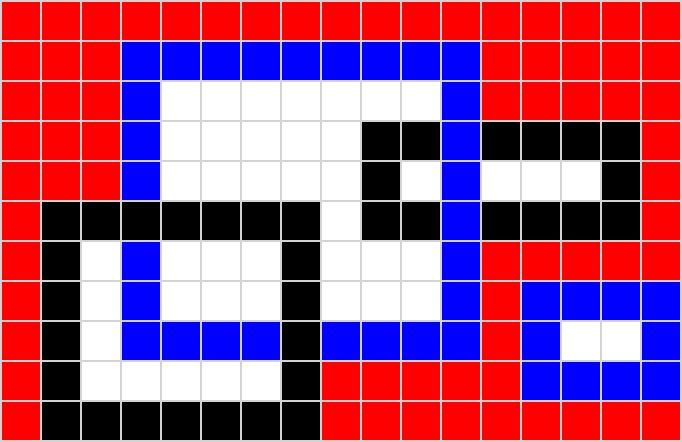
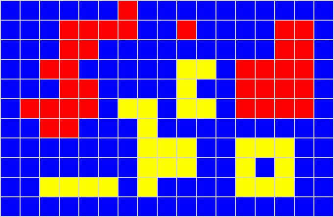
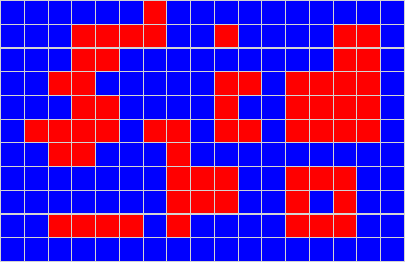

* TOC
{:toc}

## Oznamy

Táto prednáška bola spojená s [prednáškou 17](./P17.md),
oznamy a linky na videá nájdete tam.

## Vyfarbovanie súvislých oblastí

  - Uvažujme obrázok pozostávajúci z `m` krát `n` štvorčekov (pixelov).
  - Farbu každého pixelu zapíšeme do jedného políčka dvojrozmerného poľa
    s `m` riadkami a `n` stĺpcami.
  - V našom jednoduchom príklade budeme pracovať iba s piatimi farbami,
    ktoré budeme reprezentovať číslami `0,...,4` podľa nasledujúceho
    poľa (napríklad číslo `0` teda reprezentuje bielu farbu):


```cpp
const char *farby[5] = {"white", "blue", "black", "yellow", "red"}; 
```

Napríklad obrázok

{:width="400px"}

tak môže byť reprezentovaný nasledujúcim textovým súborom obsahujúcim
najprv rozmery matice (čísla `m` a `n`) a za nimi samotné prvky matice:

    11 17
     0 0 0 0 0 0 0 0 0 0 0 0 0 0 0 0 0
     0 0 0 1 1 1 1 1 1 1 1 1 0 0 0 0 0
     0 0 0 1 0 0 0 0 0 0 0 1 0 0 0 0 0
     0 0 0 1 0 0 0 0 0 2 2 1 2 2 2 2 0
     0 0 0 1 0 0 0 0 0 2 0 1 0 0 0 2 0
     0 2 2 2 2 2 2 2 0 2 2 1 2 2 2 2 0
     0 2 0 1 0 0 0 2 0 0 0 1 0 0 0 0 0
     0 2 0 1 0 0 0 2 0 0 0 1 0 1 1 1 1
     0 2 0 1 1 1 1 2 1 1 1 1 0 1 0 0 1
     0 2 0 0 0 0 0 2 0 0 0 0 0 1 1 1 1
     0 2 2 2 2 2 2 2 0 0 0 0 0 0 0 0 0

Zameriame sa teraz na nasledujúci problém: používateľ zvolí (zadá na
konzolu) súradnice niektorého štvorčeka a cieľom je ofarbiť nejakou
farbou (napríklad červenou) celú súvislú oblasť rovnakej farby
obsahujúcu daný štvorček. Napríklad pre obrazec vyššie a vstupné
súradnice `(2,1)` (teda štvorček v treťom riadku a druhom stĺpci, keďže
matica sa bude indexovať od nuly) by mal byť výstupom nasledujúci
obrazec:

{:width="400px"}

Podobný problém je napríklad často potrebné riešiť v rôznych nástrojoch
na prácu s grafikou a podobne.

  - Jednoduché útvary, napr. obdĺžnik, by sa dali vyfarbiť jednoduchými
    cyklami, naša súvislá oblasť ale môže mať veľmi zložitý tvar, s
    mnohými zákrutami, vetveniami, dierami a podobne.
  - Pre každé políčko, ktoré prefarbíme, nesmieme zabudnúť skontrolovať
    všetkých jeho susedov a ak majú rovnakú farbu ako malo pôvodné
    políčko, tak prefarbiť aj ich, ich susedov, susedov ich susedov
    atď.
  - Toto vieme ľahko zapísať rekurzívne: zafarbíme jedno políčko a potom
    rekurzívne zafarbujeme celú dosiahnuteľnú oblasť pre každého suseda
    rovnakej farby, akú malo pôvodne prefarbené políčko.
  - Táto podúloha je menšia, lebo aspoň jedno políčko z nej ubudlo prvým
    prefarbením.

### Vyfarbovanie pomocou rekurzívnej funkcie

Nasledujúca rekurzívna funkcia `vyfarbi` prefarbí políčko so súradnicami
`(riadok, stlpec)` na cieľovú farbu `farba` a následne sa rekurzívne
zavolá pre všetkých susedov tohto políčka, ktoré sú zafarbené pôvodnou
farbou prefarbovanej oblasti.

```cpp
/* Prefarbi súvislú jednofarebnú oblasť obsahujúcu 
 * pozíciu (riadok,stlpec) na farbu s číslom farba. */
void vyfarbi(int **a, int m, int n, 
             int riadok, int stlpec, int farba) {
    int staraFarba = a[riadok][stlpec];
    if (staraFarba == farba) {
        return;
    }
    a[riadok][stlpec] = farba;
    if (riadok - 1 >= 0 
        && a[riadok - 1][stlpec] == staraFarba) {
        vyfarbi(a, m, n, riadok - 1, stlpec, farba);
    }
    if (riadok + 1 < m 
        && a[riadok + 1][stlpec] == staraFarba) {
        vyfarbi(a, m, n, riadok + 1, stlpec, farba);
    }
    if (stlpec - 1 >= 0 
        && a[riadok][stlpec - 1] == staraFarba) {
        vyfarbi(a, m, n, riadok, stlpec - 1, farba);
    }
    if (stlpec + 1 < n 
        && a[riadok][stlpec + 1] == staraFarba) {
        vyfarbi(a, m, n, riadok, stlpec + 1, farba);
    }
} 
```

Proces vyfarbovania môžeme animovať pomocou našej knižnice SVGdraw

  - [Výsledná animácia](../files/Animacia1.svg)

V animácii okrem zmeny farby štvorčeka meníme aj farbu jeho rámčeka: pri
zavolaní rekurzie sa zmení na hnedú a po skončení spracovania štvorčeka
aj jeho susedov sa zmení na sivú. Hnedé sú teda vždy rámčeky štvorčekov
uložené na zásobníku volaní.

### Program s animáciou

  - Program na vyfarbovanie súvislých oblastí obsahuje funkcie na
    inicializáciu matice, jej načítanie zo súboru, vykresľovanie
    jednotlivých štvorčekov a celej matice, ako aj uvoľnenie pamäte.
    Všetky tieto funkcie pracujú podobne ako pri príklade s výškovou
    mapou z [prednášky 13](./P13.md).
  - Funkcia `main` načíta maticu zo súboru `vstup.txt` a animáciu uloží
    do súboru `matica.svg`.
  - Do rekurzívnej funkcie pridáme volania funkcie `vykresliStvorcek`,
    ktoré aktuálny štvorček v obrázku prekreslia novou farbou a menia aj
    farbu rámčeka. Za ňou vždy zavoláme funkciu `drawing.wait`, ktorá
    animáciu pozdrží, aby sme zmeny stihli na obrázku sledovať.

<!-- end list -->

```cpp
#include "SVGdraw.h"
#include <cstdio>
#include <cassert>

const char *farby[5] = {"white", "blue", "black", "yellow", "red"}; 

const int stvorcek = 40;    // velkost stvorceka v pixeloch
const int hrubkaCiary = 2;  // hrubka ciary v pixeloch
const double pauza = 0.3;   // pauza po kazdom kroku vyfarbovania v sekundach

/* Vytvori maticu s n riadkami a m stlpcami. */
int **vytvorMaticu(int m, int n) {
    int **a;
    a = new int *[m];
    for (int i = 0; i < m; i++) {
        a[i] = new int[n];
    }
    return a;
}

/* Uvolni pamat matice a s n riadkami a m stlpcami. */
void zmazMaticu(int **a, int m) {
    for (int i = 0; i < m; i++) {
        delete[] a[i];
    }
    delete[] a;
}

/* Vykresli stvorcek v riadku i a stlpci j 
   s farbou vyplne farba a farbou ciary farbaCiary. */
void vykresliStvorcek(int i, int j, 
                      const char * farba, 
                      const char * farbaCiary, 
                      SVGdraw &drawing) {
    drawing.setLineColor(farbaCiary);
    drawing.setLineWidth(hrubkaCiary);
    drawing.setFillColor(farba);
    drawing.drawRectangle(j * stvorcek, i * stvorcek, 
                          stvorcek, stvorcek);
}

/* Vykresli maticu a s n riadkami a m stlpcami. */
void vykresliMaticu(int **a, int m, int n, SVGdraw &drawing) {
    for (int i = 0; i < m; i++) {
        for (int j = 0; j < n; j++) {
            vykresliStvorcek(i, j, farby[a[i][j]], "lightgray", drawing);
        }
    }
}

/* Nacita z textoveho suboru, na ktory ukazuje fr, 
   prvky matice a s n riadkami a m stlpcami. */
void nacitajMaticu(FILE *fr, int **a, int m, int n) {
    assert(fr != NULL);
    for (int i = 0; i < m; i++) {
        for (int j = 0; j < n; j++) {
            fscanf(fr, "%d", &a[i][j]);
        }
    }
}

/* Prefarbi suvislu jednofarebnu oblast obsahujucu 
 * poziciu (riadok,stlpec) na farbu s cislom farba. */
void vyfarbi(int **a, int m, int n, 
             int riadok, int stlpec, int farba,
             SVGdraw &drawing) {
    int staraFarba = a[riadok][stlpec];
    if (staraFarba == farba) {
        return;
    }
    a[riadok][stlpec] = farba;
    vykresliStvorcek(riadok, stlpec, farby[farba], 
                     "brown", drawing);
    drawing.wait(pauza);
    if (riadok - 1 >= 0 && a[riadok - 1][stlpec] == staraFarba) {
        vyfarbi(a, m, n, riadok - 1, stlpec, farba, drawing);
    }
    if (riadok + 1 < m && a[riadok + 1][stlpec] == staraFarba) {
        vyfarbi(a, m, n, riadok + 1, stlpec, farba, drawing);
    }
    if (stlpec - 1 >= 0 && a[riadok][stlpec - 1] == staraFarba) {
        vyfarbi(a, m, n, riadok, stlpec - 1, farba, drawing);
    }
    if (stlpec + 1 < n && a[riadok][stlpec + 1] == staraFarba) {
        vyfarbi(a, m, n, riadok, stlpec + 1, farba, drawing);
    }
    vykresliStvorcek(riadok, stlpec, farby[farba], 
                     "lightgray", drawing);
    drawing.wait(pauza);
} 

int main() {
    FILE *fr = fopen("vstup.txt", "r");
    assert(fr != NULL);

    // nacitanie rozmerov matice
    int m, n;
    fscanf(fr, "%d %d", &m, &n);  
    // vytvorenie matice a nacitanie jej prvkov  
    int **a = vytvorMaticu(m, n);
    nacitajMaticu(fr, a, m, n);         
    fclose(fr);
        
    SVGdraw drawing(n * stvorcek, m * stvorcek, "matica.svg");
    vykresliMaticu(a, m, n, drawing);

    // nacitanie suradnic pociatocneho stvorceka 
    int riadok, stlpec;
    scanf("%d", &riadok);
    scanf("%d", &stlpec);

    vyfarbi(a, m, n, riadok, stlpec, 4, drawing);

    drawing.finish();
    zmazMaticu(a, m);
}
```

## Počítanie ostrovov

Vyfarbovanie teraz použijeme na riešenie trochu inej úlohy. Predstavme
si, že vstupný obrázok reprezentuje jednoduchú mapu súostrovia, kde more
je znázornené modrou farbou a pevnina je znázornená žltou farbou. Úlohou
môže byť zistiť počet ostrovov na mape. Ten môžeme zistiť napríklad
takto:

  - Prechádzame postupne všetky políčka mapy.
  - Ak narazíme na pevninu (žlté políčko), zvýšime doposiaľ nájdený
    počet ostrovov o 1 a ofarbíme celý ostrov napríklad na červeno.
  - Ak narazíme na ďalšie žlté políčko, opäť urobíme to isté.
  - Toto robíme, až kým prejdeme cez všetky políčka mapy.

Príklad mapy a jej zobrazenie pred začiatkom hľadania ostrovov, po
nájdení prvých troch ostrovov a po nájdení všetkých ostrovov:

    11 17
     1 1 1 1 1 1 3 1 1 1 1 1 1 1 1 1 1
     1 1 1 3 3 3 3 1 1 3 1 1 1 1 3 3 1
     1 1 1 3 3 1 1 1 1 1 1 1 1 1 3 3 1
     1 1 3 3 1 1 1 1 1 3 3 1 3 3 3 3 1
     1 1 1 3 3 1 1 1 1 3 1 1 3 3 3 3 1
     1 3 3 3 3 1 3 3 1 3 3 1 3 3 3 3 1
     1 1 3 3 1 1 1 3 1 1 1 1 1 1 1 1 1
     1 1 1 1 1 1 1 3 3 3 1 1 3 3 3 1 1
     1 1 1 1 1 1 1 3 3 3 1 1 3 1 3 1 1
     1 1 3 3 3 3 1 3 1 1 1 1 3 3 3 1 1
     1 1 1 1 1 1 1 1 1 1 1 1 1 1 1 1 1






Do programu vyššie teda dorobíme funkciu

```cpp
int najdiOstrovy(int **a, int m, int n, SVGdraw &drawing) {
    int ostrovov = 0;
    for (int i = 0; i < m; i++) {
        for (int j = 0; j < n; j++) {
            if (a[i][j] == 3) {
                ostrovov++;
                vyfarbi(a, m, n, i, j, 4, drawing);
            }
        }
    }
    return ostrovov;
}
```

a funkciu `main` môžeme zmeniť napríklad takto:

```cpp
int main() {
    FILE *fr = fopen("ostrovy.txt", "r");
    assert(fr != NULL);
    int m, n;
    fscanf(fr, "%d %d", &m, &n);
    int **a = vytvorMaticu(m, n);
    nacitajMaticu(fr, a, m, n);
    fclose(fr);
        
    SVGdraw drawing(n * stvorcek, m * stvorcek, "mapa.svg");
    vykresliMaticu(a, m, n, drawing);

    int pocetOstrovov = najdiOstrovy(a, m, n, drawing);
    printf("Pocet ostrovov je %d.\n", pocetOstrovov);

    drawing.finish();
    zmazMaticu(a, m);
}
```

  - [Výsledná animácia](../files/Animacia2.svg)

*Cvičenie:* upravte program tak, aby ešte navyše zistil, či má niektorý
z ostrovov jazero.

## Opakovanie: zásobník a rad

  - **Zásobník** (angl. **stack**) a **rad** alebo **front** (angl.
    **queue**) sú abstraktné dátové typy, ktoré udržiavajú postupnosť
    nejakých prvkov.
  - Obidva typy podporujú vloženie prvku a výber prvku
  - Zo zásobníka sa vyberá prvok, ktorý v ňom pobudol najkratšie, z radu
    prvok, ktorý v ňom bol najdlhšie
  - Zásobník tak pripomína stĺpec čistých tanierov v reštaurácii, rad
    pripomína rad pri pokladni

Konkrétne funkcie hlavičky funkcií

    void init(stack &s);
    bool isEmpty(stack &s);
    void push(stack &s, dataType item); // vlozenie prvku
    dataType pop(stack &s);    // vyber prvku
    dataType peek(stack &s);
    void destroy(stack &s);
    
    void init(queue &q);
    bool isEmpty(queue &q);
    void enqueue(queue &q, dataType item); // vlozenie prvku
    dataType dequeue(queue &q);  // vyber prvku
    dataType peek(queue &q);
    void destroy(queue &q);

  - Pre obidva typy sme videli implementáciu v poli aj v spájanom
    zozname
  - Hlavné funkcie vkladania a vyberania sú v obidvoch implementáciách
    rýchle a jednoduché

Videli sme tiež, že obidve štruktúry sa dajú použiť na ukladanie dát
alebo úloh, ktoré ešte treba vyriešiť

  - Dnes uvidíme ďalšie príklady, kde pomocou zásobníka alebo radu
    nahradíme rekurziu
  - Najskôr nerekurzívnu verziu vyfarbovania s použitím zásobníka alebo
    radu
  - Potom nerekurzívny Quick Sort

## Nerekurzívne vyfarbovanie

### Vyfarbovanie s použitím zásobníka

S použitím niektorej implementácie zásobníka z [minulej
prednášky](./P17.md) môžeme napísať aj nerekurzívnu
verziu funkcie `vyfarbi`. Tá zakaždým vyberie zo zásobníka niektoré
políčko, skontroluje všetkých jeho susedov a ak majú pôvodnú farbu,
ofarbí ich a vloží ich na zásobník, aby sme ďalej skontrolovali aj ich
susedov.

Súradnice jednotlivých susedov budeme počítať s použitím cyklu `for` a
polí `deltaStlpec` a `deltaRiadok`, ktoré pre `i = 0,1,2,3` obsahujú
*posuny* jednotlivých súradníc `i`-teho suseda oproti práve spracúvanému
políčku (dalo by sa použiť aj v rekurzívnej verzii).

```cpp
struct policko {
    int riadok, stlpec;
};

typedef policko dataType;


/* Sem pride definicia struktury pre zasobnik 
 * a funkcii poskytovanych zasobnikom. */


const int deltaRiadok[4] = {0, 0, 1, -1};
const int deltaStlpec[4] = {1, -1, 0, 0};

/* Prefarbi suvislu jednofarebnu oblast obsahujucu 
 * poziciu (riadok,stlpec) na farbu s cislom farba. */  
void vyfarbi(int **a, int m, int n, 
             int riadok, int stlpec, int farba,
             SVGdraw &drawing) {
    int staraFarba = a[riadok][stlpec];
    if (staraFarba == farba) {
        return;
    }
    a[riadok][stlpec] = farba;
    vykresliStvorcek(riadok, stlpec, farby[farba], 
             "lightgrey", drawing);
    stack s;
    init(s);
    
    policko p;
    p.riadok = riadok;
    p.stlpec = stlpec;
    push(s, p);
    
    while (!isEmpty(s)) {
        p = pop(s);
        for (int i = 0; i <= 3; i++) {
            policko sused;
            sused.riadok = p.riadok + deltaRiadok[i];
            sused.stlpec = p.stlpec + deltaStlpec[i];
            if (sused.riadok >= 0 && sused.riadok < m
                && sused.stlpec >= 0 && sused.stlpec < n
                && a[sused.riadok][sused.stlpec] == staraFarba) {
                a[sused.riadok][sused.stlpec] = farba;
                vykresliStvorcek(p.riadok, p.stlpec, farby[farba], 
                                "lightgrey", drawing);
                drawing.wait(pauza);
                push(s, sused);    
            }        
        }
    }
    destroy(s);
} 
```

  - [Výsledná animácia](../files/Animacia3.svg)
  - Poradie sa trochu zmenilo oproti rekurzívnej verzii. Prečo?

### Vyfarbovanie s použitím radu

Namiesto zásobníka môžeme použiť aj rad. Obrazec sa potom bude
vyfarbovať v poradí podľa vzdialenosti od počiatočného políčka. Tento
algoritmus sa volá *prehľadávanie do šírky*, kým rekurzívna verzia
zodpovedá *prehľadávaniu do hĺbky*.

```cpp
struct policko {
    int riadok, stlpec;
};

typedef policko dataType;


/* Sem pride definicia struktury pre rad 
 * a funkcii poskytovanych radom. */


const int deltaRiadok[4] = {0, 0, 1, -1};
const int deltaStlpec[4] = {1, -1, 0, 0};

/* Prefarbi suvislu jednofarebnu oblast obsahujucu
 * poziciu (riadok,stlpec) na farbu s cislom farba. */  
void vyfarbi(int **a, int m, int n, 
             int riadok, int stlpec, int farba, 
             SVGdraw &drawing) {
    int staraFarba = a[riadok][stlpec];
    if (staraFarba == farba) {
        return;
    }
    a[riadok][stlpec] = farba;
    vykresliStvorcek(riadok, stlpec, farby[farba],
                     "lightgrey", drawing);
    
    queue q;
    init(q);
    
    policko p;
    p.riadok = riadok;
    p.stlpec = stlpec;
    enqueue(q, p);
    
    while (!isEmpty(q)) {
        p = dequeue(q);
        for (int i = 0; i <= 3; i++) {
            policko sused;
            sused.riadok = p.riadok + deltaRiadok[i];
            sused.stlpec = p.stlpec + deltaStlpec[i];
            if (sused.riadok >= 0 && sused.riadok < m
                && sused.stlpec >= 0 && sused.stlpec < n
                && a[sused.riadok][sused.stlpec] == staraFarba) {
                a[sused.riadok][sused.stlpec] = farba;
                vykresliStvorcek(sused.riadok, sused.stlpec, farby[farba],
                                 "lightgrey", drawing);
                drawing.wait(pauza);
                enqueue(q, sused);    
            }        
        }
    }
    destroy(q);
} 
```

  - [Výsledná animácia](../files/Animacia4.svg)

Program potom môžeme upraviť aj tak, aby do každého ofarbeného políčka
vypísal jeho vzdialenosť od počiatočného políčka:

```cpp
struct policko {
    int riadok, stlpec, vzd;
};

typedef policko dataType;


/* Sem pride definicia struktury pre rad 
 * a funkcii poskytovanych radom. */

void vypisVzdialenost(policko p, SVGdraw &drawing) {
    drawing.setLineColor("white");
    drawing.setFontSize(20);
    char text[15];
    sprintf(text, "%d", p.vzd);
    drawing.drawText((p.stlpec + 0.5) * stvorcek,
             (p.riadok + 0.5) * stvorcek, text);
}

const int deltaRiadok[4] = {0, 0, 1, -1};
const int deltaStlpec[4] = {1, -1, 0, 0};

/* Prefarbi suvislu jednofarebnu oblast obsahujucu 
 * poziciu (riadok,stlpec) na farbu s cislom farba. */  
void vyfarbi(int **a, int m, int n, 
             int riadok, int stlpec, int farba, 
             SVGdraw &drawing) {
    int staraFarba = a[riadok][stlpec];
    if (staraFarba == farba) {
        return;
    }
    
    queue q;
    init(q);
    
    policko p;
    p.riadok = riadok;
    p.stlpec = stlpec;
    p.vzd = 0;
    enqueue(q, p);
    a[riadok][stlpec] = farba;
    vykresliStvorcek(riadok, stlpec, farby[farba],
                     "lightgrey", drawing);
    vypisVzdialenost(p, drawing);
    
    while (!isEmpty(q)) {
        p = dequeue(q);
        for (int i = 0; i <= 3; i++) {
            policko sused;
            sused.riadok = p.riadok + deltaRiadok[i];
            sused.stlpec = p.stlpec + deltaStlpec[i];
            if (sused.riadok >= 0 && sused.riadok < m
                && sused.stlpec >= 0 && sused.stlpec < n
                && a[sused.riadok][sused.stlpec] == staraFarba) {
            sused.vzd = p.vzd + 1;
                a[sused.riadok][sused.stlpec] = farba;
                vykresliStvorcek(sused.riadok, sused.stlpec, farby[farba],
                                 "lightgrey", drawing);
                vypisVzdialenost(sused, drawing);
                drawing.wait(pauza);
                enqueue(q, sused);    
            }        
        }
    }
    destroy(q);
} 
```

  - [Výsledná animácia](../files/Animacia5.svg)

## Použitie zásobníka a radu: nerekurzívny Quick Sort

Pripomeňme si triedenie Quick Sort z [prednášky 11](./P11.md#quick-sort):

```cpp
void swap (int &x, int &y) {
    int tmp = x;
    x = y;
    y = tmp;
}

int partition(int a[], int left, int right) {
    int pivot = a[left];     
    int lastSmaller = left;
    
    for (int unknown = left + 1; unknown <= right; unknown++) {
        if (a[unknown] < pivot) {
            lastSmaller++;
            swap(a[unknown], a[lastSmaller]);
        }
    }   
    swap(a[left],a[lastSmaller]); 
    return lastSmaller;
}

void quicksort(int a[], int left, int right) {
    if (left >= right) {
        return; 
    }
    
    int middle = partition(a, left, right);
        
    quicksort(a, left, middle-1);  
    quicksort(a, middle+1, right);   
}

int main() {
  // ...
  quicksort(a, 0, N-1);
  // ...
}
```

Namiesto rekurzie môžeme použiť aj zásobník úsekov, ktoré ešte treba
dotriediť.

```cpp
struct usek {
    int left;
    int right;
};

typedef usek dataType;

/* Sem pride definicia struktury stack a vsetkych potrebnych funkcii. */

/* Sem pridu funkcie swap a partition rovnake ako vyssie. */

void quicksort(int a[], int n) {
    stack s;
    init(s);
    
    usek u = {0, n-1};
    push(s,u);
    
    while (!isEmpty(s)) {
        u = pop(s);
        // vynechame useky dlzky 0 a 1
        if (u.left >= u.right) {
            continue;
        }
        
        int middle = partition(a, u.left, u.right);
        
        usek u1 = {u.left, middle - 1};
        usek u2 = {middle + 1, u.right};
        push(s,u2);
        push(s,u1);
    }
    
    destroy(s);
}

int main() {
  // ...
  quicksort(a, N);
  // ...
}
```

  - Tento program triedi úseky v rovnakom poradí, ako rekurzívny Quick
    Sort, lebo po rozdelení poľa na dve časti dá na vrch zásobníka úsek
    zodpovedajúci jeho ľavej časti. Až keď sa táto ľavá časť a všetky
    podúlohy, ktoré z nej vzniknú, spracuje, dôjde na spracovanie pravej
    časti poľa.
  - Pri triedení Quick Sort však na tomto poradí nezáleží, takže by sme
    mohli jednotlivé úseky vkladať na zásobník aj v opačnom poradí.
  - Alebo by sme namiesto zásobníka mohli použiť rad. Potom by najskôr
    rozdelil ľavú aj pravú časť na ďalšie podčasti a potom by delil
    každú z týchto podčastí atď.

**Na zamyslenie:** ako by mohla vyzerať nerekurzívna verzia triedenia
[Merge Sort](./P11.md#triedenie-zlučovaním-merge-sort)?
Prečo sa nedá použiť rovnaký prístup ako pri triedení Quick Sort?

## Zhrnutie

  - Vyfarbovanie súvislých oblastí v matici sa dá využiť v počítačovej
    grafike ale na iné úlohy, napríklad počítanie ostrovov na mape.
  - Dá sa jednoducho napísať rekurzívne.
  - Rekurziu vieme odstrániť použitím zásobníka alebo radu na ukladanie
    políčok, ktoré ešte treba spracovať.
  - Pri využití radu vieme spočítať aj vzdialenosť od počiatočného bodu
  - Budúci semester uvidíte na Programovaní (2) prehľadávanie grafov,
    ktoré funguje veľmi podobne, ale je trochu všeobecnejšie.

