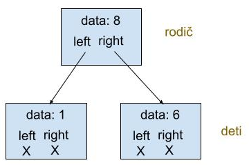
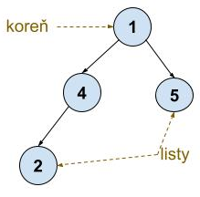
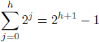

* TOC
{:toc}

## Oznamy

Prednášky

  - Tento týždeň a budúci pondelok ešte prednášky v normálnom režime.
  - Budúcu stredu 10.12. v prvej polovici prednášky informácie k skúške
    a rady k skúškovému všeobecne, potom doberieme posledné povinné
    učivo.
  - Posledný týždeň semestra v pondelok 15.12. nepovinná prednáška o
    nepreberaných črtách jazykov C a C++, v stredu 17.12. prednáška
    pravdepodobne nebude.

Cvičenia a úlohy

  - Cvičenia bežia normálne každý utorok, cvičenia v stredu už iba 2x.
  - Tento utorok rozcvička na stromy (dnešné učivo), v stredu bonusová
    rozcvička
  - Tretí miniprojekt treba odovzdať do tohto štvrtka (4.12.) 22:00.

Semestrálny test

  - Budúcu stredu o 18:10 v posluchárňach A a B, trvanie 45 minút.
  - Rovnaké pravidlá ako prvý test.
  - Bude obsahovať učivo po dnešnú prednášku a zajtrajšie cvičenia
    vrátane. Na opravnom termíne môže byť aj učivo z ďalších prednášok.
  - Viac informácií na stránke [Zimný semester, semestrálny
    test](./Zimný_semester,_semestrálny_test.md).

Na termíny skúšky sa bude dať prihlasovať od dnes 19:00

  - Kapacita termínov bude obmedzená, prihláste sa teda radšej skôr,
    neskôr to môžete zmeniť.
  - Ak vidíte konflikt niektorého termínu s hromadnou skúškou alebo
    písomkou z iného predmetu, dajte mi prosím vedieť čím skôr.
  - Decembrový termín odporúčame hlavne študentom, ktorým programovanie
    nerobí problémy.
  - Viac informácií o skúške je na stránke [Zimný semester,
    skúška](./Zimný_semester,_skúška.md), spolu cez to prejdeme
    budúcu stredu.
  - Na testovač budúcu stredu pridáme zopár tréningových príkladov na
    skúšku.

## Binárne stromy

Na predmete sme už videli spájané zoznamy, ktoré tvoria uzly pospájané
smerníkmi do reťaze. Binárne stromy sú o niečo zložitejšia štruktúra, v
ktorej má každý uzol smerníky na dva ďalšie uzly, ktoré nazývame jeho
*deti*.

### Štruktúra pre uzol binárneho stromu

V každom uzle budeme pamätať hodnotu ľubovoľného typu `dataType`,
napríklad `int` a smerníky na ľavé a pravé dieťa, ktoré môžu byť aj
NULL, ak uzol príslušné dieťa nemá.



```cpp
/* Typ prvkov ukladaných v uzloch binárneho stromu */
typedef int dataType;          

/* Uzol binárneho stromu */
struct treeNode {
    // hodnota uložená v uzle
    dataType data;  

    // smerníky na deti
    treeNode * left, * right;
};
```



Z týchto uzlov budeme vytvárať hierarchické štruktúry. Väčšinou ich
kreslíme zhora nadol tak, aby deti boli pod rodičmi. Najvyššie položený
uzol sa nazýva *koreň*.

### Definícia zakoreneného stromu

V diskrétnej matematike je strom množina *uzlov* (nazývame ich aj
*vrcholy*) a množina prepojení medzi nimi, ktoré nazývame *hrany*, ktoré
spĺňajú určité podmienky. Presnú matematickú definíciu stromov uvidíte
na predmete *Úvod do kombinatoriky a teórie grafov* (letný semester).

Na tomto predmete nás zaujímajú *zakorenené stromy*, v ktorých hrany
majú určený *smer* rodičom k deťom (môžeme ich kresliť ako šípku).
Zakorenený strom má spĺňať nasledujúce podmienky:

  - Koreň nemá rodičov a každý iný uzol v strome okrem koreňa má práve
    jedného rodiča (jednu prichádzajúcu hranu)
  - Do každého uzla sa vieme z koreňa dostať po hranách

Ako špeciálny prípad budeme povoľovať aj prázdny strom, ktorý neobsahuje
žiadne uzly (ani koreň).

*Binárne stromy* sú špeciálnym prípadom zakorenených stromov, v ktorých
má každý uzol *najviac dve deti*. V našich stromoch budeme rozlišovať
ľavé a pravé dieťa.

### Terminológia stromov

  - Uzly zakoreneného stromu, ktoré nemajú žiadne dieťa, nazývame
    *listami*; zvyšné uzly nazývame *vnútornými uzlami*.
  - *Predkom* uzla *u* nazveme ľubovoľný uzol *v* ležiaci na ceste z
    koreňa do *u* (vrátane *u* a koreňa). Naopak potom hovoríme, že *u*
    je *potomkom* uzla *v*.
  - *Podstromom* stromu *T* zakoreneným v nejakom uzle *v* stromu *T*
    budeme rozumieť strom s koreňom *v* pozostávajúci zo všetkých jeho
    potomkov a všetkých hrán stromu *T* vedúcich medzi týmito uzlami.

Každý binárny strom je teda buď prázdny, alebo je tvorený jeho koreňom a
dvoma podstromami: ľavým a pravým.

Anglické výrazy:

  - uzol=node, vrchol=vertex, hrana=edge
  - strom=tree, podstrom=subtree, koreň=root, list=leaf,
    predok=ancestor, potomok=descendant

### Vytvorenie binárneho stromu

Nasledujúca funkcia vytvorí uzol binárneho stromu s dátami `data`, ľavým
podstromom zakoreneným v uzle `* left` a pravým podstromom zakoreneným v
uzle `* right` (parametre `left` a `right` sú teda smerníky na uzly).
Ako výstup funkcia vráti smerník na novovytvorený uzol.

```cpp
/* Vytvorí uzol binárneho stromu */
treeNode * createNode(dataType data, treeNode * left, treeNode * right) {
    treeNode * v = new treeNode;
    v->data = data;
    v->left = left;
    v->right = right;
    return v;
}
```

Nasledujúca volanie tak napríklad vytvorí binárny strom so šiestimi
uzlami zakorenený v uzle `* root`.

```cpp
treeNode * root = createNode(1,
                createNode(2, 
                  createNode(3, NULL, NULL),
                  createNode(4, NULL, NULL)),
               createNode(5,
                 NULL, 
                 createNode(6, NULL, NULL)));
```

*Cvičenie*: nakreslite binárny strom vytvorený predchádzajúcim volaním.

## Použitie stromov, plán zvyšok semestra

  - Dnes si ukážeme niekoľko funkcií, ktoré pracujú s binárnymi stromami
    všeobecne
  - Ukážeme si aj prvý príklad použitia stromov: stromy reprezentujúce
    aritmetické výrazy
  - V stredu budeme viac rozprávať o práci s aritmetickými výrazmi s
    použitím stromov aj bez neho
  - Budúci pondelok si ukážeme binárne vyhľadávacie stromy, ktoré slúžia
    ako efektívna implementácia ADT dynamická množina
  - Budúcu stredu si ukážeme prefixové stromy, ktoré nebudú binárne a
    ktoré implementujú ADT dynamická množina, ak prvky množiny sú
    reťazce
  - Ďalšie príklady stromov uvidíte na skúške a vo vyšších ročníkoch

## Prehľadávanie stromov a vypisovanie ich uzlov

Často je potrebné prejsť celý strom a spracovať (napríklad vypísať)
hodnoty vo všetkých uzloch.

  - V spájanom zozname sme prešli cyklom pomocou smerníkov `next`
  - Tu ale máme dva smery pokračovania: `left` a `right`
  - Aby sme prešli všetko použijeme rekurziu:
      - Prvé rekurzívne volanie prejde všetko v ľavom podstrome
      - Druhé rekurzívne volanie prejde všetko v pravom podstrome
  - Všimnite si, ako sú riešené triviálne prípady

Ak hodnoty vypisujeme, rozlišujeme tri poradia: hodnotu v koreni môžeme
vypísať pred oboma podstromami, po nich alebo medzi ľavým a pravým
podstromom. Tieto poradia sa nazývajú *preorder*, *postorder* a
*inorder*.

Funkcie nižšie predpokladajú, že pre hodnoty typu `dataType` máme k
dispozícii funkciu `printDataType`, ktorá ich v nejakom vhodnom formáte
vypisuje.

```cpp
/* Funkcia pre výpis hodnoty typu dataType */
void printDataType(dataType data) {
    printf("%d ", data);  // pre int
}

/* Vypíše podstrom s koreňom * root v poradí preorder */
void printPreorder(treeNode * root) {
    if (root != NULL) {
        printDataType(root->data);
        printPreorder(root->left);
        printPreorder(root->right);
   } 
}

/* Vypíše podstrom s koreňom * root v poradí inorder */
void printInorder(treeNode * root) {
    if (root != NULL) {
        printInorder(root->left);
        printDataType(root->data);
        printInorder(root->right);
    }
}

/* Vypíše podstrom s koreňom * root v poradí postorder */
void printPostorder(treeNode * root) {
    if (root != NULL) {
        printPostorder(root->left);
        printPostorder(root->right);
        printDataType(root->data);
    }
}
```

**Cvičenie:**

  - Čo vypíšu tieto funkcie pre strom vytvorený vyššie?
  - Ako by sme spočítali súčet hodnôt uložených v uzloch stromu?

### Likvidácia binárneho stromu

Nasledujúca rekurzívna funkcia zlikviduje celý podstrom zakorenený v
uzle `* root` (t. j. uvoľní pamäť pre všetky jeho uzly).

  - Opäť používa rekurziu na prejdenie celého stromu.
  - Pozor na poradie príkazov, treba najskôr uvoľniť podstromy a až
    potom zavolať delete na root, inak by sme stratili prístup k deťom.

<!-- end list -->

```cpp
/* Zlikviduje podstrom s koreňom * root (uvoľní pamäť) */
void destroyTree(treeNode * root) {
    if (root != NULL) {
        destroyTree(root->left);
        destroyTree(root->right);
        delete root;
    }
}
```

## Aritmetické výrazy a stromy

Dnes a na budúcej prednáške sa budeme venovať spracovaniu aritmetických
výrazov pozostávajúcich z reálnych čísel, operátorov `+,-,*,/` a
zátvoriek `(,)`. Hlavnou úlohou je vyhodnotenie daného výrazu;
napríklad pre výraz

    (65 - 3 * 5) / (2 + 3)

chceme vedieť povedať, že jeho hodnota je 10.

Ukážeme si

  - ako výraz reprezentovať stromom, čo je veľmi pohodlné reprezentácia
    pre ďalšiu prácu (vyhodnotenie výrazu aj jeho ďalšie úpravy)
  - dva ďalšie spôsoby zápisu výrazu vo forme textu, ktoré tiež umožňujú
    výrazy ľahko vyhodnocovať
  - ako prevádzať výraz medzi týmito spôsobmi zápisu (nabudúce)

### Aritmetický výraz ako strom


Aritmetické výrazy môžeme veľmi prirodzene reprezentovať vo forme
*stromu*

  - Operátory a čísla tvoria uzly
  - Čísla tvoria listy stromu.
  - Operátory tvoria vnútorné uzly stromu, každý z nich má dve *deti*
    zodpovedajúce podvýrazom pre jednotlivé operandy.
  - Koreň stromu reprezentuje celý aritmetický výraz.

V uzloch teda niekedy potrebujeme uložiť ako dáta reálne číslo a niekedy
operátor, čo môže byť jeden zo znakov `'+'`, `'-'`, `'*'` a `'/'`. Aby
sme toto vyriešili, vytvoríme si miesto na oboje v zázname nazvanom
`token` (v preklade niečo ako symbol).

```cpp
struct token {
    char op;   
    double val;
};
typedef token dataType;
```

  - Ak štruktúra obsahuje číslo, `op` bude medzera a samotné číslo bude
    v položke `val`.
  - Ak štruktúra reprezentuje iný symbol, tento symbol bude v položke
    `op` a položka `val` sa nebude používať.

### Vytvorenie uzlov

Nasledujúce funkcie vytvoria nový vnútorný uzol (pre operátor) resp.
nový list (pre číslo):

```cpp
treeNode * createOp(char op, node * left, node * right) {
    treeNode * v = new treeNode;
    v->left = left;
    v->right = right;
    v->data.op = op;
    return v; 
}

treeNode * createNum(double val) {
    treeNode * v = new treeNode;
    v->left = NULL;
    v->right = NULL;
    v->data.op = ' ';
    v->data.val = val;
    return v;
}
```

Týmito funkciami teraz môžeme vytvoriť strom pre výraz `(65 – 3 * 5)/(2
+ 3)`:

```cpp
treeNode * root = createOp('/', 
                    createOp('-', 
                      createNum(65),
                      createOp('*', createNum(3), createNum(5))),
                    createOp('+', createNum(2), createNum(3)));
```

Alebo po častiach:

```cpp
treeNode * v65 = createNum(65);
treeNode * v3 = createNum(3);
treeNode * v5 = createNum(5);
treeNode * v2 = createNum(2);
treeNode * v3b = createNum(3);
treeNode * vKrat = createOp('*', v3, v5);
treeNode * vMinus = createOp('-', v65, vKrat);
treeNode * vPlus = createOp('+', v2, v3b);
treeNode * vDeleno = createOp('/', vMinus, vPlus);
```

### Vyhodnotenie výrazu reprezentovaného stromom

Nasledujúca rekurzívna funkcia vypočíta hodnotu aritmetického výrazu
reprezentovaného stromom s koreňom `root`.

  - Ak je zadaný vrchol listom, vrátime hodnotu uloženú v položke `val`.
  - V opačnom prípade rekurzívne spočítame hodnoty pre obidva podvýrazy
    a skombinujeme ich podľa typu znamienka.
  - Celkovo veľmi jednoduchý a prirodzený výpočet.

<!-- end list -->

```cpp
double evaluateTree(treeNode * root) {
    assert(root != NULL);
    if (root->op == ' ') {
        return root->val;
    } else {
        double valLeft = evaluateTree(root->left);
        double valRight = evaluateTree(root->right);
        switch (root->op) {
            case '+':
                return valLeft + valRight;
                break;
            case '-':
                return valLeft - valRight;
                break;
            case '*':
                return valLeft * valRight;
                break;
            case '/':
                return valLeft / valRight;
                break;
            default:
                assert(false);
                break;
        }
    }
    return 0; // nedosiahnuteľný príkaz
}
```

## Notácie na zápis výrazov

### Infixová notácia

  - Bežný spôsob zápisu aritmetických výrazov sa v matematike nazýva aj
    **infixovou notáciou**.
  - Binárne operátory (ako napríklad `+,-,*,/`) sa v tejto notácii píšu
    medzi svojimi dvoma operandmi.
  - Poradie vykonávania operácií sa riadi zátvorkami a prioritou
    operácií.

Napríklad

    (65 – 3 * 5) / (2 + 3)

je infixový výraz s hodnotou `10`.

### Prefixová notácia

Pri **prefixovej notácii** (často podľa jej pôvodcu Jana Łukasiewicza
nazývanej aj *[poľskou
notáciou](https://en.wikipedia.org/wiki/Polish_notation)*) sa každý
operátor v aritmetickom výraze zapisuje pred svojimi dvoma operandmi.

Napríklad výraz `(65 – 3 * 5) / (2 + 3)` má prefixový zápis

    / - 65 * 3 5 + 2 3

Zaujímavosť: programovací jazyk
[Lisp](https://en.wikipedia.org/wiki/Lisp_\(programming_language\)) a
jeho varianty využívajú prefixovú notáciu na všetky výrazy, píšu však aj
zátvorky, napríklad `(+ 1 2)`.

### Postfixová notácia

Pri **postfixovej notácii** (často nazývanej aj *[obrátenou poľskou
notáciou](https://en.wikipedia.org/wiki/Reverse_Polish_notation)*) je
situácia opačná: operátor sa zapisuje bezprostredne za svojimi dvoma
operandmi.

Výraz `(65 – 3 * 5) / (2 + 3)` má teda postfixový zápis

    65 3 5 * - 2 3 + /

  - Postfixová a prefixová notácia sú pre človeka o niečo ťažšie
    čitateľné, než bežná infixová notácia (čo môže byť aj otázkou
    zvyku).
  - Uvidíme však, že výrazy v postfixovej notácii sa dajú jednoducho
    vyhodnocovať.
  - Výhodou postfixovej a prefixovej notácie oproti infixovej je aj to,
    že nepotrebujú zátvorky.

### Notácie a vypisovanie stromu

  - Ak aritmetický strom vypíšeme v preorder poradí, dostaneme prefixovú
    notáciu.
  - Ak aritmetický strom vypíšeme v postorder poradí, dostaneme
    postfixovú notáciu.
  - Ak aritmetický strom vypíšeme v inorder poradí, dostaneme niečo
    blízke infixovej notácii, ale treba pridať zátvorky.

Pre preorder a postorder stačí prepísať funkciu `printDataType`:

```cpp
/* Funkcia pre výpis hodnoty typu dataType = token */
void printDataType(dataType data) {
    if (data.op == ' ') {
        printf(" %g ", data.val); 
    } else {
        printf(" %c ", data.op); 
    }
}
```

Pre inorder napíšeme vlastnú funkciu, ktorá pridáva zátvorky a pre
istotu ich dá všade

  - Ako by sme ich vypísali iba tam, kde treba?
  - Čo vypíše pre výraz z príkladov vyššie?

<!-- end list -->

```cpp
/** Funkcia vypíše aritmetický výraz v inorder poradí */
void printInorder(treeNode * root) {
    if (root->data.op == ' ') {
        printf("%g", root->data.val);
    } else {
        printf("(");
        printInorder(root->left);
        printf(" %c ", root->data.op);
        printInorder(root->right);
        printf(")");
    }
}
```

## Výška stromu

Vo zvyšku prednášky si ukážeme niekoľko ďalších funkcií na prácu s
binárnymi stromami (nie nutne reprezentujúcimi aritmetické výrazy).

### Výška binárneho stromu

  - *Hĺbkou uzla* binárneho stromu nazveme jeho vzdialenosť od koreňa.
      - Koreň má teda hĺbku *0*, jeho deti majú hĺbku *1*, atď.
  - *Výškou binárneho stromu* nazveme maximálnu hĺbku niektorého z jeho
    vrcholov.
      - Strom s jediným vrcholom má teda výšku *0*; pre ostatné stromy
        je ich výška daná ako 1 plus maximum z výšok ľavého a pravého
        podstromu.

Nasledujúca funkcia počíta výšku stromu (kvôli elegancii zápisu pritom
pracuje s rozšírením definície výšky stromu na prázdne stromy, za
ktorých výšku sa považuje číslo *-1*).

```cpp
/* Spočíta výšku podstromu s koreňom * root. 
 * Pre root == NULL vráti -1. */
int height(treeNode * root) {
    if (root == NULL) {
        return -1;
    }
    // rekurzívne spočíta výšku ľavého a pravého podstromu
    int hLeft = height(root->left);    
    int hRight = height(root->right);  
    // vráti max(hLeft, hRight) + 1
    if (hLeft >= hRight) {             
        return hLeft + 1;
    } else {
        return hRight + 1;
    }
}
```

Cvičenie: prepíšte funkciu tak, aby triviálnym prípadom bol list, nie
prázdny strom. Funkcia teda vždy dostane smerník na neprázdny strom a
nebude volať rekurziu na prázdne podstromy. Ktorá verzia je
jednoduchšia? Ktorá sa vám zdá jednoduchšia na pochopenie?

### Aká môže byť výška binárneho stromu?

Pre výšku *h* binárneho stromu s *n* uzlami platia nasledujúce vzťahy:

  - Určite *h ≤ n-1*. Tento prípad nastáva, ak sú všetky uzly „navešané
    jeden pod druhý”.
  - Strom s výškou *h* má najviac
    
    uzlov (ako možno ľahko dokázať indukciou vzhľadom na *h*).

<!-- end list -->

  - Z toho *h ≥* log<sub>2</sub>*(n+1)-1*.
  - Dostávame teda log<sub>2</sub>*(n+1)-1 ≤ h ≤ n-1*.
  - Napríklad strom s milión vrcholmi má teda hĺbku medzi *19* a
    *999999*.

### Príklad: plné binárne stromy

Binárny strom výšky *h* s maximálnym počtom vrcholov *2<sup>h+1</sup>-1*
sa nazýva *plný binárny strom*. Nasledujúca funkcia `createFullTree`
vytvorí takýto strom a vráti smerník na jeho koreň. Jeho uzly pritom
očísľuje 1, 2, 3,... pomocou globálnej premennej `count`
(predpokladáme, že `dataType` je `int`).

```cpp
// ...

int count;

/* Vytvorí plný binárny strom výšky height 
 * s dátami uzlov count, count + 1, ... */ 
treeNode * createFullTree(int height) {    
    if (height == -1) {
        return NULL;
    }
    treeNode * v = createNode(count, NULL, NULL);
    count++;
    v->left = createFullTree(height - 1);
    v->right = createFullTree(height - 1);
    return v;
}

int main() {
    count = 1;
    treeNode * root = createFullTree(3);
                     
    printf("Vyska: %d\n", height(root));                 
    printf("Inorder: ");
    printInorder(root);
    printf("\n");
    printf("Preorder: ");
    printPreorder(root);
    printf("\n");
    printf("Postorder: ");
    printPostorder(root);
    printf("\n");
                     
    destroyTree(root);
}
```

*Cvičenie*:

  - Nakreslite strom aj s hodnotami v uzloch, ktorý vznikne pre výšku 2.
  - Vo všeobecnosti opíšte poradie, v ktorom sa v uvedenom programe
    jednotlivým uzlom priraďujú ich hodnoty.
  - Ako by ste v programe odstránili globálnu premennú `count`?

## Zhrnutie

Binárne stromy

  - Definícia, terminológia, implementácia
  - Výpis v preorder, inorder a postorder poradí, uvoľnenie stromu
  - Hĺbka vrchola a výška stromu, odhady výšky

Aritmetické výrazy

  - Bežná infixová notácia, napr. (65 – 3\*5)/(2 + 3)
  - Postfixová notácia 65 3 5 \* - 2 3 + /
  - Prefixová notácia / - 65 \* 3 5 + 2 3
  - Prefixová a postfixová notácia nepotrebujú zátvorky

Aritmetický výraz ako strom

  - Vyhodnotenie
  - Výpis vo všetkých notáciách

Nabudúce

  - Vyhodnocovanie výrazu v postfixovej notácii
  - Konverzie infix -\> postfix, postfix -\> strom,

