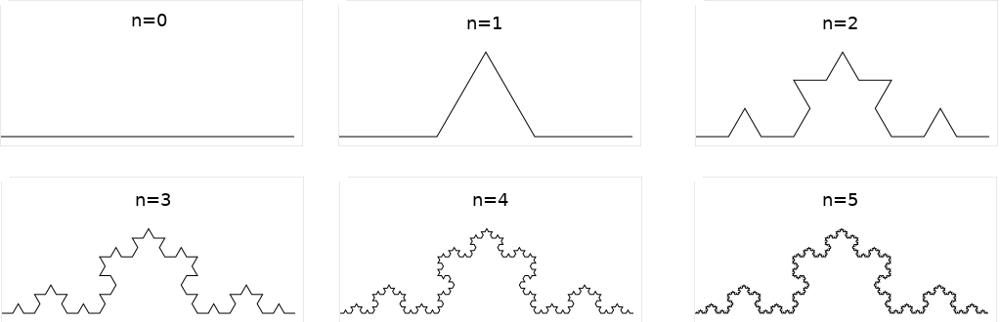
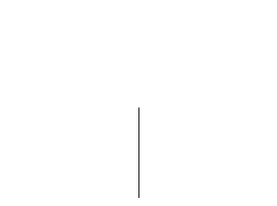
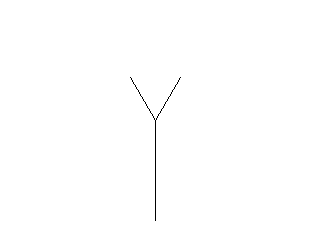
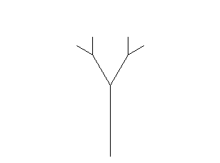
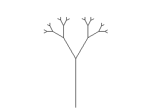

* TOC
{:toc}

## Oznamy

Cvičenia

  - Po prednáške pribudne do cvičení ďalší príklad na rekurziu a počas
    cvičení bonusová rozcvička za jeden bod.
  - Študentom, ktorí ešte nepracovali s rekurziou, odporúčame prísť na
    dnešné cvičenia.
  - V rekurzii pokračujeme aj budúci týždeň. Pondelkovú prednášku ľahšie
    pochopíte, ak si dovtedy vyriešite aspoň tieto dva ľahké rekurzívne
    príklady.

## Klasické úvodné príklady na rekurziu

Rekurzia je metóda, pri ktorej definujeme objekt (funkciu, pojem, ...) pomocou jeho samého.

Na začiatok sa pozrieme na klasické príklady algoritmov využívajúcich
rekurziu.

### Výpočet faktoriálu

Faktoriál prirodzeného čísla *n* značíme *n\!* a je to súčin všetkých
celých čísel od 1 po *n*. Pre úplnosť 0\! definujeme ako 1.

Výpočet pomocou cyklu z prednášky 3:

```cpp
int factorial(int n) {
    int result = 1;
    for (int i = 1; i <= n; i++) {
        result = result * i;
    }
    return result;
}
```

Rekurzívna definícia faktoriálu:

  - *n\! = 1* ak *n≤1*
  - *n\! = n ⋅ (n-1)\!* inak

Túto matematickú definíciu môžeme priamočiaro prepísať do rekurzívnej
funkcie:

```cpp
int factorial(int n) {
    if (n <= 1) return 1;
    else return n * factorial(n-1);
}
```

Aby sa rekurzia nezacyklila, mali by sme dodržiavať nasledujúce zásady:

  - Rekurzívna funkcia musí obsahovať vetvu pre triviálny prípad
    niektorého vstupu. Táto vetva nebude obsahovať rekurzívne volanie
    funkcie, ktorú práve definujeme.
  - Rekurzívne volanie funkcie by malo mať vhodne redukovaný niektorý
    vstup, aby sme sa časom dopracovali k triviálnemu prípadu.

### Najväčší spoločný deliteľ (Euklidov algoritmus)

Ďalším tradičným príkladom na rekurziu je počítanie najväčšieho
spoločného deliteľa.

  - [Euklidov algoritmus z prednášky
    3](./P3.md#euklidov-algoritmus) bol založený na
    rovnosti gcd(*a*,*b*) = gcd(*b*, *a* mod *b*)
  - Tú sme použili v cykle:


```cpp
int gcd(int a, int b) {
    while (b != 0) {
        int r = a % b;
        a = b;
        b = r;
    }
    return a;
}
```

Avšak opäť to isté môžeme ešte kratšie a elegantnejšie napísať
rekurziou:

```cpp
int gcd(int a, int b) {
   if (b == 0) return a;
   else return gcd(b, a % b);
}
```

### Binárne vyhľadávanie

Aj binárne vyhľadávanie prvku v utriedenom poli z [prednášky 7](./P7.md#binárne-vyhľadávanie-v-utriedenom-poli) sa dá pekne zapísať rekurzívne.

Pôvodná nerekurzívna funkcia vrátila polohu prvku *x* v poli *a* alebo
hodnotou -1, ak sa tam nenachádzal:

```cpp
int find(int a[], int n, int x) {
    int left = 0, right = n - 1;
    while (left <= right) {
        int index = (left + right) / 2;
        if (a[index] == x) {
            return index;
        }
        else if (a[index] < x) {
            left = index + 1;
        }
        else {
            right = index - 1;
        }
    }
    return -1;
}
```

V rekurzívnej verzii okraje aktuálneho úseku poľa posielame ako
parametre:

```cpp
int find(int a[], int left, int right, int x) {
    if (left > right) {
        return -1;
    }
    int index = (left + right) / 2;
    if (a[index] == x) {
        return index;
    }
    else if (a[index] < x) {
        return find(a, index+1, right, x);
    }
    else {
        return find(a, left, index - 1, x);
    }
}
```

Ak chceme vyhľadať *x* v poli *a* s *n* prvkami, voláme `find(a, 0, n-1,
x)`.

Na zamyslenie:

  - Táto funkcia má dva triviálne (nerekurzívne) prípady. Ktoré?
  - Aká veličina klesá v každom rekurzívnom volaní?

### Zhrnutie

Pri rekurzii vyjadríme riešenie nejakej úlohy pomocou riešenia jednej
alebo viacerých úloh **toho istého typu**, ale s **menším vstupom** plus
ďalšie potrebné nerekurzívne výpočty

  - výpočet *n\!* vyjadríme pomocou výpočtu *(n-1)\!* a násobenia
  - výpočet *gcd(a, b)* vyjadríme pomocou výpočtu gcd(b, a % b)
  - binárne vyhľadávanie v dlhšom intervale vyjadríme pomocou binárneho
    vyhľadávania v kratšom intervale

Všimnite si, že občas musíme zoznam parametrov nejakej funkcie rozšíriť
pre potreby rekurzie

  - napr. funkcia `find` by prirodzene dostávala pole *a*, dĺžku *n* a
    hľadaný prvok, ale kvôli rekurzii potrebuje ľavý a pravý okraj
  - pre pohodlie užívateľa môžeme pridať pomocnú funkciu (wrapper):

<!-- end list -->

```cpp
int find(int a[], int n, int x) {
  return find(a, 0, n-1, x);
}
```

## Viac o rekurzii

### Nepriama rekurzia

  - Všetky doteraz uvedené funkcie sú príkladom priamej rekurzie, kde
    definovaná funkcia používa seba samú priamo.
  - V nepriamej rekurzii funkcia neodkazuje vo svojej definícii priamo
    na seba, ale využíva inú funkciu, ktorá sa odkazuje naspäť na prvú
    (všeobecnejšie sa kruh môže uzavrieť na viac krokov).
  - Ilustračný príklad nižšie (veľmi neefektívne) testuje párnosť a
    nepárnosť čísla (párnosť je samozrejme lepšie testovať pomocou `n
    % 2`):
  - Nakoľko vo funkcii vieme použiť len funkcie definované v programe
    nad ňou, máme tu problém. Vyriešime ho tzv, deklaráciou, kde
    napíšeme len hlavičku funkcie bez tela a telo dáme nižšie.

<!-- end list -->

```cpp
// deklaracia funkcie odd, aby sa dala pouzit v even
bool odd(int n);  

bool even(int n) {
    if (n == 0) return true;
    else return odd(n - 1);
}

bool odd(int n) {
    if (n == 0) return false;
    else return even(n - 1);
}
```

### Rekurzia pomocou zásobníka - ako je rekurzia implementovaná

O rekurzívne volania sa stará **zásobník volaní** (call stack)

  - Ide o všeobecnú štruktúru potrebnú aj v nerekurzívnych programoch s
    funkciami
  - Po zavolaní nejakej funkcie *f* sa pre ňu vytvorí na zásobníku
    záznam, ktorý obsahuje všetky lokálne premenné a argumenty funkcie
  - Keď potom z funkcie *f* zavoláme nejakú funkciu *g* (pričom v
    rekurzii môže byť aj *f=g*), tak sa vytvorí nový záznam pre *g*.
    Navyše v zázname pre *f* si uložíme aj to, v ktorom kroku sme
    prestali s výpočtom, aby sme vedeli správne pokračovať
  - Po skončení výpočtu funkcie *g* sa jej záznam zruší zo zásobníka.
    Vrátime sa k záznamu pre funkciu *f* a pokračujeme vo výpočte so
    správnymi hodnotami všetkých premenných a od správneho miesta.

Záznamy v zásobníku si môžeme predstaviť uložené v stĺpci jeden nad
druhým

  - vrchný záznam je aktuálny, pre funkciu, ktorá sa vykonáva
  - pod ním je záznam pre funkciu, ktorá ju volala atď
  - na spodku je záznam pre funkciu `main`

Teraz si môžeme jednoduchý zásobník odsimulovať napríklad na výpočte
faktoriálu, ktorý sme rozpísali na viac riadkov, aby sa nám simulácia
lepšie robila.

```cpp
// Pôvodná verzia
int factorial(int n) {
    if (n <= 1) return 1;
    else return n * factorial(n - 1);
}

// Rozpísaná verzia
int factorial(int n) {
    int result;
    if (n < 2) result = 1;
    else { 
       int rest = factorial(n - 1);  // rekurzia
       result = n * rest;
    }
    return result;
}

int main() {
   int f = factorial(3);
   cout << f << endl;
}
```

### Zložitejšie príklady rekurzie

Každý z predchádzajúcich príkladov sme vedeli pomerne jednoducho zapísať
aj bez rekurzie, aj keď rekurzívny výpočet bol často prehľadnejší,
zrozumiteľnejší, kratší a krajší.

Ukážeme si však aj príklady, ktoré by sa bez rekurzie písali obtiažne
(aj keď ako si neskôr ukážeme, rekurzia sa dá vždy odstrániť, v
najhoršom prípade simuláciou zásobníka). Príklady, kde rekurzia veľmi
pomáha, uvidíme na zvyšku dnešnej prednášky, ale aj na dvoch ďalších a k
rekurzii sa vrátime aj neskôr v semestri a samozrejme na ďalších
predmetoch.

## Odbočka: korytnačia grafika v SVGdraw

Náš prvý dnešný príklad rekurzie budú rekurzívne obrázky, fraktály. Aby
sa nám lepšie vykresľovali, v knižnici [SVGdraw](./SVGdraw.md) je
možnosť kresliť pomocou korytnačej grafiky.

  - Vytvoríme si virtuálnu korytnačku, ktorá má určitú polohu a
    natočenie.
  - Môžeme jej povedať, aby sa otočila doľava alebo doprava o určitý
    počet stupňov (`turtle.turnLeft(uhol)` a `turtle.turnRight(uhol)`).
  - Môžeme jej povedať, aby išla o určitú dĺžku dopredu
    (`turtle.forward(dlzka)`)
  - Keď ide korytnačka dopredu, zanecháva v piesku chvostom čiarku
    (vykreslí teda čiaru do nášho obrázku).

Napríklad na vykreslenie štvorca s dĺžkou strany 100 môžeme korytnačke
striedavo prikazovať ísť o 100 dopredu a otáčať sa o 90 stupňov doľava.

  - Na obrázku sa [animuje pohyb korytnačky](../files/P8-stvorec.svg)
  - Program by sa dal ľahko rozšíriť na vykresľovanie pravidelného
    n-uholníka (stačí zmeniť uhol otočenia a počet opakovaní cyklu)

<!-- end list -->

```cpp
#include "SVGdraw.h"

int main(void) {
    /* Vytvor korytnačku na súradniciach (25,175)
     * otočenú doprava na obrázku s rozmermi 200x200,
     * ktorý bude uložený v súbore stvorec.svg. */
    Turtle turtle(200, 200, "stvorec.svg", 25, 175, 0);

    for (int i = 0; i < 4; i++) {
        // vykresli čiaru dĺžky 150
        turtle.forward(150);  
        // otoč sa doľava o 90 stupňov 
        turtle.turnLeft(90);  
    }
    /* strany boli vykreslené v poradí 
     * dolná, pravá, horná, ľavá */

    /* Ukonči vypisovanie obrázka. */
    turtle.finish();
}
```

## Fraktály

Fraktály sú útvary, ktorých časti na rôznych úrovniach zväčšenia sa
podobajú na celý útvar. Mnohé fraktály vieme definovať a vykresliť
pomocou jednoduchej rekurzie.

### Kochova krivka



Príkladom fraktálu je Kochova krivka. Ako vzniká?

  - Predstavme si úsečku, ktorá meria *d* centimetrov.
  - Spravíme s ňou nasledujúcu transformáciu:
      - Úsečka sa rozdelí na tretiny a nad strednou tretinou sa zostrojí
        rovnostranný trojuholník. Základňa trojuholníka v krivke nebude.
      - Dostávame tak útvar pozostávajúci zo 4 úsečiek s dĺžkou *d/3*.
  - Tú istú transformáciu môžeme teraz spraviť na každej zo 4 nových
    úsečiek, t.j. dostávame 16 úsečiek dĺžky *d/9*.
  - Takéto transformácie môžeme robiť do nekonečna.

Druhá možnosť je popísať krivku pomocou dvoch parametrov: dĺžka *d* a
stupeň *n*

  - Kochova krivka stupňa 0 je úsečka dĺžky *d*
  - Kochova krivka stupňa *n* pozostáva zo štyroch kriviek stupňa *n-1*
    a dĺžky *n/3*
      - Na presný popis umiestnenia a natočenia týchto kriviek nižšieho
        stupňa použijeme korytnačiu grafiku, čo máme spravené vo funkcii
        nižšie.

<!-- end list -->

```cpp
 
#include "SVGdraw.h"

void drawKoch(double d, int n, Turtle& turtle){
    if (n==0) turtle.forward(d);
    else {
        drawKoch(d/3, n-1, turtle);
        turtle.turnLeft(60);
        drawKoch(d/3, n-1, turtle);
        turtle.turnRight(120);
        drawKoch(d/3, n-1, turtle);
        turtle.turnLeft(60);
        drawKoch(d/3, n-1, turtle);
    }
}

int main(void) {
    int width = 310; /* rozmery obrazku */
    int height = 150;

    double d = 300; /* velkost krivky */
    int n = 5; /* stupen krivky */

    /* Vytvor korytnačku otočenú doprava. */
    Turtle turtle(width, height, "fraktal.svg", 
                  1, height-10, 0);

    /* nakresli Kochovu krivku rekurzívne */
    drawKoch(d, n, turtle);

    /* Schovaj korytnačku. */
    turtle.finish();
}
```

### Rekurzívny strom

A ešte jeden príklad fraktálu: strom definovaný nasledovne:

  - strom má dva parametre: veľkosť *d* a stupeň *n*
  - strom stupňa 0 je prázdna množina
  - strom stupňa *n* pozostáva z kmeňa, ktorý tvorí úsečka dĺžky *d* a z
    dvoch podstromov, ktoré sú stromy stupňa *n-1*, veľkosti *d/2* a
    otočené o 30 stupňov doľava a doprava od hlavnej osi stromu (pozri
    obrázky nižšie)






Rekurzívnu funkciu na vykresľovanie stromu napíšeme tak, aby sa po
skončení vrátila na miesto a otočenie, kde začala

  - Bez toho by sme nevedeli, kde korytnačka je po vykreslení ľavého
    podstromu a nemohli by sme teda kresliť pravý
  - Korytnačka teda prejde po každej vetve dvakrát, raz smerom dopredu a
    raz naspäť ([animácia](../files/Strom3.svg))


```cpp
#include "SVGdraw.h"

void drawTree(double d, int n, Turtle& turtle) {
    if (n == 0) {
        /* stupen 0 - nerob nic */
        return;  
    } else {
        /* kmen stromu */
        turtle.forward(d);              
        turtle.turnLeft(30);
        /* lava cast koruny */
        drawTree(d / 2, n - 1, turtle); 
        turtle.turnRight(60);
        /* prava cast koruny */
        drawTree(d / 2, n - 1, turtle); 
        turtle.turnLeft(30);
        /* navrat na spodok kmena */
        turtle.forward(-d);             
    }
}

int main(void) {
    /* rozmery obrazku */
    int width = 150; 
    int height = 200;

    /* velkost stromu */
    double d = 100; 
    /* stupen krivky */
    int n = 5; 

    /* vytvor korytnačku otočenú hore */
    Turtle turtle(width, height, "fraktal.svg", 
                  width / 2, height - 10, 90);

    /* nakresli strom rekurzívne */
    drawTree(d, n, turtle);

    /* schovaj korytnačku */
    turtle.finish();
}
```

## Fibonacciho čísla

*[Fibonacciho
postupnosť](https://en.wikipedia.org/wiki/Fibonacci_number)* je
postupnosť čísel taká, že:

  - Nultý člen je 0.
  - Prvý člen je 1.
  - Každý ďalší člen postupnosti je daný súčtom dvoch predchádzajúcich.

Prvých niekoľko členov Fibonacciho postupnosti je

  -   
    0, 1, 1, 2, 3, 5, 8, 13, 21, 34, 55, 89, 144, 233, 377, 610, 987,
    1597, 2584, 4181, 6765, 10946, 17711, 28657, 46368, 75025, 121393,
    ...

Formálnejšiu definíciu *n*-tého Fibonacciho čísla *F*(*n*) môžeme
zapísať ako rekurzívny vzťah:

  - *F*(0) = 0,
  - *F*(1) = 1,
  - Pre všetky prirodzené čísla *n* ≥ 2: *F*(*n*) = *F*(*n* - 1) +
    *F*(*n* - 2).

Z tejto definície vieme opäť urobiť rekurzívnu funkciu jednoducho:

```cpp
int fib(int n){
    if (n == 0) {
        return 0;
    } else if (n == 1) {
        return 1;
    } else {
        return fib(n - 1) + fib(n - 2);
    }
}
```

### Fibonacciho čísla nerekurzívne

Jedna možnosť je ukladať *F*\[0\], *F*\[1\], ..., *F*\[*n*\] do poľa

  - ```cpp
    int fibonacci(int n) {
        int F[MAXN + 1];
        F[0] = 0;
        F[1] = 1;
        for(int i = 2; i <= n; i++) {
            F[i] = F[i-1] + F[i-2];
        }
        return F[n];
    }
    ```

Všimnite si ale, že z poľa vždy potrebujeme len posledné dve vyplnené
čísla, takže stačili by nám dve premenné typu `int`.

```cpp
int fibonacci(int n) {
    if (n == 0) {
        return 0;
    } else if (n == 1) {
        return 1;
    } else {
        int F_posledne = 1;
        int F_predposledne = 0;
        for (int i = 2; i <= n; i++) {
            int F_n = F_posledne + F_predposledne;
            F_predposledne = F_posledne;
            F_posledne = F_n;                     
        }
        return F_posledne;
    }
}
```

### Cvičenie

Ako by sme bez počítača zistili, čo robí rekurzívna funkcia, napríklad
takáto obmena Fibonacciho postupnosti?

```cpp
int f(int n) {
    if (n <= 2) return 1;
    else return f(n-1) + f(n-3);
}
```

### Ako pracuje rekurzívna verzia Fibonacciho čísel

  - Rekurzívna verzia výpočtu Fibonacciho čísel je krátka a elegantná,
    podobá sa na matematickú definíciu
  - Je ale neefektívna

<!-- end list -->

  - Skúsme napríklad odsimulovať, čo sa deje, ak chceme rekurzívne
    spočítať *F*\[3\]
  - Kvôli prehľadnosti si rekurzívnu funkciu `fib` rozpíšeme na viac
    riadkov:

<!-- end list -->

```cpp
#include <iostream>
using namespace std;

int fib(int n) {
    if (n == 0) {
        return 0;
    } else if (n == 1) {
        return 1;
    } else {
        int a = fib(n - 1); // riadok (A)
        int b = fib(n - 2); // riadok (B)
        return a+b;
    }
}

int main() {
    int x = fib(3);       // riadok (C)
    cout << x << endl; 
}
```

Tu je priebeh programu (obsah zásobníka)

    (1)          (2)                      (3)
    
                                           fib n=2
                  fib n=3                  fib n=3, a=?, b=?, riadok A
    main, x=?     main, x=?, riadok C      main, x=?, riadok C
    
    (4)                             (5)
     
    fib n=1                         
    fib n=2, a=?, b=?, riadok A     fib n=2, a=1, b=?, riadok A
    fib n=3, a=?, b=?, riadok A     fib n=3, a=?, b=?, riadok A
    main, x=?, riadok C             main, x=?, riadok C             
    
    
    (6)                             (7)
     
    fib n=0                         
    fib n=2, a=1, b=?, riadok B     fib n=2, a=1, b=0, riadok B
    fib n=3, a=?, b=?, riadok A     fib n=3, a=?, b=?, riadok A
    main, x=?, riadok C             main, x=?, riadok C             
    
    
    (8)                             (9)
    
                                    fib n=1
    fib n=3, a=1, b=?, riadok A     fib n=3, a=1, b=?, riadok B 
    main, x=?, riadok C             main, x=?, riadok C                 
    
    
    (10)                            (11)
    
    fib n=3, a=1, b=1, riadok B     
    main, x=?, riadok C             main, x=2, riadok C 

Postupnosť volaní počas výpočtu vieme znázorniť aj stromovým diagramom:

[Diagram výpočtu](../files/Fib.png){:width="400px"}

Priamočiary rekurzívny zápis výpočtu Fibonacciho čísel je neefektívny,
lebo výpočet Fibonacciho čísel sa opakuje

  - Napr. pre *n=5* počítame `fib(2)` trikrát, pre *n=6* päťkrát a pre
    *n=20* až 4181-krát

